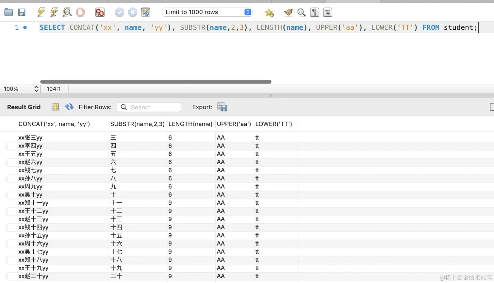

# SQL 语句

本文以学生表为例，介绍 MySQL 中常见的数据定义、数据查询和内置函数。

## 数据定义与操作

### 创建表

下面创建一张学生表：`id` 为主键并自动增长，其余字段均不能为空。

```sql
CREATE TABLE student (
  id INT PRIMARY KEY AUTO_INCREMENT COMMENT '编号',
  name VARCHAR(50) NOT NULL COMMENT '学生名',
  gender VARCHAR(10) NOT NULL COMMENT '性别',
  age INT NOT NULL COMMENT '年龄',
  class VARCHAR(50) NOT NULL COMMENT '班级名',
  score INT NOT NULL COMMENT '分数'
) CHARSET = utf8mb4;
```

### 删除表

```sql
DROP TABLE student;
```

### 插入数据

```sql
INSERT INTO student (name, gender, age, class, score)
VALUES
  ('张三', '男', 18, '一班', 90),
  ('李四', '女', 19, '二班', 85),
  ('王五', '男', 20, '三班', 70),
  ('赵六', '女', 18, '一班', 95),
  ('钱七', '男', 19, '二班', 80),
  ('孙八', '女', 20, '三班', 75),
  ('周九', '男', 18, '一班', 85),
  ('吴十', '女', 19, '二班', 90);
```

## 查询数据

### 基本查询

查询所有列：

```sql
SELECT * FROM student;
```

查询指定列：

```sql
SELECT name, score
FROM student;
```

使用 `AS` 设置列别名：

```sql
SELECT name AS 名字, score AS 分数
FROM student;
```

### 条件查询

使用 `WHERE` 设置查询条件，使用 `AND` 连接多个条件：

```sql
SELECT name AS 名字, class AS 班级
FROM student
WHERE age >= 19;

SELECT name AS 名字, class AS 班级
FROM student
WHERE gender = '男' AND score >= 90;
```

使用 `LIKE` 进行模糊查询。`%` 表示任意长度的字符串：

```sql
SELECT *
FROM student
WHERE name LIKE '张%';
```

使用 `IN` 或 `NOT IN` 查询是否属于某个集合：

```sql
SELECT *
FROM student
WHERE class IN ('一班', '二班');

SELECT *
FROM student
WHERE class NOT IN ('一班', '二班');
```

使用 `BETWEEN ... AND ...` 查询指定区间。区间两端都包含：

```sql
SELECT *
FROM student
WHERE age BETWEEN 18 AND 20;
```

### 分页与排序

使用 `LIMIT` 限制返回数量：

```sql
-- 从第 1 条数据开始，返回 5 条
SELECT * FROM student LIMIT 0, 5;

-- 简写形式：返回前 5 条数据
SELECT * FROM student LIMIT 5;

-- 从第 6 条数据开始，返回 5 条，即第二页数据
SELECT * FROM student LIMIT 5, 5;
```

使用 `ORDER BY` 排序。下面的语句先按成绩升序排列，成绩相同时再按年龄降序排列：

```sql
SELECT name, score, age
FROM student
ORDER BY score ASC, age DESC;
```

### 分组统计

使用 `GROUP BY` 对数据分组，使用聚合函数进行统计。下面统计每个班级的平均成绩，并按平均成绩降序排列：

```sql
SELECT class AS 班级, AVG(score) AS 平均成绩
FROM student
GROUP BY class
ORDER BY 平均成绩 DESC;
```

统计每个班级的学生数量。`COUNT(*)` 中的 `*` 表示统计当前分组中的所有行：

```sql
SELECT class, COUNT(*) AS 人数
FROM student
GROUP BY class;
```

分组后使用 `HAVING` 过滤分组结果，不能使用 `WHERE` 替代：

```sql
SELECT class, AVG(score) AS 平均成绩
FROM student
GROUP BY class
HAVING 平均成绩 > 90;
```

使用 `DISTINCT` 去除重复值：

```sql
SELECT DISTINCT class
FROM student;
```

## 内置函数

### 聚合函数

聚合函数用于统计多行数据，包括 `AVG`、`COUNT`、`SUM`、`MIN` 和 `MAX`：

```sql
SELECT
  AVG(score) AS 平均成绩,
  COUNT(*) AS 人数,
  SUM(score) AS 总成绩,
  MIN(score) AS 最低分,
  MAX(score) AS 最高分
FROM student;
```

### 字符串函数

字符串函数用于处理字符串，包括 `CONCAT`、`SUBSTR`、`LENGTH`、`UPPER` 和 `LOWER`：

```sql
SELECT
  CONCAT('xx', name, 'yy'),
  SUBSTR(name, 2, 3),
  LENGTH(name),
  UPPER('aa'),
  LOWER('TT')
FROM student;
```



MySQL 的字符串下标从 `1` 开始，因此 `SUBSTR('一二三', 2, 3)` 的结果是 `'二三'`。省略长度参数时，会截取到字符串末尾：

```sql
SELECT SUBSTR('一二三', 2);
```

### 数值函数

数值函数用于处理数字，包括 `ROUND`、`CEIL`、`FLOOR`、`ABS` 和 `MOD`：

```sql
SELECT
  ROUND(1.234567, 2),
  CEIL(1.234567),
  FLOOR(1.234567),
  ABS(-1.234567),
  MOD(5, 2);
```

其中，`ROUND` 表示四舍五入，`CEIL` 表示向上取整，`FLOOR` 表示向下取整，`ABS` 表示绝对值，`MOD` 表示取模。

### 日期函数

日期函数用于处理日期和时间，包括 `DATE`、`TIME`、`YEAR`、`MONTH` 和 `DAY`：

```sql
SELECT
  YEAR('2023-06-01 22:06:03'),
  MONTH('2023-06-01 22:06:03'),
  DAY('2023-06-01 22:06:03'),
  DATE('2023-06-01 22:06:03'),
  TIME('2023-06-01 22:06:03');
```

### 条件函数

条件函数根据条件是否成立返回不同结果，常见的有 `IF` 和 `CASE`：

```sql
SELECT name, IF(score >= 60, '及格', '不及格') AS 结果
FROM student;
```

`IF` 适合处理单个条件，`CASE` 适合处理多个条件：

```sql
SELECT
  name,
  score,
  CASE
    WHEN score >= 90 THEN '优秀'
    WHEN score >= 60 THEN '良好'
    ELSE '差'
  END AS 档次
FROM student;
```

### 系统函数

系统函数用于获取数据库系统信息：

```sql
SELECT VERSION(), DATABASE(), USER();
```

### 其他函数

- `NULLIF`：两个值相等时返回 `NULL`，不相等时返回第一个值。
- `COALESCE`：返回参数列表中第一个非 `NULL` 的值。
- `GREATEST`：返回多个值中的最大值。
- `LEAST`：返回多个值中的最小值。

```sql
SELECT COALESCE(NULL, 1), COALESCE(NULL, NULL, 2);
SELECT GREATEST(1, 2, 3), LEAST(1, 2, 3, 4);
```

### 类型转换函数

类型转换函数可以将值转换成其他类型，常见的有 `CAST`、`CONVERT`、`DATE_FORMAT` 和 `STR_TO_DATE`。

例如，使用 `CONVERT` 将字符串转换为整数：

```sql
SELECT GREATEST(1, '123', 3);
SELECT GREATEST(1, CONVERT('123', SIGNED), 3);
```

常见的转换类型包括：

- `SIGNED`：有符号整数
- `UNSIGNED`：无符号整数
- `DECIMAL`：定点数
- `CHAR`：字符类型
- `DATE`：日期类型
- `TIME`：时间类型
- `DATETIME`：日期时间类型
- `BINARY`：二进制类型

`DATE_FORMAT` 用于格式化日期，`STR_TO_DATE` 用于将字符串转换为日期：

```sql
SELECT DATE_FORMAT('2022-01-01', '%Y年%m月%d日');
SELECT STR_TO_DATE('2022-01-01', '%Y-%m-%d');
```

## 总结

### 常用查询关键字

| 关键字                | 作用               | 示例                              |
| --------------------- | ------------------ | --------------------------------- |
| `WHERE`               | 查询条件           | `WHERE id = 1`                    |
| `AS`                  | 设置别名           | `SELECT name AS 姓名`             |
| `AND`                 | 连接多个条件       | `WHERE age > 18 AND score > 60`   |
| `IN` / `NOT IN`       | 集合查询           | `WHERE class IN ('一班', '二班')` |
| `BETWEEN ... AND ...` | 区间查询           | `WHERE age BETWEEN 18 AND 20`     |
| `LIMIT`               | 限制返回数量或分页 | `LIMIT 0, 5`                      |
| `ORDER BY`            | 排序               | `ORDER BY score DESC`             |
| `GROUP BY`            | 分组               | `GROUP BY class`                  |
| `HAVING`              | 过滤分组结果       | `HAVING AVG(score) > 90`          |
| `DISTINCT`            | 去重               | `SELECT DISTINCT class`           |

### 常用内置函数

- 聚合函数：`AVG`、`COUNT`、`SUM`、`MIN`、`MAX`
- 字符串函数：`CONCAT`、`SUBSTR`、`LENGTH`、`UPPER`、`LOWER`
- 数值函数：`ROUND`、`CEIL`、`FLOOR`、`ABS`、`MOD`
- 日期函数：`YEAR`、`MONTH`、`DAY`、`DATE`、`TIME`
- 条件函数：`IF`、`CASE`
- 系统函数：`VERSION`、`DATABASE`、`USER`
- 类型转换函数：`CONVERT`、`CAST`、`DATE_FORMAT`、`STR_TO_DATE`
- 其他函数：`NULLIF`、`COALESCE`、`GREATEST`、`LEAST`
