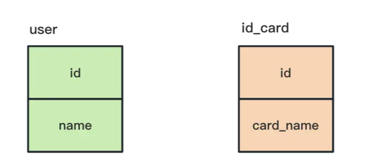
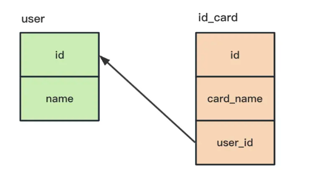
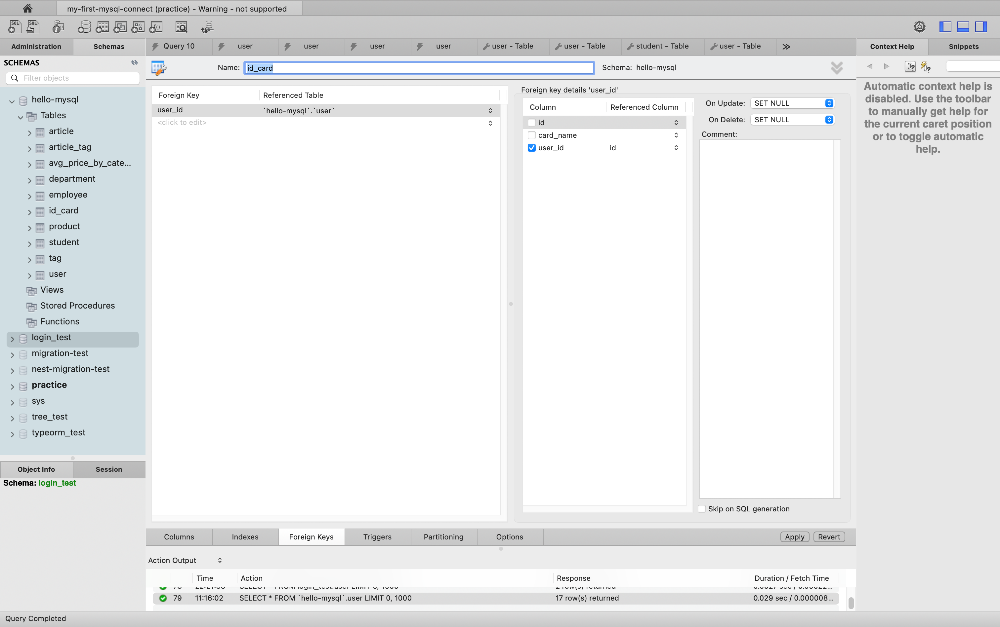
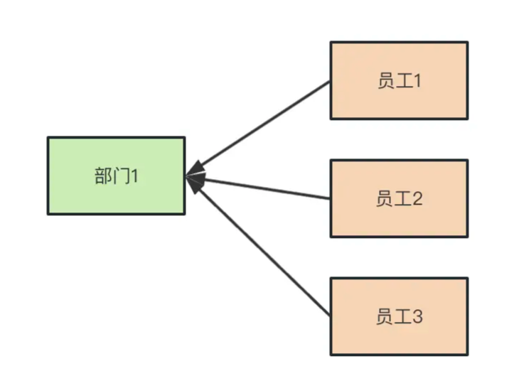
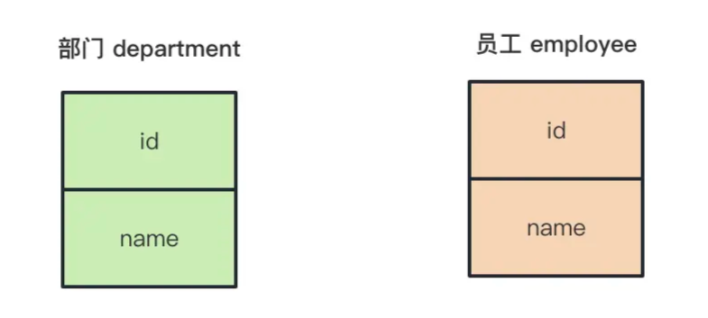
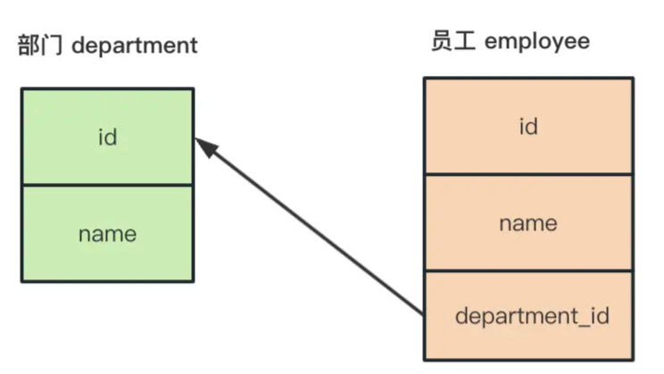
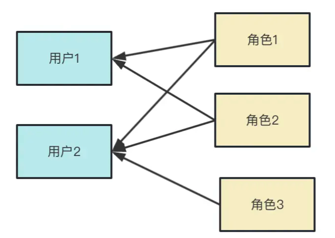
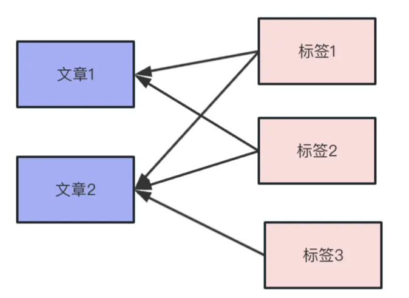
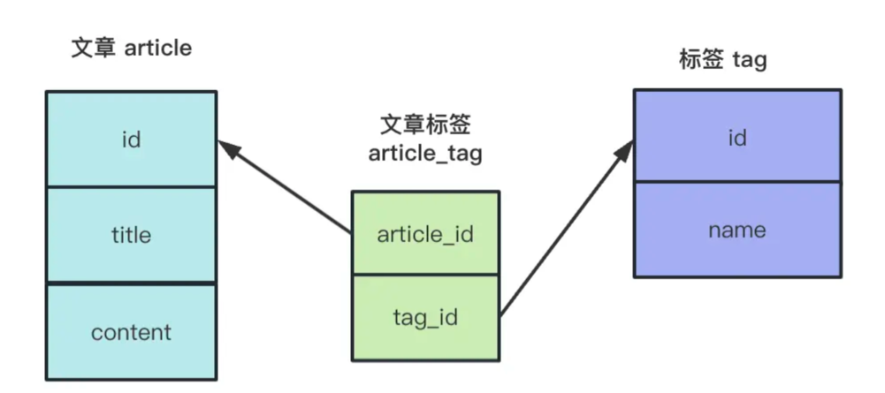

# MySQL 表关系

数据库中的表通常按照业务职责拆分，分别保存用户、身份证、部门、员工等不同类型的数据。这些表并不是孤立的，它们之间通常存在一对一、一对多或多对多关系。

MySQL 主要通过外键和中间表来表示这些关系。

## 一对一关系

一对一关系表示一张表中的一条记录，最多对应另一张表中的一条记录。例如，一个用户只能有一张身份证。



用户表和身份证表分别保存用户信息与身份证信息：



`user` 表的主键是 `id`，可以通过它唯一标识一个用户。为了让 `id_card` 表能够关联到用户，可以增加一个 `user_id` 字段保存用户的 `id`，这个字段就是外键。

`user` 表称为主表，引用主表的 `id_card` 表称为从表：



创建身份证表的示例：

```sql
CREATE TABLE `id_card` (
  `id` INT NOT NULL AUTO_INCREMENT COMMENT '编号',
  `card_name` VARCHAR(45) NOT NULL COMMENT '身份证号',
  `user_id` INT DEFAULT NULL COMMENT '用户 id',
  PRIMARY KEY (`id`),
  INDEX `card_id_idx` (`user_id`),
  CONSTRAINT `user_id`
    FOREIGN KEY (`user_id`) REFERENCES `user` (`id`)
) CHARSET = utf8mb4;
```

这些建表 SQL 的具体语法了解即可，实际开发中通常会通过 ORM 或数据库迁移工具生成。

- `PRIMARY KEY`：指定 `id` 为主键。
- `INDEX`：为 `user_id` 建立索引，以加速通过用户 id 查询身份证的操作。
- `CONSTRAINT ... FOREIGN KEY`：为 `user_id` 添加外键约束，并指定它引用 `user` 表的 `id` 列。

### 关联查询

使用 `JOIN ... ON` 查询用户及其身份证信息：

```sql
SELECT *
FROM user
JOIN id_card ON user.id = id_card.user_id;
```

也可以明确指定需要返回的列，并为身份证表的 `id` 设置别名：

```sql
SELECT
  user.id,
  user.name,
  id_card.id AS card_id,
  id_card.card_name
FROM user
JOIN id_card ON user.id = id_card.user_id;
```

`JOIN ON` 默认等价于 `INNER JOIN ON`：

```sql
SELECT
  user.id,
  user.name,
  id_card.id AS card_id,
  id_card.card_name
FROM user
INNER JOIN id_card ON user.id = id_card.user_id;
```

`INNER JOIN` 只返回两个表中能够关联上的数据。

在 `FROM` 后面的表是左表，`JOIN` 后面的表是右表。使用 `RIGHT JOIN` 时，会额外返回右表中没有关联的数据：

```sql
SELECT
  user.id,
  user.name,
  id_card.id AS card_id,
  id_card.card_name
FROM user
RIGHT JOIN id_card ON user.id = id_card.user_id;
```

使用 `LEFT JOIN` 时，会额外返回左表中没有关联的数据：

```sql
SELECT
  user.id,
  user.name,
  id_card.id AS card_id,
  id_card.card_name
FROM user
LEFT JOIN id_card ON user.id = id_card.user_id;
```

### 外键级联操作

外键可以配置主表记录发生更新或删除时，从表如何处理。常见选项如下：

| 选项        | 作用                                                                                   |
| ----------- | -------------------------------------------------------------------------------------- |
| `CASCADE`   | 主表主键更新时同步更新从表外键；主表记录删除时同步删除从表关联记录。                   |
| `SET NULL`  | 主表主键更新或主表记录删除时，将从表关联字段设置为 `NULL`。从表外键必须允许为 `NULL`。 |
| `RESTRICT`  | 只要存在从表关联记录，就不允许删除主表记录或更新主表主键。                             |
| `NO ACTION` | 在 MySQL 中与 `RESTRICT` 等价。                                                        |

因此，`RESTRICT` 和 `NO ACTION` 的处理逻辑是：只要从表存在关联记录，就不能更新主表 id 或删除主表记录。

## 一对多关系

一对多关系表示一张表中的一条记录可以对应另一张表中的多条记录。例如，一个部门有多个员工，而一个员工只属于一个部门。



对应的表结构如下：



在员工表中添加 `department_id` 外键，即可表示员工与部门之间的多对一关系：



一对多关系和一对一关系的数据表设计方式基本相同，区别在于从表中的多个记录可以引用主表中的同一条记录。

查询 id 为 `5` 的部门及其所有员工：

```sql
SELECT *
FROM department
JOIN employee ON department.id = employee.department_id
WHERE department.id = 5;
```

## 多对多关系

多对多关系表示一张表中的一条记录可以对应另一张表中的多条记录，反过来也一样。例如，一个用户可以拥有多个角色，一个角色也可以被多个用户拥有。



文章和标签也是常见的多对多关系：一篇文章可以有多个标签，一个标签也可以被多篇文章使用。



文章表和标签表都不直接保存对方的外键，而是增加一个中间表保存双方的外键：



中间表保存文章和标签之间的关联关系。中间表的外键通常配置为 `CASCADE`，这样删除文章或标签时，可以自动删除中间表中的关联记录，避免产生无效数据。

假设现在有 `article`、`tag` 和 `article_tag` 三张表，可以通过连接三张表查询文章的标签：

```sql
SELECT *
FROM article AS a
JOIN article_tag AS at ON a.id = at.article_id
JOIN tag AS t ON t.id = at.tag_id
WHERE a.id = 1;
```

也可以只返回文章标题和标签名：

```sql
SELECT
  t.name AS 标签名,
  a.title AS 文章标题
FROM article AS a
JOIN article_tag AS at ON a.id = at.article_id
JOIN tag AS t ON t.id = at.tag_id
WHERE a.id = 1;
```

## 小结

- **一对一**：从表通过一个外键关联主表中的一条记录，例如用户和身份证。
- **一对多**：从表中的多条记录可以关联主表中的同一条记录，例如部门和员工。
- **多对多**：通过中间表保存两张表的外键，例如文章和标签。
- **外键级联**：使用 `CASCADE`、`SET NULL`、`RESTRICT` 或 `NO ACTION` 控制主表变更时从表的处理方式。
