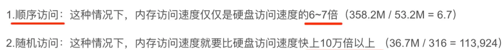
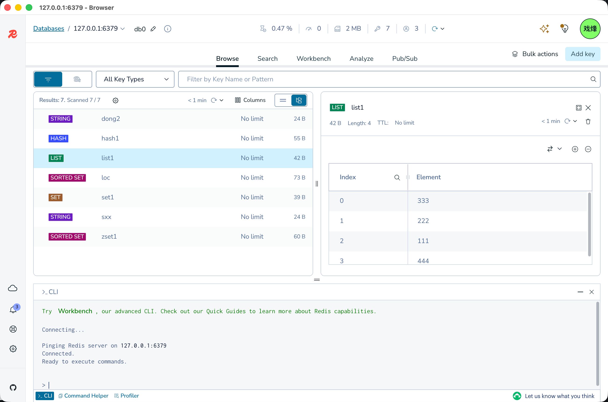

# Redis

## Redis 是什么

MySQL 主要通过磁盘存储数据，并且需要解析和执行 SQL。高并发场景下，频繁访问数据库可能成为性能瓶颈。

缓存的基本思路是：把访问频率高、计算成本高但不需要每次都实时查询的数据暂时放到内存中，下次直接读取内存结果。内存访问速度通常远高于磁盘访问速度：



Redis 是最常用的内存数据库之一。它以 `key-value` 作为基本数据模型，并为 value 提供多种数据结构：`String`、`Hash`、`List`、`Set`、`Sorted Set`、`Stream`、`Bitmap`、`Geospatial` 等。



Redis 不只是缓存，也可以用于分布式锁、排行榜、消息队列、计数器、限流和会话存储。但 Redis 的数据主要保存在内存中，使用时必须结合过期时间、持久化、容量和故障恢复策略。

## 基本概念

### Key 的设计

建议使用有层次的 key，便于阅读、批量删除和定位问题：

```text
业务:资源:标识

user:profile:1001
order:detail:202607310001
product:stock:10
captcha:register:13800000000
```

Key 设计注意事项：

- 使用统一命名规则，常用 `:` 分隔层级。
- 包含业务名称和资源名称，避免不同模块发生冲突。
- 不要把过长的 JSON 或大量重复信息放进 key。
- 缓存 key 最好包含版本号，方便结构升级，例如 `v1:user:profile:1001`。

### 常用通用命令

```redis
# 设置并读取字符串
SET user:name:1001 "张三"
GET user:name:1001

# 判断 key 是否存在
EXISTS user:name:1001

# 查看数据类型
TYPE user:name:1001

# 删除 key
DEL user:name:1001

# 设置过期时间，单位分别为秒和毫秒
EXPIRE user:name:1001 3600
PEXPIRE user:name:1001 3600000

# 查看剩余过期时间
TTL user:name:1001

# 按秒设置过期时间
SET session:token:abc123 "1001" EX 3600

# 仅当 key 不存在时设置，常用于加锁
SET lock:order:3 request-id NX EX 30
```

生产环境中不要使用 `KEYS pattern` 扫描大量 key，它可能阻塞 Redis。排查或批量处理时使用渐进式的 `SCAN`：

```redis
SCAN 0 MATCH user:profile:* COUNT 100
```

## 数据结构与常用命令

### String

`String` 可以保存文本、数字或序列化后的 JSON，适合缓存对象、计数器、验证码和开关配置。

```redis
# 设置和读取字符串
SET user:name:1001 "张三"
GET user:name:1001

# 批量设置和读取
MSET user:name:1001 "张三" user:name:1002 "李四"
MGET user:name:1001 user:name:1002

# 数值递增和递减
SET article:views:1 0
INCR article:views:1
INCRBY article:views:1 10
DECRBY article:views:1 2

# 仅在 key 不存在时设置
SET captcha:register:13800000000 938211 EX 300 NX
```

适用场景：

- 缓存数据库查询结果。
- 保存验证码、登录 token 和配置开关。
- 统计文章阅读数、接口调用数等计数数据。

注意：Redis 的数值操作要求 value 是合法整数，不能直接对 JSON 字符串使用 `INCR`。

### Hash

`Hash` 适合保存一个对象的多个字段。相比把整个对象序列化成 String，Hash 可以只更新其中一个字段。

```redis
HSET user:profile:1001 name "张三" age 20 city "北京"
HGET user:profile:1001 name
HMGET user:profile:1001 name city
HGETALL user:profile:1001
HINCRBY user:profile:1001 age 1
HDEL user:profile:1001 city
HEXISTS user:profile:1001 name
```

适用场景：

- 缓存用户资料、商品摘要等结构化对象。
- 保存在线用户状态。
- 保存可局部更新的配置。

`HGETALL` 会返回整个 Hash，大对象不应频繁执行，必要时使用 `HMGET` 只读取需要的字段。

### List

`List` 是有序的字符串列表，常用于简单队列、最近访问记录和消息列表。

```redis
# 从左侧和右侧插入
LPUSH queue:email email-1 email-2
RPUSH queue:email email-3

# 从左侧和右侧取出
LPOP queue:email
RPOP queue:email

# 查看指定区间，0 到 -1 表示全部
LRANGE queue:email 0 -1

# 查看长度并限制列表长度
LLEN queue:email
LTRIM user:recent:1001 0 9
```

阻塞式消费适合简单的任务队列：

```redis
# 没有消息时最多等待 5 秒
BRPOP queue:email 5
```

如果需要消息确认、消费组、重试和消息持久化，建议使用 Redis Streams，而不是只使用 List。

### Set

`Set` 是无序且不重复的集合，适合去重、标签和集合关系运算。

```redis
SADD article:1:tags redis mysql backend
SISMEMBER article:1:tags redis
SMEMBERS article:1:tags
SCARD article:1:tags
SREM article:1:tags mysql
```

集合运算：

```redis
SADD user:1001:roles admin editor
SADD user:1002:roles editor

# 交集：两个用户共有的角色
SINTER user:1001:roles user:1002:roles

# 并集：两个用户所有角色
SUNION user:1001:roles user:1002:roles

# 差集：1001 有但 1002 没有的角色
SDIFF user:1001:roles user:1002:roles
```

适用场景：

- 文章标签去重。
- 用户收藏、点赞关系。
- 判断用户是否属于某个权限集合。
- 计算共同好友、共同标签等集合关系。

### Sorted Set

`Sorted Set` 是带分数的有序集合，成员唯一，Redis 按 score 排序，适合排行榜和延迟任务。

```redis
# 添加用户及分数
ZADD leaderboard 95 user:1001 88 user:1002 99 user:1003

# 查询分数和排名
ZSCORE leaderboard user:1001
ZRANK leaderboard user:1001
ZREVRANK leaderboard user:1001

# 查询最高分前 10 名，并返回分数
ZREVRANGE leaderboard 0 9 WITHSCORES

# 增加分数
ZINCRBY leaderboard 5 user:1001

# 按分数区间查询
ZRANGEBYSCORE leaderboard 90 100 WITHSCORES

# 移除成员
ZREM leaderboard user:1002
```

适用场景：

- 游戏积分排行榜。
- 直播间热度排行。
- 按时间戳排序的延迟任务。
- 统计分数并支持按区间筛选的业务。

### Stream

`Stream` 适合需要消息 ID、消费组、确认和重试机制的消息场景：

```redis
# 添加消息，* 表示由 Redis 自动生成消息 ID
XADD order-events * orderId 1001 status paid

# 读取消息
XREAD COUNT 10 STREAMS order-events 0

# 创建消费组
XGROUP CREATE order-events order-workers 0 MKSTREAM

# 消费组读取消息
XREADGROUP GROUP order-workers worker-1 COUNT 10 BLOCK 5000 STREAMS order-events >

# 确认消息处理完成
XACK order-events order-workers 1750000000000-0
```

适用场景：订单事件、异步任务、日志处理和需要确认机制的消息消费。

## 延伸阅读

- [Redis 常见业务用法](./usage)
- [Redis 可靠性与性能](./reliability)

## 小结

- Redis 是基于内存的高性能 key-value 数据库。
- `String` 适合缓存、计数器和验证码；`Hash` 适合对象字段；`List` 适合简单队列；`Set` 适合去重和集合运算；`Sorted Set` 适合排行榜；`Stream` 适合带确认机制的消息消费。
- Redis 负责高频访问和数据结构操作，具体业务策略见延伸阅读。
