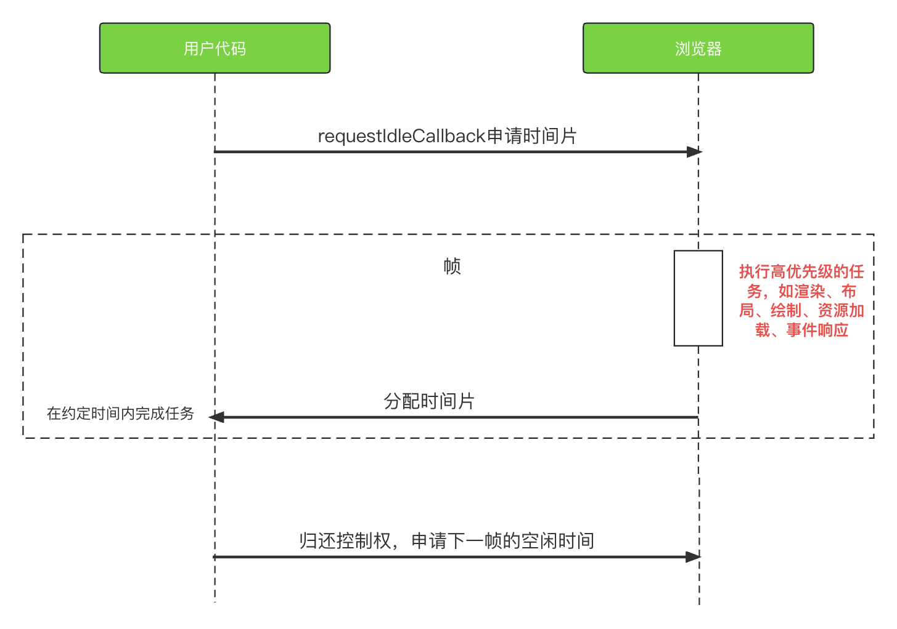

# 浏览器的一些 API

## requestIdleCallback

[MDN requestIdleCallback API](https://developer.mozilla.org/zh-CN/docs/Web/API/Window/requestIdleCallback)

- 我们希望快速响应用户，让用户觉得够快，不能阻塞用户的交互。
- requestIdleCallback 使开发者能够在主事件循环上执行后台和低优先级工作，而不会影响延迟关键事件，如动画和输入响应。
- 正常帧任务完成后没超过 16.6 ms，说明时间有富余，此时就会执行 requestIdleCallback 里注册的任务。



缺点：

1. 兼容性问题。
2. 执行任务的帧空闲时间不可控（React 自己实现了一个 requestIdleCallback）。
3. 一个任务就是最小的执行单位，不能被打断，所以有可能会被卡住。

### Demo

```html
<!DOCTYPE html>
<html lang="en">
  <head>
    <meta charset="UTF-8" />
    <meta http-equiv="X-UA-Compatible" content="IE=edge" />
    <meta name="viewport" content="width=device-width, initial-scale=1.0" />
    <title>requestIdleCallback</title>
  </head>

  <body>
    <script>
      function sleep(duration) {
        for (var t = Date.now(); Date.now() - t <= duration; ) {}
      }

      const works = [
        () => {
          console.log('第1个任务开始')
          // 任务执行时间少过当前帧的空余时间，就会等待当前任务执行完毕，当前帧才会结束
          sleep(1000)
          console.log('第1个任务结束')
        },
        () => {
          console.log('第2个任务开始')
          sleep(20)
          console.log('第2个任务结束')
        },
        () => {
          console.log('第3个任务开始')
          sleep(20)
          console.log('第3个任务结束')
        },
      ]

      requestIdleCallback(workLoop)

      function workLoop(deadline) {
        //因为一帧是16.6ms，浏览器执行完高优先级之后，如果还有时间，会执行workLoop,timeRemaining获取此帧剩下的时间
        console.log(`本帧的剩余时间是`, deadline.timeRemaining())

        //如果没有剩余时间了，就会跳出循环
        while (deadline.timeRemaining() > 1 && works.length > 0) {
          // 还有空闲时间 && 还有任务没执行
          performUnitOfWork()
        }

        //如果还有剩余任务
        if (works.length > 0) {
          console.log(
            `只剩下${deadline.timeRemaining()}ms，不够了，等待浏览器下次空闲 的时候再帮我调用`,
          )
          requestIdleCallback(workLoop)
        }
      }

      function performUnitOfWork() {
        //取出任务数组中的第一个任务，并移除第一个任务
        let work = works.shift()
        work()
      }
    </script>
  </body>
</html>
```

```lua
- 本帧的剩余时间是 5.4
- 第1个任务开始
- 第1个任务结束
- 只剩下0ms，不够了，等待浏览器下次空闲 的时候再帮我调用
- 本帧的剩余时间是 3.3
- 第2个任务开始
- 第2个任务结束
- 只剩下0ms，不够了，等待浏览器下次空闲 的时候再帮我调用
- 本帧的剩余时间是 50
- 第3个任务开始
- 第3个任务结束
```

## requestAnimationFrame

[MDN requestAnimationFrame API](https://developer.mozilla.org/zh-CN/docs/Web/API/window/requestAnimationFrame)
