# 浏览器 V8 引擎

## V8 如何执行一段 JS 代码

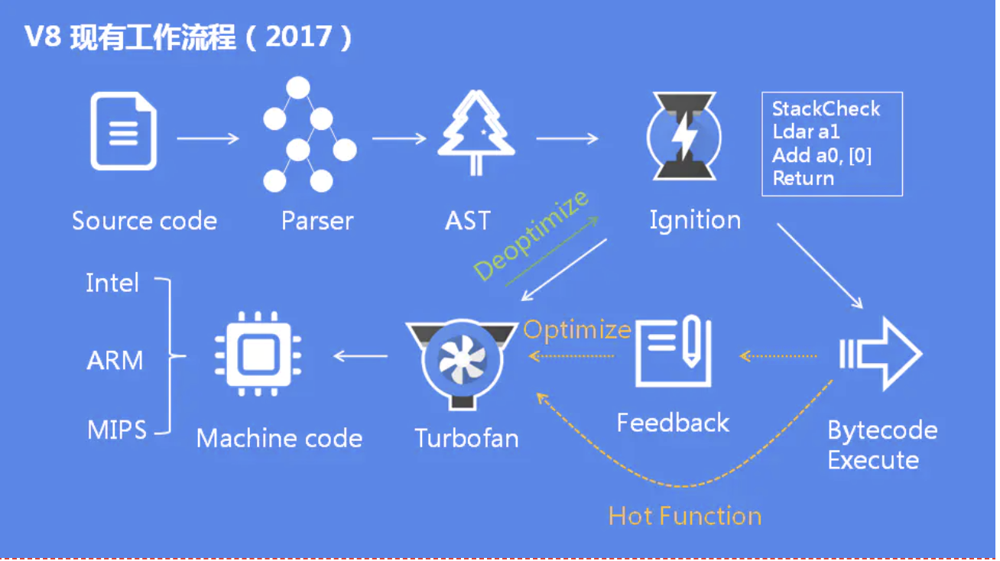

1. 预解析：检查语法错误但不生成 AST。
2. 生成 AST：经过词法/语法分析，生成抽象语法树。
3. 生成字节码：基线编译器(Ignition)将 AST 转换成字节码。
4. 生成机器码：优化编译器(Turbofan)将字节码转换成优化过的机器码，此外在逐行执行字节码的过程中，如果一段代码经常被执行，那么 V8 会将这段代码直接转换成机器码保存起来，下一次执行就不必经过字节码，优化了执行速度。

## 介绍一下引用计数和标记清除

### 引用计数

给一个变量赋值引用类型，则该对象的引用次数+1，如果这个变量变成了其他值，那么该对象的引用次数-1，垃圾回收器会回收引用次数为 0 的对象。但是当对象循环引用时，会导致引用次数永远无法归零，造成内存无法释放。

### 标记清除

垃圾收集器先给内存中所有对象加上标记，然后从根节点开始遍历，去掉被引用的对象和运行环境中对象的标记，剩下的被标记的对象就是无法访问的等待回收的对象。

## V8 如何进行垃圾回收

### 为什么要有垃圾回收?

在 C 语言和 C++语言中，我们如果想要开辟一块堆内存的话，需要先计算需要内存的大小，然后自己通过 malloc 函数去手动分配，在用完之后，还要时刻记得用 free 函数去清理释放，否则这块内存就会被永久占用，造成内存泄露。

但是我们在写 JavaScript 的时候，却没有这个过程，因为人家已经替我们封装好了，V8 引擎会根据你当前定义对象的大小去自动申请分配内存。

不需要我们去手动管理内存了，所以自然要有垃圾回收，否则的话只分配不回收，岂不是没多长时间内存就被占满了吗，导致应用崩溃。

垃圾回收的好处是不需要我们去管理内存，把更多的精力放在实现复杂应用上，但坏处也来自于此，不用管理了，就有可能在写代码的时候不注意，造成循环引用等情况，导致内存泄露。

JS 引擎中对变量的存储主要有两种位置，栈内存和堆内存，栈内存存储基本类型数据以及引用类型数据的内存地址，堆内存储存引用类型的数据。

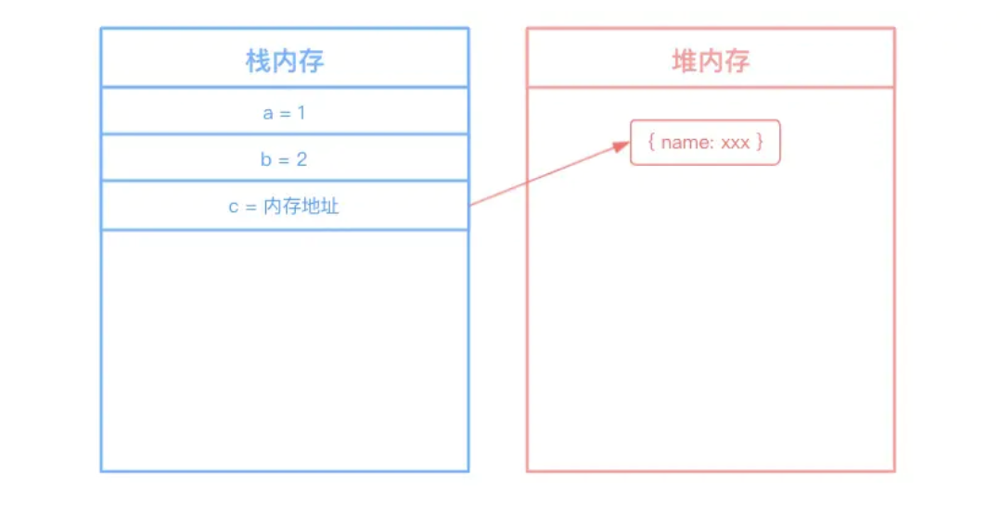

- 栈内存的回收：
  栈内存调用栈上下文切换后就被回收，比较简单

- 堆内存的回收：
  V8 的堆内存分为新生代内存和老生代内存，新生代内存是临时分配的内存，存在时间短，老生代内存存在时间长

### 新生代内存回收机制：

新生代内存容量小，64 位系统下仅有 32M。新生代内存分为 From、To 两部分，进行垃圾回收时，先扫描 From，将非存活对象回收，将存活对象顺序复制到 To 中，之后调换 From/To，等待下一次回收。

1. 分配方式

新生代存的都是生存周期短的对象，分配内存也很容易，只保存一个指向内存空间的指针，根据分配对象的大小递增指针就可以了，当存储空间快要满时，就进行一次垃圾回收。

2. 算法

新生代采用 Scavenge 垃圾回收算法，在算法实现时主要采用 Cheney 算法。

Cheney 算法将内存一分为二，叫做 semispace，一块处于使用状态，一块处于闲置状态。

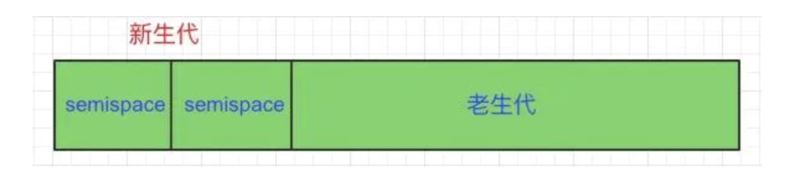

处于使用状态的 semispace 称为 From 空间，处于闲置状态的 semispace 称为 To 空间。

我画了一套详细的流程图，接下来我会结合流程图来详细说明 Cheney 算法是怎么工作的。 垃圾回收在下面我统称为 GC（Garbage Collection）。

1. **在 From 空间中分配了 3 个对象 A、B、C**

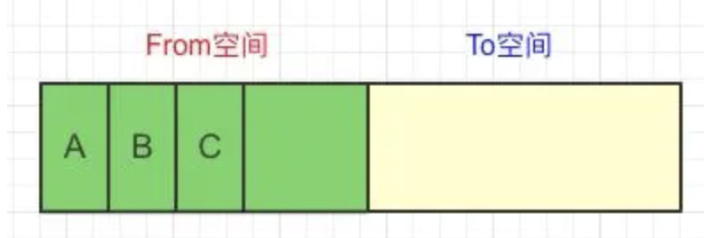

2. **GC 进来判断对象 B 没有其他引用，可以回收，对象 A 和 C 依然为活跃对象**

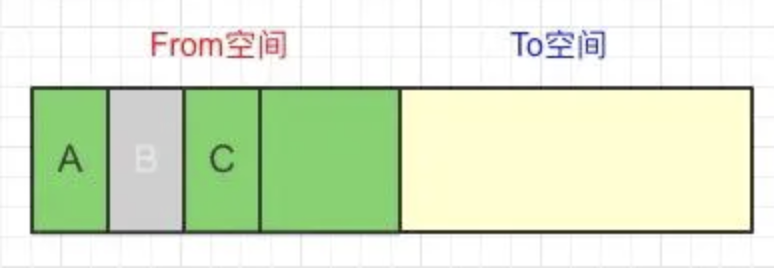

3. **将活跃对象 A、C 从 From 空间复制到 To 空间**

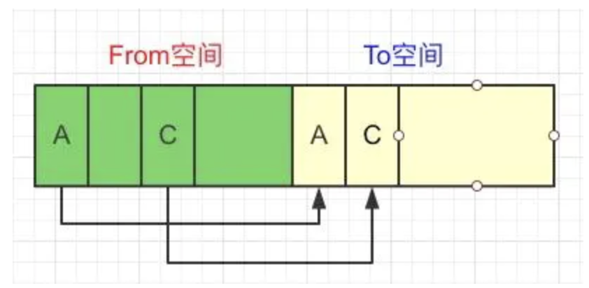

4. **清空 From 空间的全部内存**

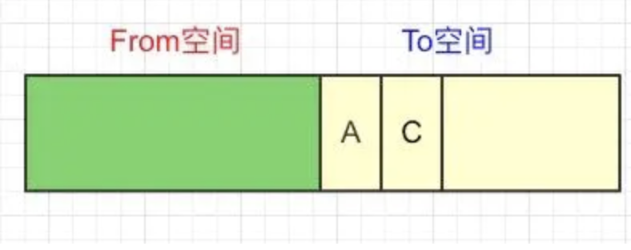

5. **交换 From 空间和 To 空间**

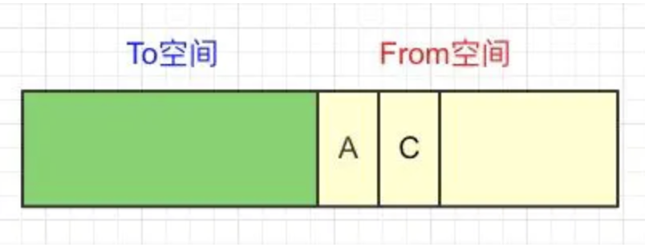

6. **在 From 空间中又新增了 2 个对象 D、E**

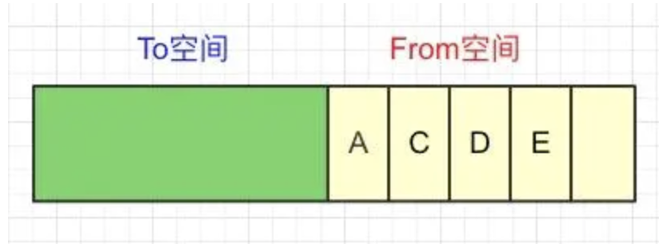

7. **下一轮 GC 进来发现对象 D 没有引用了，做标记**

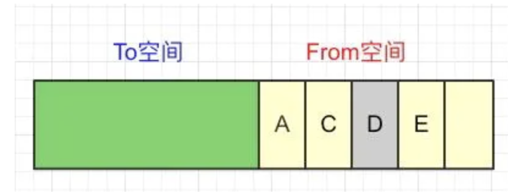

8. **将活跃对象 A、C、E 从 From 空间复制到 To 空间**

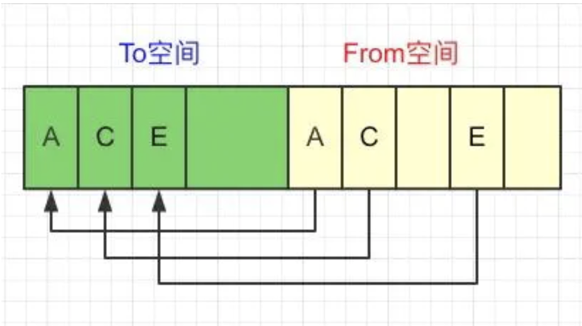

9. **清空 From 空间全部内存**

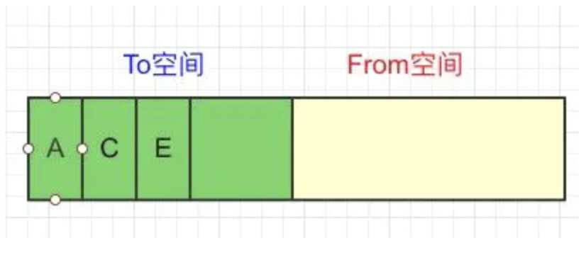

10. **继续交换 From 空间和 To 空间，开始下一轮**

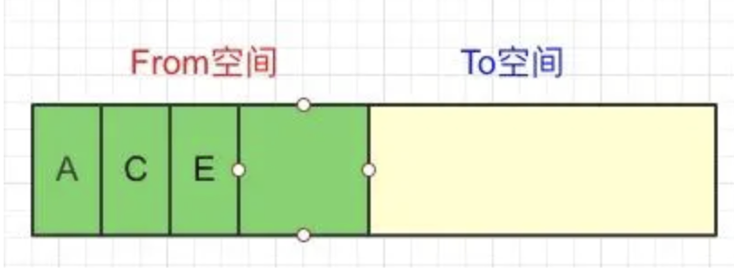

通过上面的流程图，我们可以很清楚的看到，进行 From 和 To 交换，就是为了让活跃对象始终保持在一块 semispace 中，另一块 semispace 始终保持空闲的状态。

Scavenge 由于只复制存活的对象，并且对于生命周期短的场景存活对象只占少部分，所以它在时间效率上有优异的体现。Scavenge 的缺点是只能使用堆内存的一半，这是由划分空间和复制机制所决定的。

由于 Scavenge 是典型的牺牲空间换取时间的算法，所以无法大规模的应用到所有的垃圾回收中。但我们可以看到，Scavenge 非常适合应用在新生代中，因为新生代中对象的生命周期较短，恰恰适合这个算法。

## 晋升

当一个对象经过多次复制仍然存活时，它就会被认为是生命周期较长的对象。这种较长生命周期的对象随后会被移动到老生代中，采用新的算法进行管理。

对象从新生代移动到老生代的过程叫作晋升。

对象晋升的条件主要有两个：

1. 对象从 From 空间复制到 To 空间时，会检查它的内存地址来判断这个对象是否已经经历过一次 Scavenge 回收。如果已经经历过了，会将该对象从 From 空间移动到老生代空间中，如果没有，则复制到 To 空间。总结来说，如果一个对象是第二次经历从 From 空间复制到 To 空间，那么这个对象会被移动到老生代中。
2. 当要从 From 空间复制一个对象到 To 空间时，如果 To 空间已经使用了超过 25%，则这个对象直接晋升到老生代中。设置 25%这个阈值的原因是当这次 Scavenge 回收完成后，这个 To 空间会变为 From 空间，接下来的内存分配将在这个空间中进行。如果占比过高，会影响后续的内存分配。

## 老生代内存回收机制

- 晋升：如果新生代的变量经过多次回收依然存在，那么就会被放入老生代内存中。
- 标记清除：老生代内存会先遍历所有对象并打上标记，然后对正在使用或被强引用的对象取消标记，回收被标记的对象。
- 整理内存碎片：把对象挪到内存的一端。

### 介绍

在老生代中，存活对象占较大比重，如果继续采用 Scavenge 算法进行管理，就会存在两个问题：

1. 由于存活对象较多，复制存活对象的效率会很低。
2. 2.采用 Scavenge 算法会浪费一半内存，由于老生代所占堆内存远大于新生代，所以浪费会很严重。

所以，V8 在老生代中主要采用了 Mark-Sweep 和 Mark-Compact 相结合的方式进行垃圾回收。

### Mark-Sweep

Mark-Sweep 是标记清除的意思，它分为标记和清除两个阶段。

与 Scavenge 不同，Mark-Sweep 并不会将内存分为两份，所以不存在浪费一半空间的行为。Mark-Sweep 在标记阶段遍历堆内存中的所有对象，并标记活着的对象，在随后的清除阶段，只清除没有被标记的对象。

也就是说，Scavenge 只复制活着的对象，而 Mark-Sweep 只清除死了的对象。活对象在新生代中只占较少部分，死对象在老生代中只占较少部分，这就是两种回收方式都能高效处理的原因。

我们还是通过流程图来看一下：

1. **老生代中有对象 A、B、C、D、E、F**

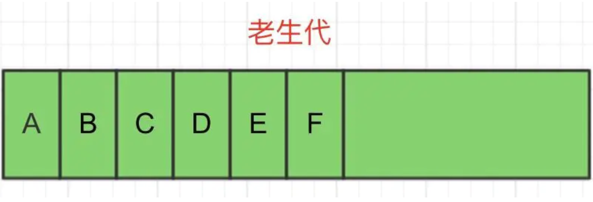

2. **GC 进入标记阶段，将 A、C、E 标记为存活对象**

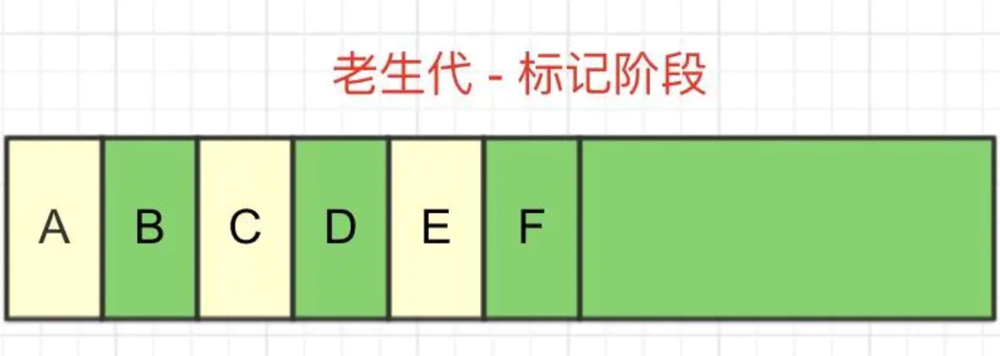

3. **GC 进入清除阶段，回收掉死亡的 B、D、F 对象所占用的内存空间**

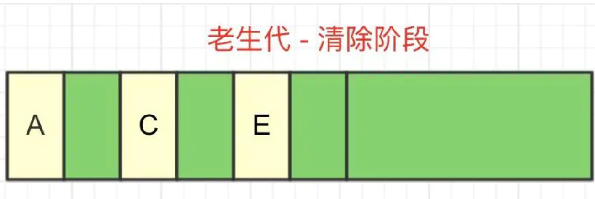

**可以看到，Mark-Sweep 最大的问题就是，在进行一次清除回收以后，内存空间会出现不连续的状态。这种内存碎片会对后续的内存分配造成问题。**

如果出现需要分配一个大内存的情况，由于剩余的碎片空间不足以完成此次分配，就会提前触发垃圾回收，而这次回收是不必要的

### Mark-Compact

为了解决 Mark-Sweep 的内存碎片问题，Mark-Compact 就被提出来了。

**Mark-Compact 是标记整理的意思，**是在 Mark-Sweep 的基础上演变而来的。Mark-Compact 在标记完存活对象以后，会将活着的对象向内存空间的一端移动，移动完成后，直接清理掉边界外的所有内存。如下图所示：

1. **老生代中有对象 A、B、C、D、E、F（和 Mark—Sweep 一样）**

2. **GC 进入标记阶段，将 A、C、E 标记为存活对象（和 Mark—Sweep 一样）**

3. **GC 进入整理阶段，将所有存活对象向内存空间的一侧移动，灰色部分为移动后空出来的空间**

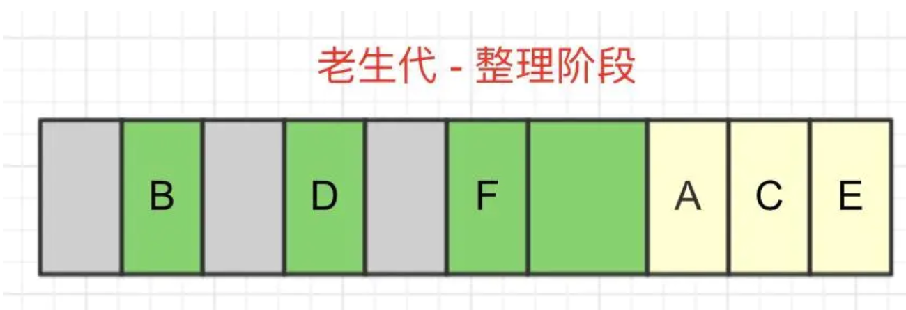

4. **GC 进入清除阶段，将边界另一侧的内存一次性全部回收**

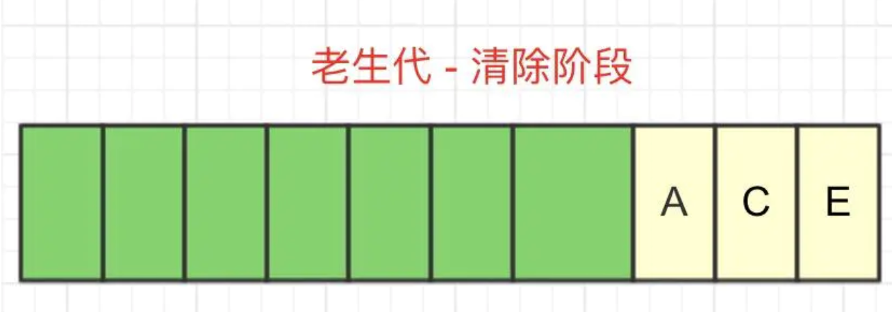

## 两者结合

在 V8 的回收策略中，Mark-Sweep 和 Mark-Conpact 两者是结合使用的。

由于 Mark-Conpact 需要移动对象，所以它的执行速度不可能很快，在取舍上，V8 主要使用 Mark-Sweep，在空间不足以对从新生代中晋升过来的对象进行分配时，才使用 Mark-Compact。

## 总结

V8 的垃圾回收机制分为新生代和老生代。

新生代主要使用 Scavenge 进行管理，主要实现是 Cheney 算法，将内存平均分为两块，使用空间叫 From，闲置空间叫 To，新对象都先分配到 From 空间中，在空间快要占满时将存活对象复制到 To 空间中，然后清空 From 的内存空间，此时，调换 From 空间和 To 空间，继续进行内存分配，当满足那两个条件时对象会从新生代晋升到老生代。

老生代主要采用 Mark-Sweep 和 Mark-Compact 算法，一个是标记清除，一个是标记整理。两者不同的地方是，Mark-Sweep 在垃圾回收后会产生碎片内存，而 Mark-Compact 在清除前会进行一步整理，将存活对象向一侧移动，随后清空边界的另一侧内存，这样空闲的内存都是连续的，但是带来的问题就是速度会慢一些。在 V8 中，老生代是 Mark-Sweep 和 Mark-Compact 两者共同进行管理的。

## 内存结构分配

由于 V8 最开始就是为 JavaScript 在浏览器执行而打造的，不太可能遇到使用大量内存的场景，所以它可以申请的最大内存就没有设置太大，在 64 位系统下大约为 1.4GB，在 32 位系统下大约为 700MB。

在 NodeJS 环境中，我们可以通过**process.memoryUsage()**来查看内存分配

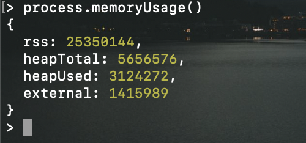

process.memoryUsage 返回一个对象，包含了 Node 进程的内存占用信息。该对象包含四个字段，含义如下:

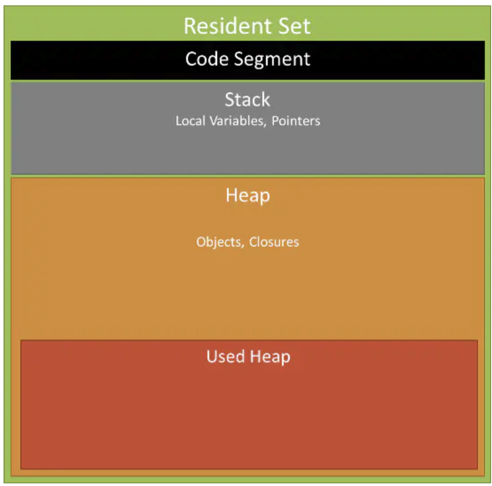

- rss（resident set size）：所有内存占用，包括指令区和堆栈
- heapTotal：V8 引擎可以分配的最大堆内存，包含下面的 heapUsed
- heapUsed：V8 引擎已经分配使用的堆内存
- external： V8 管理 C++对象绑定到 JavaScript 对象上的内存

以上所有内存单位均为字节（Byte）

如果说想要扩大 Node 可用的内存空间，可以使用 Buffer 等堆外内存内存:

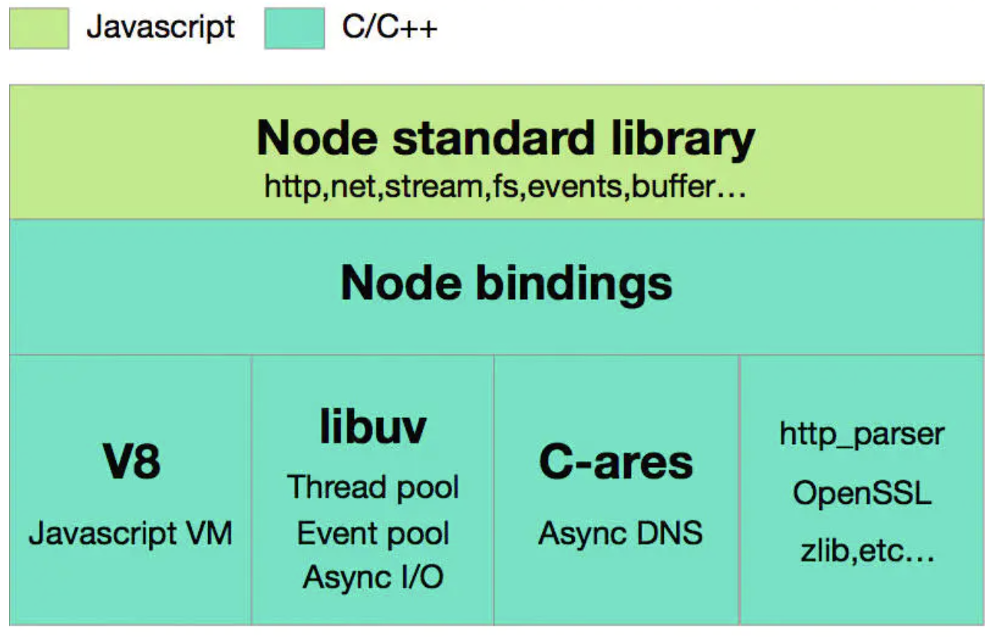

Node Standard Library: 是我们每天都在用的标准库，如 Http, Buffer 模块。

Node Bindings: 是沟通 JS 和 C++的桥梁，封装 V8 和 Libuv 的细节，向上层提供基础 API 服务。

第三层是支撑 Node.js 运行的关键，由 C/C++ 实现：

1. V8 是 Google 开发的 JavaScript 引擎，提供 JavaScript 运行环境，可以说它就是 Node.js 的发动机。
2. Libuv 是专门为 Node.js 开发的一个封装库，提供跨平台的异步 I/O 能力。
3. C-ares：提供了异步处理 DNS 相关的能力。
4. http_parser、OpenSSL、zlib 等：提供包括 http 解析、SSL、数据压缩等其他的能力。
