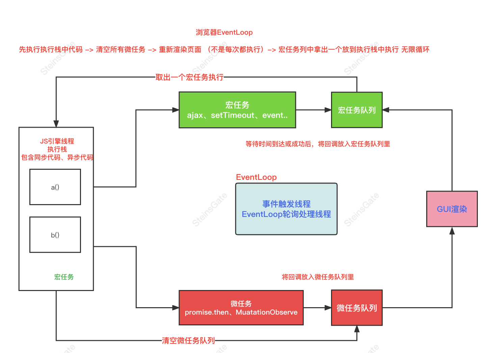
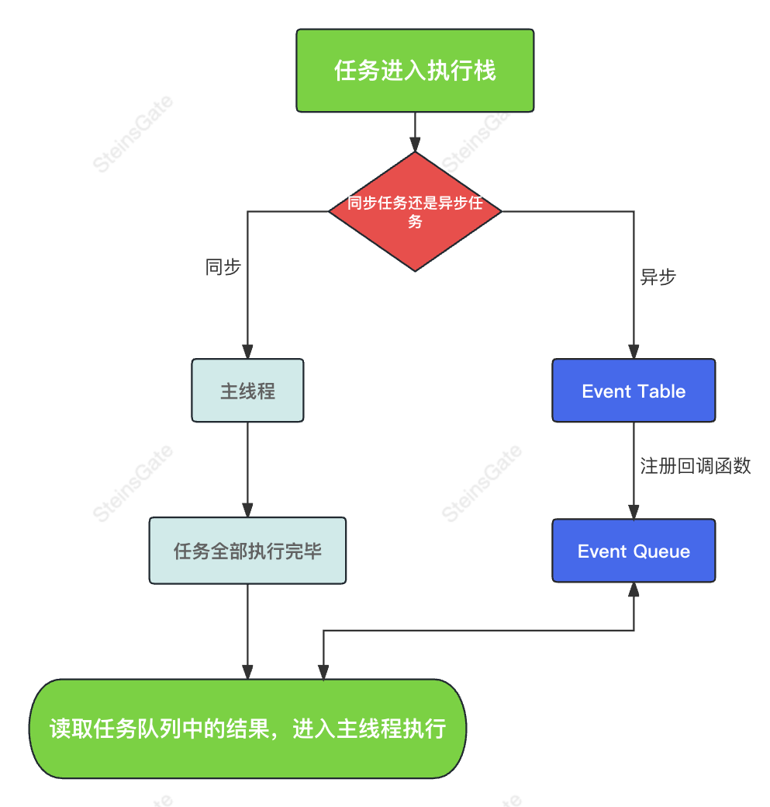

# 事件循环机制

**事件循环机制：event loop 即事件循环，是指浏览器或 Node 的一种解决 javaScript 单线程运行时不会阻塞的一种机制，也就是我们经常使用异步的原理。**

- JavaScript 是一个单进程的语言，同一时间不能处理多个任务，所以何时执行宏任务，何时执行微任务？我们需要有这样的一个判断逻辑存在。

例如：

每办理完一个业务，柜员就会问当前的客户，是否还有其他需要办理的业务。（检查还有没有微任务需要处理）

而客户明确告知说没有事情以后，柜员就去查看后边还有没有等着办理业务的人。（结束本次宏任务、检查还有没有宏任务需要处理）

这个检查的过程是持续进行的，每完成一个任务都会进行一次，而这样的操作就被称为 Event Loop。

## 浏览器中的事件循环

### 主线程、执行栈、任务队列

Javascript 有一个 main thread 主线程 和 call-stack 执行栈。所有的任务都会被放到执行栈等待主线程执行。

#### 执行栈

执行栈是在其它编程语言中所说的“调用栈”，是一种拥有 LIFO（后进先出）数据结构的栈，被用来存储代码运行时创建的所有执行上下文。

（作用域链）当 JavaScript 引擎第一次遇到你的脚本时，它会创建一个全局的执行上下文并且压入当前执行栈。

每当引擎遇到一个函数调用，它会为该函数创建一个新的执行上下文并压入栈的顶部。

引擎会执行那些执行上下文位于栈顶的函数。当该函数执行结束时，执行上下文从栈中弹出，控制流程到达当前栈中的下一个上下文。

#### 任务队列 Task Queue

队列：是一种先进先出的一种数据结构。

### 同步任务和异步任务

Javascript 单线程任务被分为同步任务和异步任务。

1. 同步任务会在执行栈中按照顺序等待主线程依次执行
2. 异步任务会进入 Event Table 并注册函数。
3. 当指定的事情完成时，Event Table 会将这个函数移入任务队列中。等待主线程空闲的时候（执行栈被清空），任务队列的任务按顺序被读取到栈内等待主线程的执行。

如图：

