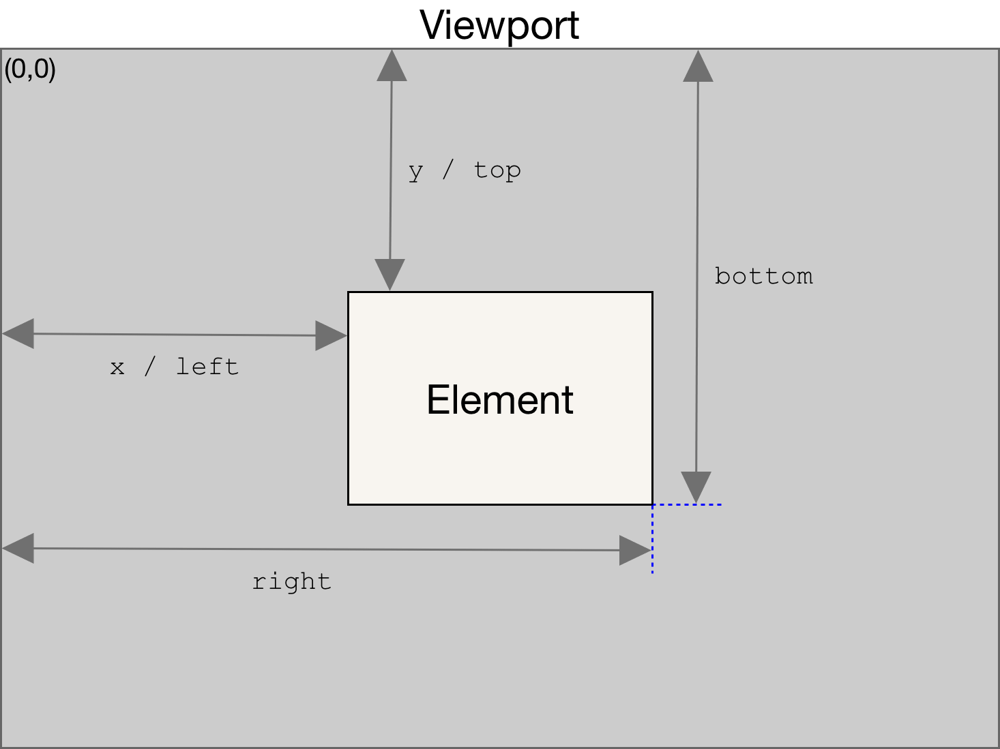

# Html 相关知识

## `Element.getBoundingClientRect()`

`Element.getBoundingClientRect()` 方法返回一个 [<u>`DOMRect`</u>](https://developer.mozilla.org/zh-CN/docs/Web/API/DOMRect) 对象，其提供了元素的大小及其相对于视口的位置。

返回值是一个 `DOMRect` 对象，是包含整个元素的最小矩形（包括 `padding` 和 `border-width`）。该对象使用 `left`、`top`、`right`、`bottom`、`x`、`y`、`width` 和 `height` 这几个以像素为单位的只读属性描述整个矩形的位置和大小。

除了 `width` 和 `height` 以外的属性是相对于视图窗口的左上角来计算的。



> 举个 🌰 两个 `div` 在不断移动，碰撞检测

```js
function isCollision(div1, div2) {
  const rect1 = div1.getBoundingClientRect()
  const rect2 = div2.getBoundingClientRect()

  return !(
    (
      rect1.right < rect2.left || // div1 在 div2 的左侧
      rect1.left > rect2.right || // div1 在 div2 的右侧
      rect1.bottom < rect2.top || // div1 在 div2 的上方
      rect1.top > rect2.bottom
    ) // div1 在 div2 的下方
  )
}

const div1 = document.getElementById('div1')
const div2 = document.getElementById('div2')

setInterval(() => {
  if (isCollision(div1, div2)) {
    console.log('碰撞发生')
  }
}, 100) // 每 100ms 检查一次碰撞
```

::: info 相关资料

- [<u>getBoundingClientRect | MDN</u>](https://developer.mozilla.org/zh-CN/docs/Web/API/Element/getBoundingClientRect)

:::
