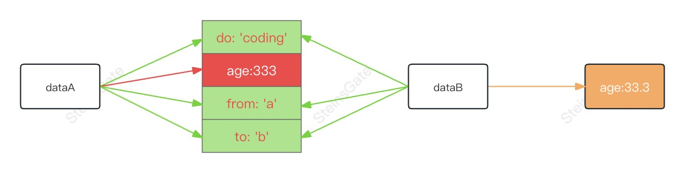
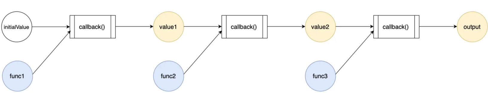

# 函数式编程

## 纯函数

- 对于相同的输入，总是会得到相同的输出
- 在执行过程中没有语义上可观察的副作用

:::tip
输入只能够以参数形式传入，输出只能够以返回值形式传递，除了入参和返回值之外，不以任何其它形式和外界进行数据交换的函数。
:::

### 副作用

函数副作用指当调用函数时，除了返回可能的函数值之外，还对主调用函数产生附加的影响

> 如果一个函数除了计算之外，还对它的执行上下文、执行宿主等外部环境造成了一些其它的影响，那么这些影响就是所谓的”副作用”。

## 函数的`纯`与`不纯`

`纯`的本质——有且仅有【显式数据流】

### 显示数据流

纯函数：输入输出数据流全是显式`（Explicit）`的函数

显示数据流：显式数据流意味着函数除了入参和返回值之外，不以任何其它形式与外界进行数据交换。

`不纯`的元凶——隐式数据流，代表着函数和外界存在数据交换。

## 函数是一等公民

> 如果一门编程语言将函数当做一等公民对待，那么这门语言被称作“拥有头等函数

- 可以被当作参数传递给其他函数
- 可以作为另一个函数的返回值
- 可以被赋值给一个变量

## 不可变的值，可变的引用内容

值类型的数据无法被修改，像数字类型这样，自创建起就无法再被修改的数据，我们称其为`不可变数据`。

```js
let a = 1
let b = a

// true
a === b

b = 2

// false
a === b
```

创建后仍然可以被修改的数据，我们称其为`可变数据`。

```js
const a = {
  name: 'xiuyan',
  age: 30,
}

const b = a

// true
a === b

b.name = 'youhu'

// true
a === b
```

## 如何实现不可变数据

要想写出好的函数式代码，就需要确保数据的不可变性。

### `const`

`const` 只能够保证值类型数据的不变性，却不能够保证引用类型数据的不变性。

```js
const price = 10

price = 20 // Uncaught TypeError: Assignment to constant variable.
```

`const` 生下来就是专门阻止你做 `reassign` 这个动作的，但对于引用类型来说，就算堵住了 `reassign`，也不影响我们修改数据的内容，因此，对于存储值类型数据的变量来说，`const` 确实能够确保其内容的不变性。

```js
const my = {
  name: 'steins gate',
  age: 28,
}

// 这一行不会报错
me.age = 18

console.log(my)
```

### 拷贝

拷贝的目的：确保外部数据的只读性。

对于函数式编程来说，函数的外部数据是只读的，函数的内部数据则是可写的。

对于一个函数来说，”外部数据“可以包括全局变量、文件系统数据、数据库数据、网络层数据等。有且仅有这些外部数据，存在【只读】的必要。

> 注：由于纯函数只能通过参数获取数据，因此如果需要使用外部数据，就必须将其作为参数传递给函数。

### `Immutable.js`

持久化数据结构的精髓同样在于“数据共享”。

数据共享意味着将“变与不变”分离，确保只有变化的部分被处理，而不变的部分则将继续留在原地、被新的数据结构所复用。

不同的是，在 `git` 世界里，这个“变与不变”的区分是文件级别的；而在 `Immutable.js` 的世界里，这个“变与不变”可以细化到数组的某一个元素、对象的某一个字段。

举个 🌰：

```js
const dataA = Map({
  do: 'coding',
  age: 333,
  from: 'a',
  to: 'b',
})
```

```js
// 使用 immutable 暴露的 Api 来修改 baseMap 的内容
const dataB = dataA.set({
  age: 33.3,
})
```



为了达到这种“数据共享”的效果，持久化数据结构在底层依赖了一种经典的基础数据结构，那就是 `Trie`(字典树）

### `Immer.js`

**API**

```js
import produce from 'immer'

// 这是我的源数据
const baseState = [
  {
    name: 'steins gate',
    age: 99,
  },
  {
    name: 'azzlzzxz',
    age: 100,
  },
]

// 定义数据的写逻辑
const recipe = (draft) => {
  draft.push({ name: 'person', age: 101 })
  draft[1].age = 102
}

// 借助 produce，执行数据的写逻辑
const nextState = produce(baseState, recipe)
```

- `(base)state`：源数据，是我们想要修改的目标数据
- `recipe`：一个函数，我们可以在其中描述数据的写逻辑
- ` draft` ：`recipe ` 函数的默认入参，它是对源数据的代理，我们可以把想要应用在源数据的变更应用在 `draft` 上
- `produce`：入口函数，它负责把上述要素串起来。具体逻辑请看下文分解。

---

`Immer.js` 实现 `Immutability` 的姿势非常有趣——它使用 `Proxy`，对目标对象的行为进行“元编程”。

> `Proxy` 对象用于创建一个对象的代理，从而实现基本操作的拦截和自定义（如属性查找、赋值、枚举、函数调用等）。 ——MDN

`Immer.js` 的一切奥秘都蕴含在 `produce` 里，包括其对 `Proxy` 的运用。

那么 `produce` 是如何工作的呢？

`Immer.js` 的源代码虽然简洁，但整个读完也是个力气活。这里我们只关注 `produce` 函数的核心逻辑，我将其提取为如下的极简版本：

```js
function produce(base, recipe) {
  // 预定义一个 copy 副本
  let copy
  // 定义 base 对象的 proxy handler
  const baseHandler = {
    set(obj, key, value) {
      // 先检查 copy 是否存在，如果不存在，创建 copy
      if (!copy) {
        copy = { ...base }
      }
      // 如果 copy 存在，修改 copy，而不是 base
      copy[key] = value
      return true
    },
  }

  // 被 proxy 包装后的 base 记为 draft
  const draft = new Proxy(base, baseHandler)
  // 将 draft 作为入参传入 recipe
  recipe(draft)
  // 返回一个被“冻结”的 copy，如果 copy 不存在，表示没有执行写操作，返回 base 即可
  // “冻结”是为了避免意外的修改发生，进一步保证数据的纯度
  return Object.freeze(copy || base)
}
```

```js
// 这是我的源对象
const baseObj = {
  a: 1,
  b: {
    name: 'azzlzzxz',
  },
}

// 这是一个执行写操作的 recipe
const changeA = (draft) => {
  draft.a = 2
}

// 这是一个不执行写操作、只执行读操作的 recipe
const doNothing = (draft) => {
  console.log('doNothing function is called, and draft is', draft)
}

// 借助 produce，对源对象应用写操作，修改源对象里的 a 属性
const changedObjA = produce(baseObj, changeA)

// 借助 produce，对源对象应用读操作
const doNothingObj = produce(baseObj, doNothing)

// 顺序输出3个对象，确认写操作确实生效了
console.log(baseObj)
console.log(changedObjA)
console.log(doNothingObj)

// 【源对象】 和 【借助 produce 对源对象执行过读操作后的对象】 还是同一个对象吗？
// 答案为 true
console.log(baseObj === doNothingObj)
// 【源对象】 和 【借助 produce 对源对象执行过写操作后的对象】 还是同一个对象吗？
// 答案为 false
console.log(baseObj === changedObjA)
// 源对象里没有被执行写操作的 b 属性，在 produce 执行前后是否会发生变化？
// 输出为 true，说明不会发生变化
console.log(baseObj.b === changedObjA.b)
```

:::tip
`Produce` 工作原理：将拷贝操作精准化，只要写操作没执行，拷贝动作就不会发生，逐层拷贝。

`produce` 借助 `Proxy`，将拷贝动作发生的时机和 `setter` 函数的触发时机牢牢绑定，确保了拷贝动作的精确性。 而逐层的浅拷贝，则间接地实现了数据在新老对象间的共享。

在 `Immer.js` 中，完整版 `produce` 的浅拷贝其实是可递归的。
:::

## 高阶函数 `HOF`

高阶函数，指的就是接收函数作为入参（回调），或者将函数作为出参返回的函数（闭包）。

```js
// 装饰器模式  （对原本的功能进行包装）  切片编程
function core(a, b, c) {
  console.log('core。。。。', a, b, c)
}

// 每个类都有一个原型， 所有实例都有一个属性__proto__
Function.prototype.before = function (beforeFn) {
  // this = core // this的指向 就是看调用者
  // 这里return的就是newFn函数
  return (...args) => {
    // 箭头函数中没有this 没有arguments 没有prototype
    beforeFn() // 先调用() => {console.log('core before')} 从而不会影响core的逻辑
    this(...args) // 用箭头函数是为了让，这里this指向core
  }
}

let newFn = core.before(() => {
  console.log('core before')
})

newFn(1, 2, 3)
// core before
// core。。。。 1 2 3
```

:::tip
闭包：定义函数的作用域 和 调用的作用域不是同一个。

在 Function.prototype.before 里定义了函数（return 的函数），但是在外面调用（newFn），就形成闭包。
:::

---

**实现声明式的数据流，除了借助链式调用，还可以借助函数组合。**

## 链式调用

`map()`、`reduce()`、`filter()` 这些方法之间，之所以能够进行链式调用，是因为：

- 它们都挂载在 `Array` 原型的 `Array.prototype` 上。
- 它们在计算结束后都会 `return` 一个新的 `Array`。
- 既然 `return` 出来的也是 `Array`，那么自然可以继续访问原型 `Array.prototype` 上的方法。

也就是说，链式调用是有前提的。

链式调用的本质 ，是通过在方法中返回对象实例本身的 `this`/ 与实例 `this` 相同类型的对象，达到多次调用其原型（链）上方法的目的。

要对函数执行链式调用，前提是函数挂载在一个靠谱的宿主 `Object` 上。

## 函数组合



### `pipe`

```js
function pipe(funcs) {
  function callback(input, func) {
    return func(input)
  }

  return function (param) {
    return funcs.reduce(callback, param)
  }
}
```

简化后 👇

```js
function pipe(...fns) {
  return function (param) {
    return fns.reduce((acc, cur) => cur(acc), param)
  }
}
```

### `compose`

```js
function compose(...funcs) {
  function callback(input, func) {
    return func(input)
  }

  return function (param) {
    return funcs.reduceRight(callback, param)
  }
}
```

## 函数柯里化

柯里化函数在偏函数的基础上，不仅减少了函数入参个数，还改变了函数执行次数。其含义就是将一个接收 `N` 个入参的函数，改写为接受一个入参，并返回接受剩余 `N-1 `个参数的函数。也就是：

```js
fn(1,2,3) => fn(1)(2)(3)
```

实现一个柯里化函数也是面试高频内容，其实如果规定了函数入参个数，那么是很容易实现的。例如对于入参个数为 3 的函数，实现如下：

```js
const curry = (fn) => (arg1) => (arg2) => (arg3) => fn(arg1, arg2, arg3)

const fn = (a, b, c) => console.log(a, b, c)

curry(fn)(1)(2)(3) // 1 2 3
```

那么实现通用的 `curry` 函数的关键就在于：

- 自动判断函数入参
- 自我递归调用

```js
const curry = (fn) => {
  const argLen = fn.length // 原函数的入参个数
  const recursion = (args) =>
    args.length >= argLen ? fn(...args) : (newArg) => recursion([...args, newArg])
  return recursion([])
}
```

## 偏函数

偏函数的定义简单来说就是，将函数转换为参数更少的函数，也就是为其预设参数。

```sh
从 fn(arg1, arg2) 到 fn(arg1)
```
