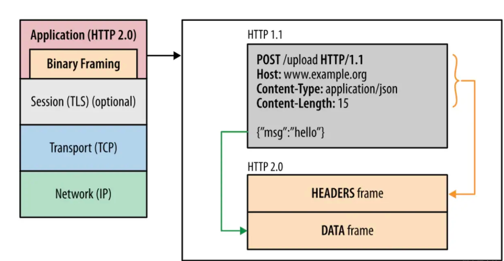
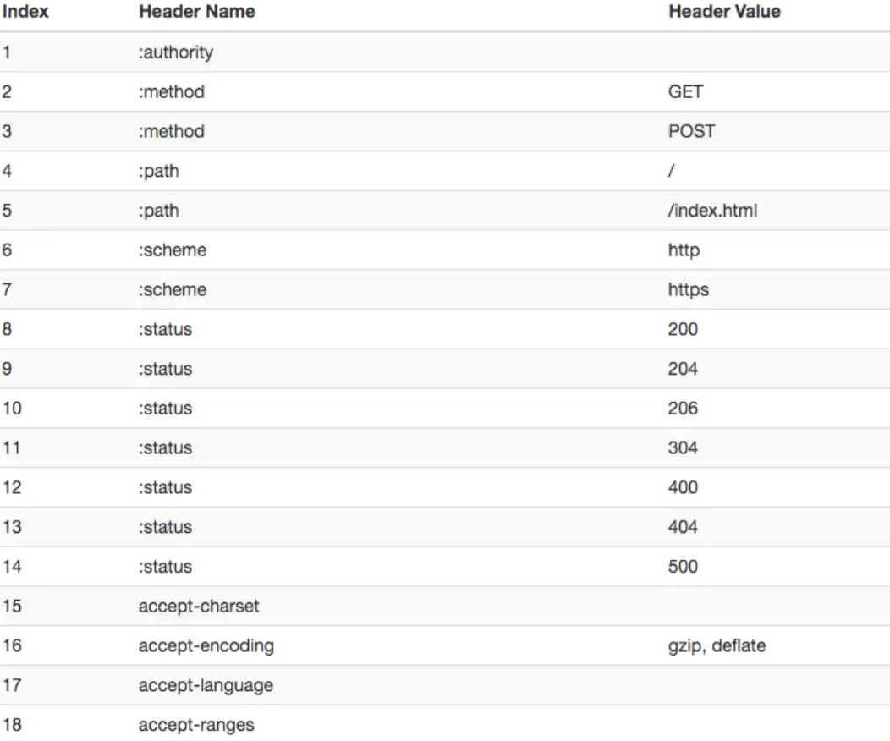
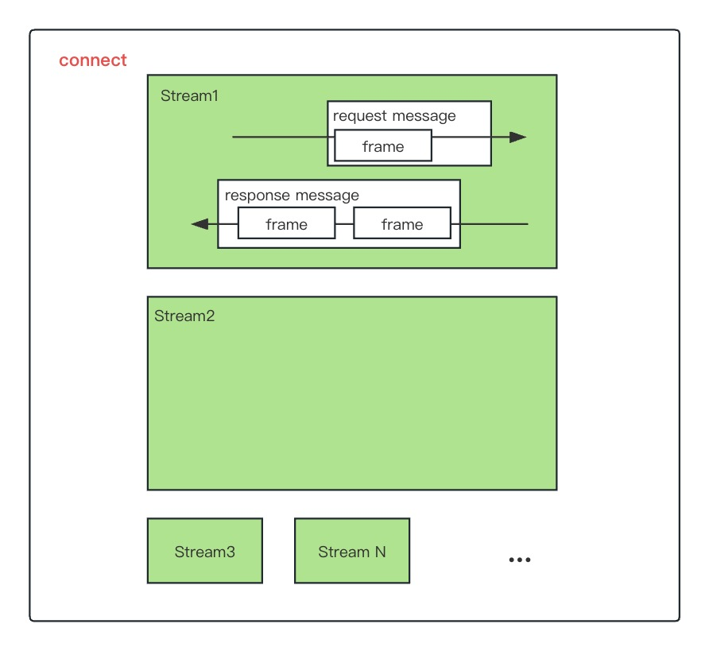
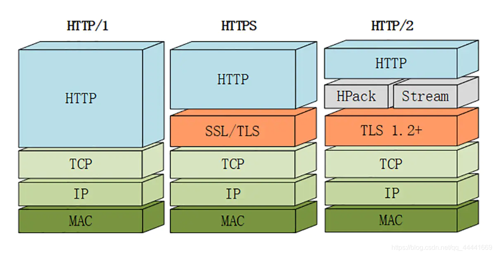
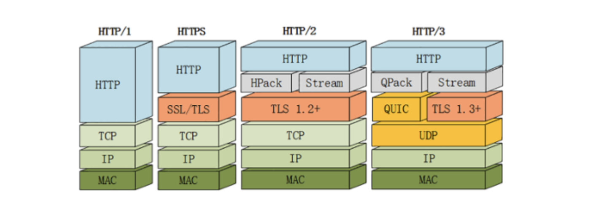

# HTTP 协议

## http/0.9 - 单行协议

http 于 1990 年问世，那时候 http 非常简单：只支持 GET 方法；没有首部；只能获取纯文本。

## http/1.0 - 搭建协议的框架

1996 年，http 正式被作为标准公布，版本为 http/1.0。1.0 版本增加了首部、状态码、权限、缓存、长连接（默认短连接）等规范，可以说搭建了协议的基本框架。

缺陷：无法复用链接，完成即断开，重新慢启动和 TCP 3 次握手。

## http/1.1 - 进一步完善

1997 年，1.1 版本接踵而至。1.1 版本的重大改进在于默认长连接；强制客户端提供 Host 首部；管线化；Cache-Control、ETag 等缓存的相关扩展。

### http/1.1 存在有哪些问题：

1. 线头阻塞：TCP 连接上只能发送一个请求，前面的请求未完成前，后续的请求都在排队等待。
   针对队头阻塞,人们尝试过以下办法来解决：

   - 同一页面的资源分散到不同域名下，提升连接上限。

     Chrome 有个机制，对于同一个域名，默认允许同时建立 6 个 TCP 持久连接，使用持久连接时，虽然能公用一个 TCP 管道，但是在一个管道中同一时刻只能处理一个请求，在当前的请求没有结束之前，其他的请求只能处于阻塞状态。另外如果在同一个域名下同时有 10 个请求发生，那么其中 4 个请求会进入排队等待状态，直至进行中的请求完成（chrome 放弃了）

   - 合并小文件减少资源数。

     精灵图，Spriting 合并多张小图为一张大图,再用 JavaScript 或者 CSS 将小图重新“切割”出来的技术。

   - 内联(Inlining)资源是另外一种防止发送很多小图请求的技巧，将图片的原始数据嵌入在 CSS 文件里面的 URL 里，减少网络请求次数。

   - 减少请求数量。

     拼接(Concatenation)将多个体积较小的 JavaScript 使用 webpack 等工具打包成 1 个体积更大的 JavaScript 文件,但如果其中 1 个文件的改动就会导致大量数据被重新下载多个文件。

2. 多个 TCP 连接

虽然 http/1.1 管线化可以支持请求并发，所以 1.1 版本请求并发依赖于多个 TCP 连接，建立 TCP 连接成本很高，还会存在慢启动的问题。

3. 头部冗余，采用文本格式

- http/1.x 版本是采用文本格式，首部未压缩，而且每一个请求都会带上 cookie、user-agent 等完全相同的首部。
- 无状态是指协议对于连接状态没有记忆能力。纯净的 http 是没有 cookie 等机制的，每一个连接都是一个新的连接。
- 由于报文 Header 一般会携带"User Agent"、"Cookie"、"Accept"、"Server"等许多固定的头字段，多达几百字节甚至上千字节，但 Body 却经常只有几十字节（比如 GET 请求、204/301/304 响应），成了不折不扣的“大头儿子”。Header 里携带的内容过大，在一定程度上增加了传输的成本。更要命的是，请求响应报文里有大量字段值都是重复的，非常浪费。

4. 客户端需要主动请求
5. http/1.1 在传输数据时，所有传输的内容都是明文内容都是明文，客户端和服务器端都无法验证对方的身份，这在一定程度上无法保证数据的安全性。

## http/2

2015 年，http/2 发布。http/2 是现行 http 协议（http/1.x）的替代，但它不是重写，http 方法/状态码/语义都与 http/1.x 一样。
http/2 基于 SPDY，专注于性能，最大的一个目标是在用户和网站间只用一个连接（connection） 。从目前的情况来看，国内外一些排名靠前的站点基本都实现了 http/2 的部署，使用 http/2 能带来 20%~60%的效率提升。

http/2 由两个规范（Specification）组成：

- Hypertext Transfer Protocol version 2 - RFC7540
- HPACK - Header Compression for http/2 - RFC7541

**http/2 传输数据量的大幅减少,主要有两个原因:以二进制方式传输和 Header 压缩。**

### 二进制分帧层

http/2 是二进制协议，他采用二进制格式传输数据而不是 1.x 的文本格式。

👆 的图中很清晰的表达了 http/1.1 的响应和 2.0 的区别。
1.1 响应是文本格式，而 2.0 把响应划分成了两个帧，图中的 HEADERS（首部）和 DATA（消息负载） 是帧的类型。也就是说一条 http 响应，划分成了两个帧来传输，并且采用二进制来编码。

这里我们来提三个概念。

- 流（Stream）：已建立的 TCP 连接上的双向字节流，可以承载一个或多个消息。
- 消息（Message）：一个完整的 http 请求或响应，由一个或多个帧组成。特定消息的帧在同一个流上发送，这意味着一个 http 请求或响应只能在一个流上发送。
- 帧（Frame）：通信的基本单位。

一个 TCP 连接上可以有任意数量的流。

### 头部压缩

在 1.x 版本中，首部用文本格式传输，通常会给每个传输增加 500-800 字节的开销。现在打开一个网页上百个请求已是常态，而每个请求带的一些首部字段都是相同的，例如 cookie、user-agent 等。

http/2 为此采用 HPACK 压缩格式来压缩首部。头部压缩需要在浏览器和服务器端之间：

- 维护一份相同的静态字典，包含常见的头部名称，以及常见的头部名称和值的组合。
- 维护一份相同的动态字典，可以动态的添加内容。
- 通过静态 Huffman 编码对传输的首部字段进行编码。

http2 的静态字典是长这个样子的（只截取了部分）：

所以我们在传输首部字段的时候，例如要传输 method:GET,那我们只需要传输静态字典里面 method:GET 对应的索引值就可以了，一个字节搞定。

像 user-agent、cookie 这种静态字典里面只有首部名称而没有值的首部，第一次传输需要 user-agent 在静态字典中的索引以及他的值，值会采用静态 Huffman 编码来减小体积。

第一次传输过 user-agent 之后呢，浏览器和服务器端就会把它添加到自己的动态字典中。后续传输就可以传输索引了，一个字节搞定。

### 多路复用

在 http/2 中:

- **同域名下所有通信都在单个连接上完成。**
- **单个连接可以承载任意数量的双向数据流。**
- **数据流以消息的形式发送，而消息又由一个或多个帧组成，多个帧之间可以乱序发送，因为根据帧首部的流标识可以重新组装。**

这一特性，使性能有了极大提升：

- 同个域名只需要占用一个 TCP 连接，使用一个连接并行发送多个请求和响应,这样整个页面资源的下载过程只需要一次慢启动，同时也避免了多个 TCP 连接竞争带宽所带来的问题。
- 并行交错地发送多个请求/响应，请求/响应之间互不影响。
- 在 http/2 中，每个请求都可以带一个 31bit 的优先值，0 表示最高优先级， 数值越大优先级越低。有了这个优先值，客户端和服务器就可以在处理不同的流时采取不同的策略，以最优的方式发送流、消息和帧。

:::tip
多路复用的技术可以只通过一个 TCP 连接就可以传输所有的请求数，但是还是会有请求排队现象。

一个 TCP 连接可以有任意数量的流，也就是同时可以并发任意数量的请求啊，为啥还会排队呢？

原因就是请求太多时，浏览器或服务器会受不了，这超出了它的处理能力。

流控制帮我们解决了这个问题，流控制会管理数据的传输，允许接收者停止或减少发送的数据量，免得接收方不堪重负。

所以请求太多时，还是会存在排队等待的问题，因为不管是客户端或服务器端，能同时处理请求或响应都是有限的。
:::

### 服务端推送

服务器端推送使得服务器可以预测客户端需要的资源，主动推送到客户端。

例如：客户端请求 index.html，服务器端能够额外推送 script.js 和 style.css。 实现原理就是客户端发出页面请求时，服务器端能够分析这个页面所依赖的其他资源，主动推送到客户端的缓存，当客户端收到原始网页的请求时，它需要的资源已经位于缓存。

针对每一个希望发送的资源，服务器会发送一个 PUSH_PROMISE 帧，客户端可以通过发送 RST_STREAM 帧来拒绝推送（当资源已经位于缓存）。

这一步的操作先于父响应（index.html），客户端了解到服务器端打算推送哪些资源，就不会再为这些资源创建重复请求。当客户端收到 index.html 的响应时，script.js 和 style.css 已经位于缓存。

### 提高安全性

出于兼容的考虑，http/2 延续了 http/1 的“明文”特点，可以像以前一样使用明文传输数据，不强制使用加密通信，不过格式还是二进制，只是不需要解密。

但由于 https 已经是大势所趋，而且主流的浏览器 Chrome、Firefox 等都公开宣布只支持加密的 http/2，所以“事实上”的 http/2 是加密的。

也就是说，互联网上通常所能见到的 http/2 都是使用"https”协议名，跑在 TLS 上面。http/2 协议定义了两个字符串标识符：“h2"表示加密的 http/2，“h2c”表示明文的 http/2。

### http2 的问题

主要是底层支撑的 TCP 协议造成的。http/2 的缺点主要有以下几点：

- TCP 以及 TCP+TLS 建立连接的延时
- TCP 的队头阻塞并没有彻底解决
- 多路复用导致服务器压力上升
- 多路复用容易 Timeout

1. 建连延时
   http/2 都是使用 TCP 协议来传输的，而如果使用 https 的话，还需要使用 TLS 协议进行安全传输，而使用 TLS 也需要一个握手过程，这样就需要有两个握手延迟过程：
   ① 在建立 TCP 连接的时候，需要和服务器进行三次握手来确认连接成功，即需要消耗完 1.5 个 RTT 之后才能进行数据传输。
   ② 进行 TLS 连接，TLS 有两个版本——TLS1.2 和 TLS1.3，每个版本建立连接所花的时间不同，大致是需要 1~2 个 RTT。

总之，在传输数据之前，我们需要花掉 3 ～ 4 个 RTT。

> RTT（Round-Trip Time）:往返时延。表示从发送端发送数据开始，到发送端收到来自接收端的确认（接收端收到数据后便立即发送确认），总共经历的时延。

2. 队头阻塞没有彻底解决
   上文我们提到在 http/2 中，多个请求是跑在一个 TCP 管道中的。

   但当出现了丢包时，http/2 的表现反倒不如 http/1 了。

   因为 TCP 为了保证可靠传输，有个特别的“丢包重传”机制，丢失的包必须要等待重新传输确认，http/2 出现丢包时，整个 TCP 都要开始等待重传，那么就会阻塞该 TCP 连接中的所有请求（如下图）。而对于 http/1.1 来说，可以开启多个 TCP 连接，出现这种情况反到只会影响其中一个连接，剩余的 TCP 连接还可以正常传输数据。

3. 多路复用导致服务器压力上升

多路复用没有限制同时请求数。请求的平均数量与往常相同，但实际会有许多请求的短暂爆发，导致瞬时 QPS 暴增。

4. 多路复用容易 Timeout

大批量的请求同时发送，由于 http2 连接内存在多个并行的流，而网络带宽和服务器资源有限，每个流的资源会被稀释，虽然它们开始时间相差更短，但却都可能超时。

即使是使用 Nginx 这样的负载均衡器，想正确进行节流也可能很棘手。 其次，就算你向应用程序引入或调整排队机制，但一次能处理的连接也是有限的。如果对请求进行排队，还要注意在响应超时后丢弃请求，以避免浪费不必要的资源。

## http3

Google 在推 SPDY 的时候就已经意识到了这些问题，于是就另起炉灶搞了一个基于 UDP 协议的“QUIC”协议，让 http 跑在 QUIC 上而不是 TCP 上。

而这个“http over QUIC”就是 http 协议的下一个大版本，http/3。它在 http/2 的基础上又实现了质的飞跃，真正“完美”地解决了“队头阻塞”问题。

QUIC 虽然基于 UDP，但是在原本的基础上新增了很多功能，接下来我们重点介绍几个 QUIC 新功能。不过 http/3 目前还处于草案阶段，正式发布前可能会有变动，所以本文尽量不涉及那些不稳定的细节。

### QUIC 新功能

QUIC 基于 UDP，而 UDP 是“无连接”的，根本就不需要“握手”和“挥手”，所以就比 TCP 来得快。

此外 QUIC 也实现了可靠传输，保证数据一定能够抵达目的地。

它还引入了类似 http/2 的“流”和“多路复用”，单个“流"是有序的，可能会因为丢包而阻塞，但其他“流”不会受到影响。具体来说 QUIC 协议有以下特点：

### 实现了类似 TCP 的流量控制、传输可靠性的功能

虽然 UDP 不提供可靠性的传输，但 QUIC 在 UDP 的基础之上增加了一层来保证数据可靠性传输。它提供了数据包重传、拥塞控制以及其他一些 TCP 中存在的特性。

QUIC 协议到底改进在哪些方面呢？主要有如下几点：

- 可插拔 — 应用程序层面就能实现不同的拥塞控制算法。
- 单调递增的 Packet Number — 使用 Packet Number 代替了 TCP 的 seq。
- 不允许 Reneging — 一个 Packet 只要被 Ack，就认为它一定被正确接收。
- 前向纠错（FEC）
- 更多的 Ack 块和增加 Ack Delay 时间。
- 基于 stream 和 connection 级别的流量控制。

### 实现了快速握手功能

由于 QUIC 是基于 UDP 的，所以 QUIC 可以实现使用 0-RTT 或者 1-RTT 来建立连接，这意味着 QUIC 可以用最快的速度来发送和接收数据，这样可以大大提升首次打开页面的速度。

**0RTT 建连可以说是 QUIC 相比 http2 最大的性能优势。**

### 集成了 TLS 加密功能

目前 QUIC 使用的是 TLS1.3，相较于早期版本 TLS1.3 有更多的优点，其中最重要的一点是减少了握手所花费的 RTT 个数。

在完全握手情况下，需要 1-RTT 建立连接。 TLS1.3 恢复会话可以直接发送加密后的应用数据，不需要额外的 TLS 握手，也就是 0-RTT。

但是 TLS1.3 也并不完美。TLS 1.3 的 0-RTT 无法保证前向安全性(Forward secrecy)。简单讲就是，如果当攻击者通过某种手段获取到了 Session Ticket Key，那么该攻击者可以解密以前的加密数据。

要缓解该问题可以通过设置使得与 Session Ticket Key 相关的 DH 静态参数在短时间内过期（一般几个小时）。

### 多路复用，彻底解决 TCP 中队头阻塞的问题

和 TCP 不同，QUIC 实现了在同一物理连接上可以有多个独立的逻辑数据流（如下图）。实现了数据流的单独传输，就解决了 TCP 中队头阻塞的问题。

### 连接迁移

TCP 是按照 4 要素（客户端 IP、端口, 服务器 IP、端口）确定一个连接的。

而 QUIC 则是让客户端生成一个 Connection ID （64 位）来区别不同连接。

只要 Connection ID 不变，连接就不需要重新建立，即便是客户端的网络发生变化。由于迁移客户端继续使用相同的会话密钥来加密和解密数据包，QUIC 还提供了迁移客户端的自动加密验证。

## http & https

- http：是一个客户端和服务器端请求和应答的标准（TCP），用于从 WWW 服务器传输超文本到本地浏览器的超文本传输协议。

- https：是以安全为目标的 http 通道，即 http 下 加入 SSL 层进行加密。其作用是：建立一个信息安全通道，来确保数据的传输，确保网站的真实性。

### http 和 https 的区别及优缺点

- http 是超文本传输协议，信息是明文传输，https 协议要比 http 协议安全，https 是具有安全性的 ssl 加密传输协议，可防止数据在传输过程中被窃取、改变，确保数据的完整性(当然这种安全性并非绝对的，对于更深入的 Web 安全问题，此处暂且不表)。
- http 协议的默认端口为 80，https 的默认端口为 443。
- http 的连接很简单，是无状态的。https 握手阶段比较费时，会使页面加载时间延长 50%，增加 10%~20%的耗电。
- https 缓存不如 http 高效，会增加数据开销。
- https 协议需要 ca 证书，费用较高，功能越强大的证书费用越高。
- SSL 证书需要绑定 IP，不能再同一个 IP 上绑定多个域名，IPV4 资源支持不了这种消耗。

### https 协议的工作原理

客户端在使用 https 方式与 Web 服务器通信时有以下几个步骤：

- 客户端使用 https url 访问服务器，则要求 web 服务器建立 ssl 链接。
- web 服务器接收到客户端的请求之后，会将网站的证书（证书中包含了公钥），传输给客户端。
- 客户端和 web 服务器端开始协商 SSL 链接的安全等级，也就是加密等级。
- 客户端浏览器通过双方协商一致的安全等级，建立会话密钥，然后通过网站的公钥来加密会话密钥，并传送给网站。
- web 服务器通过自己的私钥解密出会话密钥。
- web 服务器通过会话密钥加密与客户端之间的通信。

## 总结

:::tip
http/1.1 有两个主要的缺点：安全不足和性能不高。

http/2 完全兼容 http/1，是“更安全的 http、更快的 https"，二进制传输、头部压缩、多路复用、服务器推送等技术可以充分利用带宽，降低延迟，从而大幅度提高上网体验；

QUIC 基于 UDP 实现，是 http/3 中的底层支撑协议，该协议基于 UDP，又取了 TCP 中的精华，实现了即快又可靠的协议。
:::
