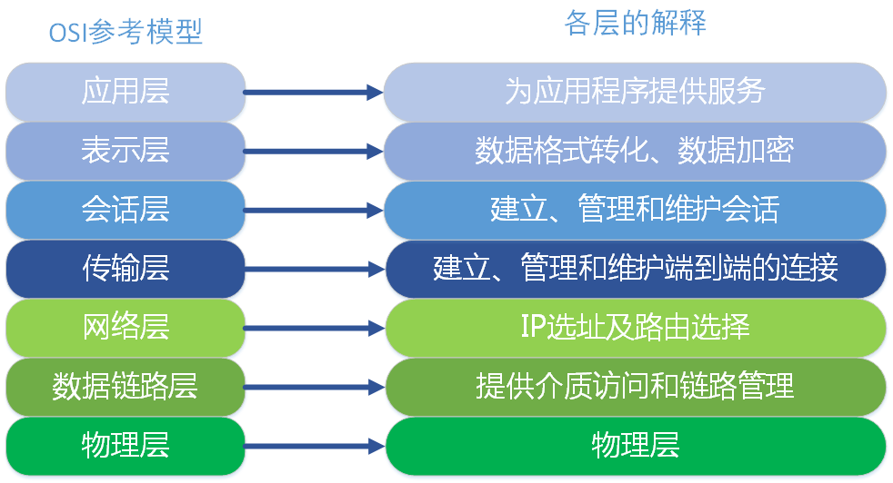
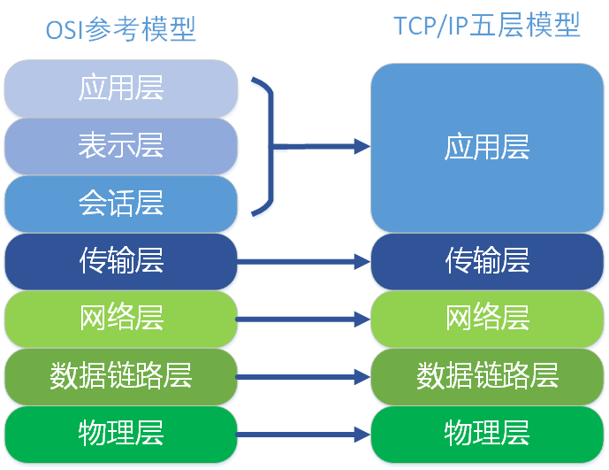
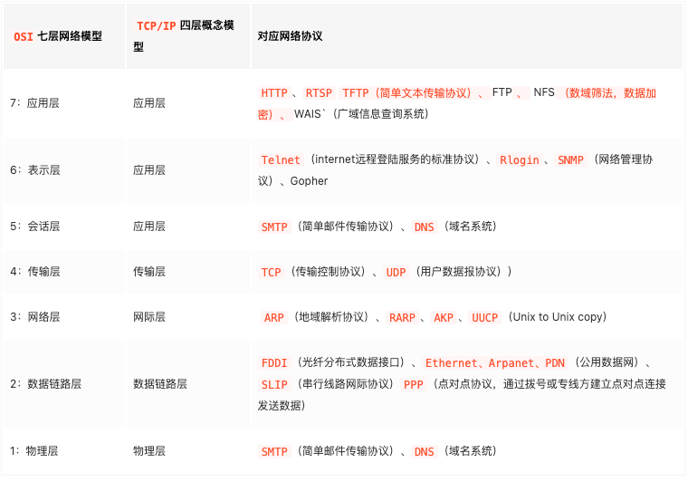
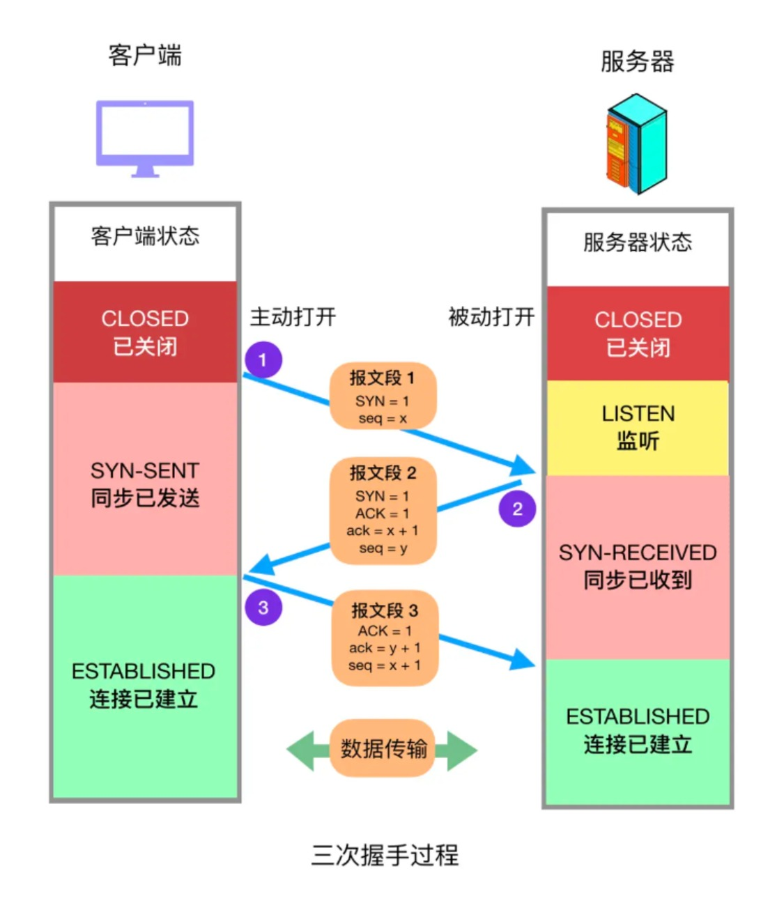

# OSI & TCP

OSI 分层：应用层、表示层、会话层、传输层、网络层、数据链路层、物理层。

TCP/IP 模型：应用层、传输层、网络层、网络接口层。

应用层协议(常用)：HTTP、RTSP、FTP。

传输层协议：TCP、UDP。

## OSI 的七层模型具体是什么

ISO 于 1978 年开发的一套标准架构 ISO 模型，被引用来说明数据通信协议的结构和功能。

OSI 在功能上可以划分为两组：

- 网络群组：物理层、数据链路层、网络层
- 使用者群组：传输层、会话层、表示层、应用层

其中高层（7、6、5、4 层）定义了应用程序的功能，下面三层（3、2、1 层）主要面向通过网络的端到端的数据流。

## TCP / IP

TCP/IP 传输协议，即传输控制/网络协议，也叫作网络通讯协议。 它是在网络的使用中的最基本的通信协议。 TCP/IP 传输协议对互联网中各部分进行通信的标准和方法进行了规定。 并且，TCP/IP 传输协议是保证网络数据信息及时、完整传输的两个重要的协议。

### TCP 三次握手&四次挥手

