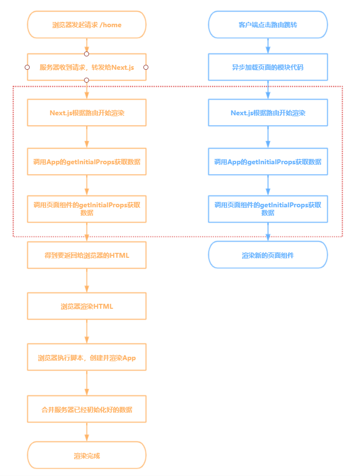

# 前端页面渲染方式

## 客户端渲染（CSR）

> CSR 客户端渲染（Client Side Rendering）

客户端渲染是指浏览器在请求页面 `URL` 后，服务端直接返回一个空的静态 `HTML` 文件，这个 `HTML` 文件需要再加载 `JavaScript` 脚本和 `CSS` 样式表，浏览器加载和执行这些文件去动态改变 `DOM` 树的结构，使页面渲染成用户所需要的界面，这种动态渲染的方式就是客户端渲染 `（CSR）`

> 客户端渲染（CSR）是 React 应用程序的默认渲染策略。

::: tip 举个 🌰

- 在 `useEffect()` 中请求数据就属于 `CSR`

```js
import React, { useState, useEffect } from 'react'

export function Page() {
  const [data, setData] = useState(null)

  useEffect(() => {
    const fetchData = async () => {
      const response = await fetch('https://xxx/data')
      const result = await response.json()
      setData(result)
    }
  }, [])

  return <p>{data ? `Your data: ${data}` : 'Loading...'}</p>
}
```

:::

### 优点

- **局部刷新**：无需每次都进行完整页面请求

- **懒加载**：首次加载时可以只加载可视区域内的数据

- **减轻服务器压力**：服务器负载较轻，因为大部分工作都在客户端完成

- **适用于高度交互的应用**：如 `SPA` (单页应用)

### 缺点

- **首屏渲染慢**：首次加载时间可能较长，因为需要下载、解析和执行大量 `JavaScript` 完毕后才开始渲染页面

- **不利于 `SEO`**：因为搜索引擎可能只看到空的 `HTML`，而不是实际内容。

  - `SEO（Search Engine Optimization）`：搜索引擎优化，利用搜索引擎的规则提高网站在有关搜索引擎内的自然排名。目的是让其在行业内占据领先地位，获得品牌收益。

- **增加了客户端的计算负担**：可能导致手机等低功耗设备的性能问题。

## 服务端渲染（SSR）

> SSR 服务端渲染（Server Side Rendering）

### 为什么要服务端渲染

- **避免首屏等待，即`TTFP`，首屏等待时间**：在 `SPA` 模式下，所有的数据请求和 `DOM` 渲染都在浏览器端完成，所以当我们第一次访问页面的时候很可能会存在`“白屏”`等待，而服务端渲染所有数据请求和 `HTML`内容已在服务端处理完成，浏览器收到的是完整的 `HTML` 内容，可以更快的看到渲染内容，在服务端完成数据请求肯定是要比在浏览器端效率要高的多。

- **更好支持`SEO`**：有些网站的流量来源主要还是靠搜索引擎，所以网站的 `SEO` 还是很重要的，而 `SPA` 模式对搜索引擎不够友好，要想彻底解决这个问题只能采用服务端直出。

::: tip 主流的`SSR`框架

- [<u>Next.js</u>](https://www.nextjs.cn/)，`React`应用框架

- [<u>Nuxt.js</u>](https://www.nuxtjs.cn/)，`Vue`应用框架

:::

### 什么是 `SSR`

服务端渲染是指浏览器在请求页面 `URL` 时，服务端将我们需要的 `HTML` 文本组装好，并返回给浏览器，这个 `HTML` 文本被浏览器解析之后，不需要经过 `JavaScript` 脚本的下载过程，就能直接构建出我们所希望的 `DOM` 树并展示到页面中。这个服务端组装 `HTML` 的过程就叫做服务端渲染`（SSR）`

### 优点

- **首屏渲染快**：首次加载速度快，因为浏览器立即获得完整的页面内容。

- **有利于 SEO**：因为搜索引擎可以直接爬取和索引完整的页面内容

### 缺点

- **占用服务器资源**：服务器压力较大，尤其是在高流量情况下
- **用户体验不好**：新页面都需要在服务端重新渲染整个页面，不能局部渲染，并且总体延迟可能增加，因为每次页面请求都需要服务器处理

## 同构渲染（SSR + CSR）

::: tip 前端同构应用

- 第一次访问页面是服务端渲染，基于第一次访问，后续的交互就是 `SPA` 的效果和体验，还不影响`SEO`。

- 简单说就是一个前端项目里的组件，部分服务端渲染后输出，部分由客户端异步渲染，既保障网页渲染速度，也有利于搜索引擎 `SEO`。

:::

::: tip 同构是什么意思

- 服务端和前端使用同一套渲染层代码，在服务端执行虚拟`DOM`(一般用`Node.js`)，此时服务端使用和前端相同的虚拟`DOM`的原理来拼接`HTML`模板。

- 也就是采用一套代码，构建双端（`server` 和 `client`）逻辑，最大限度的重用代码，不用维护两套代码。

:::

### 3 种同构

- **路由同构**：例如 `Next` 的文件路由系统

- **数据同构**：例如 `Next` 的 `getInitialProps` 用来获取数据并将其传递给页面

- **渲染同构**：为了保证服务端和客户端端渲染的组件具有相同的 `props` 和 `DOM` 结构，组件才能只渲染一次，这时就需要脱水和注水了

  - **脱水**：对组件进行脱水，变成`HTML`字符串，脱去动态数据，成为风干标本快照

  - **注水**：发送到客户端后，重新注入数据(水)，重新变成可交互组件

> Next 渲染流程图



## 静态网站生成 (SSG)

> SSG 静态网站生成（Static Site Generation）

静态站点生成是指在构建时就会为每个页面生成包含内容的 `HTML` 文件，当浏览器在请求页面 `URL` 时，服务端直接返回 `HTML` 即可。

### 优点

- 有利于 `SEO`

- 极快的加载速度，因为服务器仅提供预生成的文件。

- 减轻了服务器压力，因为不需要实时渲染。

- 非常适合内容不经常变动的网站或应用。

### 缺点

- 每次更改内容时都需要重新构建和部署应用程序

- 无法生成用户相关内容

## 增量静态生成 (ISR)

增量静态再生`（ISR）`建立在 `SSG` 的基础上，同时又有 `SSR` 的优点，`ISR` 允许页面的某些部分是静态的，而其他部分则可以在数据发生变化时动态渲染。`ISR` 在性能和内容更新之间取得了平衡，因此适用于内容经常更新的站点。

> 举个 🌰

```js
function Blog({ posts }) {
  return (
    <ul>
      {posts.map((post) => (
        <li key={post.id}>{post.title}</li>
      ))}
    </ul>
  )
}

export async function getStaticProps() {
  const res = await fetch('https://.../posts')
  const posts = await res.json()

  return {
    props: {
      posts,
    },
    revalidate: 60,
  }
}

export async function getStaticPaths() {
  const res = await fetch('https://.../posts')
  const posts = await res.json()

  const paths = posts.map((post) => ({
    params: { id: post.id },
  }))

  return { paths, fallback: 'blocking' }
}

export default Blog
```

这个 🌰 和 `SSG` 的示例大同小异，为什么能做到增量渲染呢？

核心就在于`revalidate`和`fallback`

- 当我们使用 `revalidate`选项时，`Next.js` 会在 `build` 时调用一次`getStaticProps`，部署生产后，`Next.js` 还会在达到`revalidate`设置的时间间隔后再次运行`getStaticProps`，以此更新内容

- `fallback`则是用来决定当用户请求一个在构建时未被预渲染的路径时，`Next.js` 应当怎么处理。它有三种可选值：`false`、`true` 和 `blocking`

  - `fallback: false`

    当用户请求一个在构建时未被预渲染的路径时，将立即返回 `404` 页面。

    这意味着如果路径不在`getStaticPaths`返回的列表中，用户会看到一个 `404` 错误。

  - `fallback: true`

    当用户请求一个未被预渲染的路径时，`Next.js` 会立即提供一个`“fallback”`版本的页面。这通常是一个空页面或一个加载状态。

    然后，`Next.js` 会在后台异步地运行`getStaticProps`来获取页面的数据，并重新渲染页面。一旦页面准备好，它将替换`“fallback”`版本。

    这允许页面几乎立即可用，但可能不显示任何实际内容，直到数据被加载并页面被渲染。

  - `fallback: 'blocking'`

    当用户请求一个未被预渲染的路径时，`Next.js` 会等待`getStaticProps`完成并生成该页面，然后再提供给用户。

    这意味着用户会等待，直到页面准备好，但他们会立即看到完整的页面内容，而不是一个空页面或加载状态。

### 优点

- 结合了 `SSR` 的实时性和 `SSG` 的速度优势。

- 适合内容经常变动但不需要实时更新的应用。

- 减轻了服务器的压力，同时提供了实时内容。

### 缺点

- 相比于 `SSG`，初次请求可能需要更长的加载时间。

## 如何选择合适的渲染策略

- 高度交互的应用

如果你正在开发一个如单页应用`（SPA）`那样高度交互的应用，`CSR` 可能是最佳选择。一旦页面加载，用户的任何交互都将非常迅速，无需再次从服务器加载内容。

- 需要 `SEO` 优化的应用

如果你的应用依赖于搜索引擎优化，`SSR` 或 `SSG` 是更好的选择。这两种方法都会提供完整的 `HTML`，有助于搜索引擎索引。

- 内容静态但更新频繁的网站

例如博客网站，`ISR` 是一个很好的选择。它允许内容在背景中更新，而用户仍然可以快速访问页面。

- 内容基本不变的网站

对于内容很少或根本不更改的网站，`SSG` 是最佳选择。一次生成，无需再次渲染，提供了最快的加载速度。

- 混合内容的应用

`Next.js` 允许你在同一个应用中混合使用不同的渲染策略。例如，你可以使用 `SSR` 渲染首页，使用 `SSG` 渲染博客部分，而使用 `CSR` 渲染用户交互部分。
