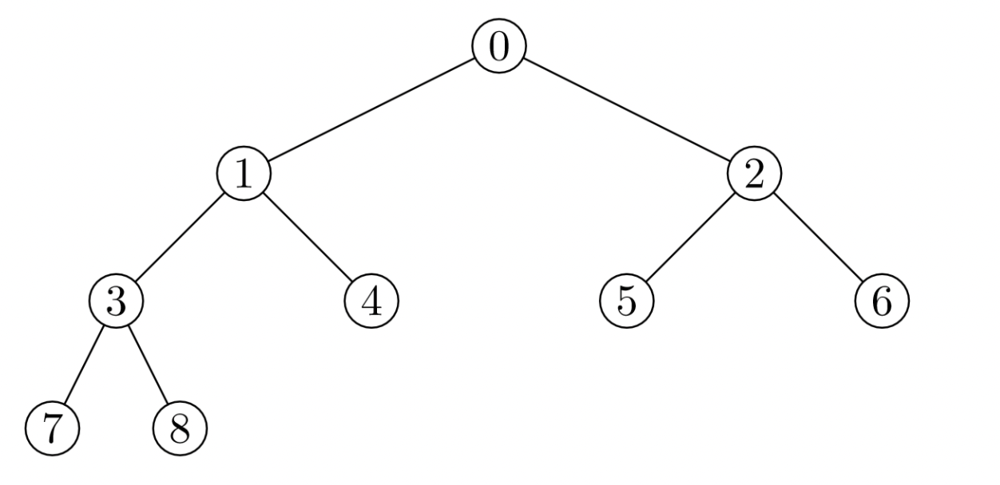
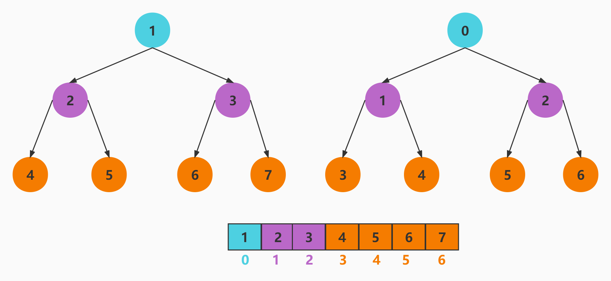

# 堆

堆通常是一个可以被看做一棵完全二叉树的数组对象

> 举个 🌰



::: tip 堆满足的性质

- 堆中某个节点的值，不大于或不小于其父节点的值

- 堆总是一颗完全二叉树

:::

堆又可以分成最大堆和最小堆：

- 最大堆：每个根结点，都有根结点的值大于两个子结点的值

- 最小堆：每个根结点，都有根结点的值小于子结点的值

## 最小堆

`React` 在的任务调度中通过最小堆，实现根据任务过期时间排序，获取任务优先级最高的任务

> [<u>React 源码 最小堆的实现 ｜ SchedulerMinHeap.js</u>](https://github.com/azzlzzxz/react-source-code/blob/main/packages/scheduler/src/SchedulerMinHeap.js)
>
> [<u>React 任务调度 看这里 🚀</u>](/rsource/react/schedule.md)

最小堆是一种经过排序的完全二叉树，其中任一非终端节点的数据值均不大于其左子节点和右子节点的值，根结点值是所有堆结点值中最小者。



### compare 比较

```js
function compare(a, b) {
  const diff = a.sortIndex - b.sortIndex
  return diff !== 0 ? diff : a.id - b.id
}
```

### push

添加新节点后需要调用`siftUp`函数向上调整堆

```js
/**
 * 向最小堆里添加一个节点
 * @param {*} heap 最小堆
 * @param {*} node 节点
 */
function push(heap, node) {
  //获取元素的数量
  const index = heap.length

  //先把添加的元素放在数组的尾部
  heap.push(node)

  //把尾部这个元素向上调整到合适的位置
  siftUp(heap, node, index)
}
```

### siftUp

向上调整堆结构, 保证最小堆

```js
/**
 * 向上调整某个节点，使其位于正确的位置
 * @param {*} heap 最小堆
 * @param {*} node 节点
 * @param {*} i 节点所在的索引
 */
function siftUp(heap, node, i) {
  let index = i
  while (true) {
    //获取父节点的索引
    const parentIndex = (index - 1) >>> 1 // (子节点索引-1)/2
    //获取父节点
    const parent = heap[parentIndex]
    //如果父节点存在，并且父节点比子节点要大
    if (parent !== undefined && compare(parent, node) > 0) {
      //把儿子的值给父索引
      heap[parentIndex] = node
      //把父亲的值给子索引
      heap[index] = parent
      //让index等于父亲的索引
      index = parentIndex
    } else {
      //如果子节点比父节要大，不需要交换位置，结束循环
      return
    }
  }
}
```

### pop

弹出堆的顶点后，把最后面的元素放在第一个，再调用`siftDown`函数向下调整堆

::: tip 为啥不直接删除

数组尾部元素替换堆顶，这里不直接删除堆顶，因为所有的元素会向前移动一位，会破坏了堆的结构

然后进行下移操作，将新的堆顶和它的子节点进行交换，直到子节点大于等于这个新的堆顶，删除堆顶的时间复杂度为`O(logk)`

:::

```js
/**
 * 弹出最小堆的堆顶元素
 * @param {*} heap
 */
function pop(heap) {
  // 取出数组中第一个也就是堆顶的元素
  const first = heap[0]
  // 弹出数组中的最后一个元素
  const last = heap.pop()
  if (first !== undefined) {
    if (last !== first) {
      heap[0] = last
      siftDown(heap, last, 0)
    }
    return first
  } else {
    return null
  }
}
```

### siftDown

向下调整堆结构, 保证最小堆

```js
/**
 * 向下调整某个节点，使其位于正确的位置
 * @param {*} heap 最小堆
 * @param {*} node 节点
 * @param {*} i 节点所在的索引
 */
function siftDown(heap, node, i) {
  let index = i
  const length = heap.length
  while (index < length) {
    // 左子节点的索引
    const leftIndex = (index + 1) * 2 - 1
    const left = heap[leftIndex]
    // 右子节点的索引
    const rightIndex = leftIndex + 1
    const right = heap[rightIndex]
    //如果左子节点存在，并且左子节点比父节点要小
    if (left !== undefined && compare(left, node) < 0) {
      //如果右节点存在，并且右节点比左节点还要小
      if (right !== undefined && compare(right, left) < 0) {
        heap[index] = right
        heap[rightIndex] = node
        index = rightIndex
      } else {
        heap[index] = left
        heap[leftIndex] = node
        index = leftIndex
      }
    } else if (right !== undefined && compare(right, node) < 0) {
      heap[index] = right
      heap[rightIndex] = node
      index = rightIndex
    } else {
      return
    }
  }
}
```

### peek

查看堆的顶点

```js
/**
 * 查看最小堆顶的元素
 * @param {*} heap
 */
function peek(heap) {
  const first = heap[0]
  return first === undefined ? null : first
}
```
