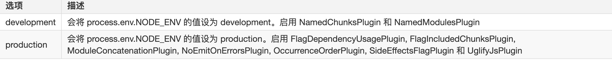
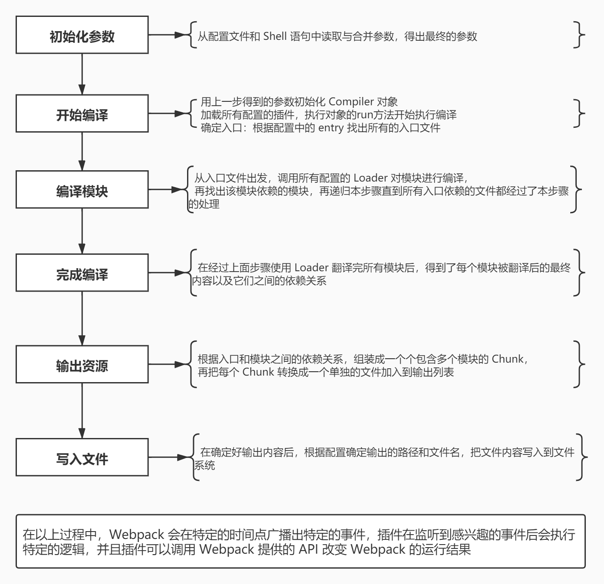

# Webpack 基本概念

`webpack`是一个现代`js`应用程序的静态模块打包器。当`webpack`处理应用程序时，他会内部从一个或多个入口点，递归的构建一个关系依赖图，其中包含应用程序需要的每个模块，然后将所有这些模块打包成一个或多个`bundle`


## `webpack`核心概念

::: info 相关资料

- [<u>Webpack 官方文档 🚀</u>](https://webpack.docschina.org/)

:::

### 入口`（entry）`

入口起点`(entry point)`指示 `webpack` 应该使用哪个模块，来作为构建其内部依赖图的开始。进入入口起点后，`webpack` 会找出有哪些模块和库是入口起点（直接和间接）依赖的。

默认值是  `./src/index.js`，但你可以通过在  `webpack.config.js`  中配置  `entry`  属性，来指定一个（或多个）不同的入口起点。

```js
// webpack.config.js
module.exports = {
  entry: './src/index.js'
  // 等效于
  entry: {
      main: './src/index.js'
  }
}
```

### 输出`（output）`

`output`  属性告诉 `webpack` 在哪里输出它所创建的  `bundle`，以及如何命名这些文件，默认值为  `./dist`。

基本上，整个应用程序结构，都会被编译到你指定的输出路径的文件夹中。

你可以通过在配置中指定一个  `output`  字段，来配置这些处理过程。

```js
const path = require('path')

module.exports = {
  entry: './src/index.js',
  output: {
    path: path.resolve(__dirname, 'dist'), // 输出目录（打包之后输出到硬盘上的那个目录上去）
    filename: 'main.js', // 文件名
    publicPath: '/asset', // 表示打包生成的index.html文件里引用资源的前缀
  },
}
```

### `loader`

`loader`  让 `webpack` 能够去处理那些非 `JavaScript` 文件（`webpack` 自身只理解 `JavaScript`文件 和 `JSON` 文件）。

`loader` 可以将所有类型的文件转换为 `webpack` 能够处理的有效模块，以供应用程序使用，以及被添加到依赖图中。
在 `webpack` 的配置中  `loader`  有两个目标：

- `test`  属性：用于标识出应该被对应的 `loader` 进行转换的某个或某些文件。

- `use`  属性：表示进行转换时，应该使用哪个 `loader`。

::: tip

在 `webpack` 配置中定义 `loader` 时，要定义在  `module.rules`  中，而不是  `rules`

:::

```js
// webpack.config.js
const path = require('path')

module.exports = {
  entry: {
    main: './src/index.js',
  },
  output: {
    path: path.resolve(__dirname, 'dist'),
    filename: 'main.js',
    publicPath: '/asset',
  },
  // loader就是把webpack不认识的内容转换成webpack认识的内容
  module: {
    rules: [
      {
        test: /\.txt$/,
        use: 'raw-loader', // 解析原生文件
      },
    ],
  },
}
```

### 插件`（plugins）`

`loader` 被用于转换某些类型的模块，而插件则可以用于执行范围更广的任务，包括：打包优化，资源管理，注入环境变量。

插件接口功能极其强大，可以用来处理各种各样的任务。

想要使用一个插件，你只需要  `require()`  它，然后把它添加到  `plugins`  数组中。

多数插件可以通过选项`(option)`自定义。

你也可以在一个配置文件中因为不同目的而多次使用同一个插件，这时需要通过使用  `new`  操作符来创建它的一个实例

```js
// webpack.config.js
const path = require('path')
const HtmlWebpackPlugin = require('html-webpack-plugin')
const webpack = require('webpack')

module.exports = {
  entry: {
    main: './src/index.js',
  },
  output: {
    path: path.resolve(__dirname, 'dist'),
    filename: 'main.js',
    publicPath: '/asset',
  },
  module: {
    rules: [
      {
        test: /\.txt$/,
        use: 'raw-loader',
      },
    ],
  },
  plugins: [
    new HtmlWebpackPlugin({
      template: './src/index.html', // 以src下的index.html为模版
    }),
    new webpack.DefinePlugin({
      // DefinePlugin运行本质是在编译的时候，一个纯字符串替换，并不会定义任何的变量
      'process.env.NODE_ENV': JSON.stringify(process.env.NODE_ENV),
      NODE_ENV: JSON.stringify(process.env.NODE_ENV),
    }),
  ],
}
```

### 模式

日常的前端开发工作中，一般都会有两套构建环境：

- 一套开发时使用，构建结果用于本地开发调试，不进行代码压缩，打印 `debug` 信息，包含 `sourcemap` 文件

- 一套构建后的结果是直接应用于线上的，即代码都是压缩后，运行时不打印 `debug` 信息，静态文件不包括 `sourcemap`



```js
module.exports = {
  mode: 'production',
}
```

## `chunk` & `bundle`

- `chunk`

`chunk` 是 `Webpack` 构建时的逻辑产物，是 `Webpack` 按照配置或策略将一组模块（`module`）集合在一起的单元，一个 `chunk` 通常包含多个模块和它们的依赖项（依赖关系树）。

- `bundle`

`bundle` 是 `Webpack` 输出的产物，它是 `Webpack` 构建过程的最终结果，是`Webpack`输出的包含所有应用代码和依赖的最终文件，通常是被浏览器或其他运行环境所加载的文件，一个或多个 `chunk` 会被 `Webpack` 打包成一个 `bundle` 文件

## `webpack` 的工作流程



## 简单实现一下 `webpack` 的工作流程

### `webpack.config.js`

```js
const path = require('path')
const RunPlugin = require('./plugins/run-plugin')
const DonePlugin = require('./plugins/done-plugin')
const AssetPlugin = require('./plugins/assets-plugin')

module.exports = {
  mode: 'development',
  devtool: false,
  context: process.cwd(), //上下文目录, ./src .默认代表根目录 默认值其实就是当前命令执行的时候所在的目录
  entry: {
    entry1: 'src/entry1.js',
    entry2: 'src/entry2.js',
  },
  output: {
    path: path.join(__dirname, 'dist'),
    filename: '[name].js',
  },
  resolve: {
    extensions: ['.js', '.jsx', '.json'],
  },
  module: {
    rules: [
      {
        test: /\.js$/,
        use: [
          path.resolve(__dirname, 'loaders', 'logger1-loader.js'),
          path.resolve(__dirname, 'loaders', 'logger2-loader.js'),
        ],
      },
    ],
  },
  // 插件注册顺序一般不会影响插件运行时机（前提是它们监听的钩子不一样）
  // 如果几个插件监听同一个钩子，谁先注册谁先执行
  plugins: [new RunPlugin(), new DonePlugin(), new AssetPlugin()],
}
```

### 入口

```js
const webpack = require('./webpack')
const webpackOptions = require('./webpack.config')

//compiler代表整个编译过程.
const compiler = webpack(webpackOptions)

//调用它的run方法可以启动编译
compiler.run((err, stats) => {
  let result = stats.toJson({
    files: true, // 产出了哪些文件
    assets: true, // 生成了那些资源
    chunk: true, // 生成哪些代码块
    module: true, // 模块信息
    entries: true, // 入口信息
  })
})
```

### `webpack.js`

```js
const Compiler = require('./Compiler')

function webpack(options) {
  // 1. 初始化参数：从配置文件和Shell语句中读取并合并参数,得出最终的配置对象

  console.log(options) // options 就是webpack.config.js里的配置项，module.exports导出的对象

  // node debugger.js --mode=development
  console.log(process.argv)
  // process.argv是个数组
  // [
  //     '/usr/local/bin/node',
  //     '/Users/xxx/Desktop/xxx/debugger.js',
  //     '--mode=development'
  // ]

  let shellConfig = process.argv.slice(2).reduce((shellConfig, item) => {
    //item=   --mode=development(命令行里的语句就是shell语句)（执行webpack --mode=development）
    let [key, value] = item.split('=') // key:--mode value:development
    shellConfig[key.slice(2)] = value // mode=development
    return shellConfig
  }, {})
  let finalConfig = { ...options, ...shellConfig }

  // 2. 用上一步得到的参数初始化Compiler对象
  let compiler = new Compiler(finalConfig)

  // 3. 加载所有配置的插件
  let { plugins } = finalConfig
  for (let plugin of plugins) {
    // 只要是插件就一定有apply方法，传compiler，写死的
    plugin.apply(compiler)
  }
  return compiler
}

module.exports = webpack
```

### compiler.js

```js
let { SyncHook } = require('tapable')
let Complication = require('./Complication')
let path = require('path')
let fs = require('fs')
// 整个编译工作都是在compiler里完成的
class Compiler {
  constructor(options) {
    this.options = options

    // compiler的钩子函数（实际上会有四五十个）
    this.hooks = {
      // 典型钩子
      run: new SyncHook(), // 开始启动编译 刚刚开始
      emit: new SyncHook(['assets']), // 会在将要写入文件的时候触发
      done: new SyncHook(), // 将会在完成编译的时候触发 全部完成
    }
  }

  // 4. 执行Compiler对象的run方法开始执行编译
  run(callback) {
    // 触发run钩子
    this.hooks.run.call()

    // 5. 根据配置中的entry找出入口文件
    this.compile((err, stats) => {
      this.hooks.emit.call(stats.assets)

      // 10. 在确定好输出内容后，根据配置确定输出的路径和文件名，把文件内容写入到文件系统
      for (let filename in stats.assets) {
        let filePath = path.join(this.options.output.path, filename)
        fs.writeFileSync(filePath, stats.assets[filename], 'utf8')
      }

      callback(null, {
        toJson: () => stats,
      })
    })

    //监听入口的文件变化,如果文件变化了,重新再开始编译
    //  Object.values(this.options.entry).forEach(entry=>{
    //  fs.watchFile(entry,()=>this.compile(callback));
    //});

    // 中间是我们编译流程
    this.hooks.done.call() // 编译之后触发done钩子
  }
  compile(callback) {
    let complication = new Complication(this.options)
    complication.build(callback)
  }
}

module.exports = Compiler
```

### complication.js

```js
const path = require('path')
const fs = require('fs')
const types = require('babel-types')
const parser = require('@babel/parser')
const traverse = require('@babel/traverse').default
const generator = require('@babel/generator').default
//process.cwd()项目根目录，分隔符是\，用toUnitPath转成/
const baseDir = toUnitPath(process.cwd())

function toUnitPath(filePath) {
  return filePath.replace(/\\/g, '/')
}

class Complication {
  constructor(options) {
    this.options = options
    // webpack4 数组  webpack5 set，防止多模块依赖一个模块时出现依赖重复
    this.entries = [] // 存放所有的入口

    // 存放所有的模块
    this.modules = []

    // 存放所的代码块
    this.chunks = []

    // 所有产出的资源
    this.assets = {}

    // 所有产出的文件
    this.files = []
  }
  build(callback) {
    //5. 根据配置中的entry找出入口文件
    let entry = {}

    if (typeof this.options.entry === 'string') {
      entry.main = this.options.entry
    } else {
      entry = this.options.entry
    }

    //entry={entry1:'./src/entry1.js',entry2:'./src/entry2.js'}
    for (let entryName in entry) {
      //5. 获取 entry1的绝对路径：this.options.context当前的根目录
      let entryFilePath = toUnitPath(path.join(this.options.context, entry[entryName]))

      //6. 从入口文件出发,调用所有配置的Loader对模块进行编译
      let entryModule = this.buildModule(entryName, entryFilePath)

      // this.modules.push(entryModule);
      //8. 根据入口和模块之间的依赖关系，组装成一个个包含多个模块的 Chunk
      let chunk = {
        name: entryName,
        entryModule,
        modules: this.modules.filter((item) => {
          return item.name === entryName || item.extraNames.includes(entryName)
        }),
      }

      this.entries.push(chunk)
      this.chunks.push(chunk)
    }

    //9. 再把每个Chunk转换成一个单独的文件加入到输出列表
    this.chunks.forEach((chunk) => {
      let filename = this.options.output.filename.replace('[name]', chunk.name)
      // this.assets就是输出列表 key输出的文件名 值就是输出的内容
      this.assets[filename] = getSource(chunk)
    })

    callback(null, {
      entries: this.entries,
      chunks: this.chunks,
      modules: this.modules,
      files: this.files,
      assets: this.assets,
    })
  }
  // name = 名称，modulePath = 模块的绝对路径
  buildModule(name, modulePath) {
    // 6. 从入口文件出发,调用所有配置的Loader对模块进行编译

    // 1.读取模块文件的内容
    let sourceCode = fs.readFileSync(modulePath, 'utf8') // console.log('entry1');

    let rules = this.options.module.rules

    let loaders = [] ///寻找匹配的loader

    for (let i = 0; i < rules.length; i++) {
      let { test } = rules[i]

      //如果此rule的正则和模块的路径匹配的话
      if (modulePath.match(test)) {
        loaders = [...loaders, ...rules[i].use]
      }
    }

    sourceCode = loaders.reduceRight((sourceCode, loader) => {
      return require(loader)(sourceCode)
    }, sourceCode)

    /*  for(let i=loaders.length-1;i>=0;i--){
          let loader = loaders[i];
          sourceCode = require(loader)(sourceCode);
      } */
    // console.log('entry1');//2//1
    // console.log(sourceCode);

    // 7. 再找出该模块依赖的模块，再递归本步骤直到所有入口依赖的文件都经过了本步骤的处理
    // 获得当前模块模块ID ./src/index.js
    let moduleId = './' + path.posix.relative(baseDir, modulePath)

    // dependencies：依赖模块
    let module = { id: moduleId, dependencies: [], name, extraNames: [] }

    // parser.parse把源代码转成ast
    let ast = parser.parse(sourceCode, { sourceType: 'module' })

    // 遍历，找到依赖模块
    traverse(ast, {
      CallExpression: ({ node }) => {
        if (node.callee.name === 'require') {
          // 找require语句
          //依赖的模块的相对路径
          let moduleName = node.arguments[0].value //./title1

          // 获取当前模块的所在的目录
          // posix是统一路径分割符 /
          let dirname = path.posix.dirname(modulePath) // /

          // xxx/src/title1
          let depModulePath = path.posix.join(dirname, moduleName)

          // 获取扩展名数组
          let extensions = this.options.resolve.extensions

          //得到依赖的模块ID xxx/src/title1.js
          depModulePath = tryExtensions(depModulePath, extensions) // 已经包含了拓展名了

          //相对于项目根目录 的相对路径 ./src/title1.js
          //relative：获取相对路径
          let depModuleId = './' + path.posix.relative(baseDir, depModulePath)

          //require('./title1');=>require('./src/title1.js');
          // stringLiteral创建文本节点
          // node.arguments把require('./title1');转成require('./src/title1.js');因为打包后是用./src/title1.js
          node.arguments = [types.stringLiteral(depModuleId)]

          //依赖的模块绝对路径放到当前的模块的依赖数组里
          module.dependencies.push({ depModuleId, depModulePath })
        }
      },
    })
    // 把语法树生成新的源代码
    let { code } = generator(ast)

    module._source = code // 模块源代码指向语法树转换后的新生成的源代码

    // 7. 再找出该模块依赖的模块，再递归本步骤直到所有入口依赖的文件都经过了本步骤的处理
    module.dependencies.forEach(({ depModuleId, depModulePath }) => {
      let depModule = this.modules.find((item) => item.id === depModuleId)
      if (depModule) {
        depModule.extraNames.push(name)
      } else {
        let dependencyModule = this.buildModule(name, depModulePath)
        this.modules.push(dependencyModule)
      }
    })
    return module
  }
}
function getSource(chunk) {
  return `
  (() => {
      var modules = ({
          ${chunk.modules
            .map(
              (module) => `
                  "${module.id}":(module,exports,require)=>{
                      ${module._source}
                  }
              `,
            )
            .join(',')}
      });
      var cache = {};
      function require(moduleId) {
        var cachedModule = cache[moduleId];
        if (cachedModule !== undefined) {
          return cachedModule.exports;
        }
        var module = cache[moduleId] = {
          exports: {}
        };
        modules[moduleId](module, module.exports, require);
        return module.exports;
      }
      var exports = {};
      (() => {
        ${chunk.entryModule._source}
      })();
    })()
      ;
  `
}
function tryExtensions(modulePath, extensions) {
  extensions.unshift('')

  for (let i = 0; i < extensions.length; i++) {
    let filePath = modulePath + extensions[i] // ./title.js

    // fs.existsSync()是否存在这个文件
    if (fs.existsSync(filePath)) {
      return filePath
    }
  }

  throw new Error(`Module not found`)
}

module.exports = Complication
```
