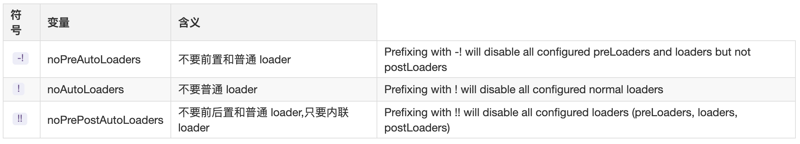

# Loader

`Loader` 转换器，用于转换模块的源代码。可以将不同类型的文件（如 `CSS`、`TypeScript` 等）转换为 `JavaScript` 模块，从而使它们能够被 `Webpack` 处理

- 所谓 `loader` 只是一个导出为函数的 `JavaScript` 模块。它接收上一个 `loader` 产生的结果或者资源文件`(resource file)`作为入参。也可以用多个 `loader` 函数组成 `loader chain`

- `compiler` 需要得到最后一个 `loader` 产生的处理结果。这个处理结果应该是 `String` 或者 `Buffer`（被转换为一个 `string`）

::: info

- [<u>Webpack Loader 🚀</u>](https://webpack.docschina.org/api/loaders/)

:::

## `loader` 执行顺序

`loader` 总是 从右到左（或者从下到上）被调用

> 举个 🌰

- `loader`在同一个`rule`中的执行顺序

```js
module.exports = {
  module: {
    rules: [
      {
        test: /\.js$/,
        use: ['loader1', 'loader2', 'loader3'],
      },
    ],
  },
}
```

执行顺序

```sh
loader3 -> loader2 -> loader1
```

- `loader`在多个`rule`中的执行顺序

```js
module.exports = {
  module: {
    rules: [
      {
        test: /\.js$/,
        use: ['loader1'],
      },
      {
        test: /\.js$/,
        use: ['loader2'],
      },
      {
        test: /\.js$/,
        use: ['loader3'],
      },
    ],
  },
}
```

执行顺序

```sh
loader3 -> loader2 -> loader1
```

### `pitch` 方法

`pitch` 是 `Webpack loader` 的一种特殊方法，它允许 `loader` 在正常的执行链之前做一些额外的操作。`pitch` 方法并不是必须的，只有当 `loader` 中明确定义了 `pitch` 时才会执行。

`pitch` 方法允许你改变 `loader` 的执行流程。它的主要功能有：

- 提前处理：在文件加载之前进行某些逻辑操作（如预处理、缓存等）。

- 终止链式调用：`pitch` 方法可以返回某些内容并终止剩下 `loader` 的执行链。如果 `pitch` 方法返回一个值，Webpack 将不会继续执行剩余的 `loader`，而是直接将该值作为最终结果传递给上一个 loader。

> 举个 🌰

```js
module.exports = {
  module: {
    rules: [
      {
        //...
        use: ['a-loader', 'b-loader', 'c-loader'],
      },
    ],
  },
}
```

执行顺序

```sh
|- a-loader `pitch`
  |- b-loader `pitch`
    |- c-loader `pitch`
      |- requested module is picked up as a dependency
    |- c-loader normal execution
  |- b-loader normal execution
|- a-loader normal execution
```

所有完整的 `loader` 的执行顺序是这样的

> 流程图


::: info 相关资料

- [<u>Webpack | pitching-loader 🚀</u>](https://webpack.docschina.org/api/loaders/#pitching-loader)

:::

## `loader` 类型

- `normal(正常)`：没有值表示是普通 `loader`

- `pre(前置)`

```js
{
  enforce: 'pre', // enforce 强制
  test: /\.js$/,
  use: ['pre1-loader', 'pre2-loader'] //前置
},
```

- `post(后置)`

```js
{
  enforce: 'post',
  test: /\.js$/,
  use: ['post1-loader', 'post2-loader'] //后置
}
```

- `inline(内联)`：`loader` 被应用在 `import/require` 行内

`loader` 的叠加顺序  = `post(后置)` + `inline(内联)` + `normal(正常)` + `pre(前置)`

- `Pitching` 阶段: `loader` 上的 `pitch` 方法，按照 后置`(post)`、行内`(inline)`、普通`(normal)`、前置`(pre)` 的顺序调用。
- `Normal` 阶段: `loader` 上的 常规方法，按照 前置`(pre)`、普通`(normal)`、行内`(inline)`、后置`(post)` 的顺序调用。模块源码的转换，发生在这个阶段。



::: info 相关资料

- [<u>Webpack | Rule.enforce 🚀</u>](https://webpack.docschina.org/configuration/module#ruleenforce)

:::

## 如何编写一个 `loader`

`Loader` 本质上是一个函数，作用是将某个源码字符串转换成另一个源码字符串返回。接收源文件代码字符串为参数，经过处理转换，然后 `return` 目标代码字符串

> 举个 🌰

```js
const babel = require('@babel/core')

function loader(sourceCode, inputSourceMap, inputAst) {
  //正在处理的文件绝对路径
  const filename = this.resourcePath

  // options就是webpack.config.js里的loader配置的options
  const useOptions = this.getOptions()

  const options = {
    filename,
    inputSourceMap, // 指定输入代码的sourcemap
    sourceMaps: true, // 表示是否要生成sourcemap
    sourceFileName: filename, // 指定编译 后的文件所属的文件名
    ast: true, // 是否生成ast
    ...useOptions,
  }

  //.babelrc babel.config.js
  const config = babel.loadPartialConfig(options)

  if (config) {
    babel.transformAsync(sourceCode, config.options, (err, result) => {
      this.callback(null, result.code, result.map, result.ast)
    })
    //code 转译后的代码 map sourcemap映射文件 ast 抽象语法树
    return
  }

  return sourceCode
}

module.exports = loader
```

::: info 相关资料

- [<u>Webpack | 编写 loader</u>](https://webpack.docschina.org/contribute/writing-a-plugin/)

:::
