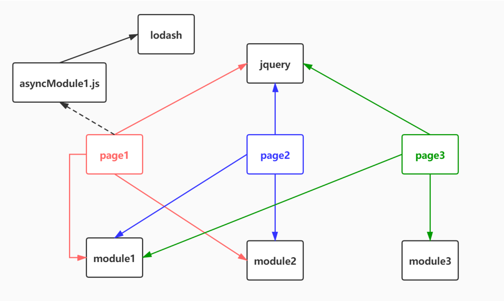
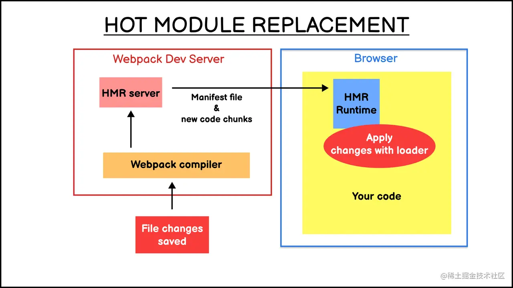

# Webpack 优化相关知识

## 压缩资源

- `JavaScript压缩`：使用 [<u>TerserWebpackPlugin</u>](https://webpack.docschina.org/plugins/terser-webpack-plugin/) 等工具压缩 JS 代码。

- `CSS压缩`：使用 [<u>cssnano</u>](https://www.npmjs.com/package/cssnano) 等工具压缩 CSS 代码。

- `HTML压缩`：使用 [<u>HtmlWebpackPlugin</u>](https://webpack.docschina.org/plugins/html-webpack-plugin/) 时配置压缩选项。

- `图片压缩`：使用 [<u>image-webpack-loader</u>](https://www.npmjs.com/package/image-webpack-loader) 等工具减小图片体积。

## 引入外部库的 CDN

对于 React、Vue 等这种库不会经常变化，所以就没必要打包。这种方式可以减少打包体积，并利用 CDN 的缓存优势加快页面加载速度

> 举个 🌰

```js
const path = require('path')
const HtmlWebpackPlugin = require('html-webpack-plugin')

module.exports = {
  entry: './src/index.js',
  output: {
    filename: 'bundle.js',
    path: path.resolve(__dirname, 'dist'),
  },
  // 配置 externals，说明哪些模块是外部引入的，不打包到 bundle 中
  externals: {
    react: 'React',
    'react-dom': 'ReactDOM',
    vue: 'Vue',
  },
}
```

## 忽略解析依赖

- `module.noParse`  字段，可以用于配置模块文件的内容不需要进行解析

- 不需要解析依赖（即无依赖） 的第三方大型类库等，可以通过这个字段来配置，以提高整体的构建速度

> 举个 🌰

```js
module.exports = {
  // ...
  module: {
    // 不需要解析jquery和lodash
    noParse: /jquery|lodash/, // 正则表达式
    // 或者使用函数
    noParse(content) {
      return /jquery|lodash/.test(content)
    },
  },
}
```

**使用 `noParse` 进行忽略的模块文件中不能使用 `import`、`require`、`define` 等导入机制。**

::: tip `noParse`与`external`区别

- `external`是外联：例如`lodash`，它的代码`module.exports = window._`，拿到这个代码会进一步分析依赖，找`require`、`import`。
- `noParse`是不会进一步分析依赖：代码还是会正常打包进去，但是不再进一步分析它的依赖，不再检查里面是不是有`require`、`important`。

:::

## 代码分割 `SplitChunksPlugin`

- 用 `SplitChunksPlugin` 自动提取公共模块和第三方库，可以减少代码重复和减少编译时间。

- 提取公共模块：将多个 `chunk` 共享的模块提取到一个单独 `chunk` 中，减少代码重复和生成文件的大小。

- 分割大模块：将大的模块拆分成更小的块，提高加载速度和并行下载的效率。

- 按需加载：创建按需加载的代码块，提高应用的启动速度

> 依赖关系



## 多进程打包

使用 [<u>thread-loader</u>](https://webpack.docschina.org/loaders/thread-loader/#root) 可以将打包任务分配到多个进程，提高打包速度

把`thread-loader`放在其他`loader`之前，放在这个`loader`后的`loader`就会在单独的`worker`池里运行

## 缓存

- `Webpack 4`

  - `babel-loader`自带的缓存功能，直接启用就好，`cacheDirectory:true`

  - 在所有`loader`之前使用`loader: 'cache-loader'`

```js
module.exports = {
  // ...
  module: {
    rules: [
      {
        test: /\.js$/,
        include: path.resolve(__dirname, 'src'),
        exclude: /node_modules/,
        use: [
          {
            loader: 'cache-loader',
          },
          {
            loader: 'babel-loader',
            options: {
              cacheDirectory: true, //启用缓存
              presets: [['@babel/preset-env', { modules: false }], '@babel/preset-react'],
            },
          },
        ],
      },
    ],
  },
}
```

- `Webpack 5` 引入了持久化缓存，通过配置`cache.type`属性缓存生成的 `chunk`

  - `webpack`会缓存生成的`webpack`模块和`chunk`，来改善构建速度。

  - 缓存在`webpack5`里是默认开启的，缓存是默认是在内存里，但可以对`cache`进行设置。

  - `webpack`追踪了每个模块的依赖，并创建了文件系统快照，此快照会与真实文件系统进行比较，当检测到差异时，将触发对应模块的更新构建

```js
cache: {
  type: 'memory',  //'memory'（内存） | 'filesystem'（使用文件系统级别的缓存）
}
```

## `Tree shaking`

`Tree Shaking` 是一种用于移除 `JavaScript` 中未使用代码的优化技术。可以减小打包文件的体积，提高加载性能。

它依赖于 `ES6` 模块的静态结构特性（`import` 和 `export`），使得构建工具能够在编译时确定哪些代码是未使用的，并将其移除。

### 启动 `Tree Shaking`

在 `Webpack` 中，启动 `Tree Shaking` 功能必须同时满足三个条件：

- 使用 `ESM` 规范编写模块代码

- 配置 `optimization.usedExports` 为 `true`，启动标记功能

- 启动代码优化功能，可以通过如下方式实现：

  - 配置 `mode = production`

  - 配置 `optimization.minimize = true`

  - 提供 `optimization.minimizer` 数组

### 实现原理

`Webpack` 中，`Tree-shaking` 的实现，一是先标记出模块导出值中哪些没有被用过，二是使用 `Terser` 删掉这些没被用到的导出语句。标记过程大致可划分为三个步骤：

- `Make 阶段`：收集模块导出变量并记录到模块依赖关系图 `ModuleGraph` 变量中

- `Seal 阶段`：遍历 `ModuleGraph` 标记模块导出变量有没有被使用

- `生成产物时`：若变量没有被其它模块使用则删除对应的导出语句

::: info 相关资料

- [<u>Tree-Shaking 实现原理</u>](https://juejin.cn/post/7019104818568364069)

:::

## `HMR` 热更新

`HMR` 热更新，它能够在保持页面状态的情况下动态替换资源模块，提供丝滑顺畅的 `Web` 页面开发体验。

### 启动 `HMR`

```js
module.exports = {
  // ...
  devServer: {
    hot: true,
  },
}
```

### `HMR` 实现原理

- 使用 `WDS（webpack-dev-server）`托管静态资源，同时以 `Runtime` 方式注入 `HMR` 客户端代码

- 浏览器加载页面后，与 `WDS` 建立 `WebSocket` 连接

- `Webpack` 监听到文件变化后，增量构建发生变更的模块，并通过 `WebSocket` 发送 `hash` 事件

- 浏览器接收到 `hash` 事件后，请求 `manifest` 资源文件，确认增量变更范围

- 浏览器加载发生变更的增量模块

- `Webpack` 运行时触发变更模块的 `module.hot.accept` 回调，执行代码变更逻辑

> 流程图



::: info 相关资料

- [<u>HMR 原理全解析</u>](https://juejin.cn/post/7021729340945596424)

:::

## `Mainfest` 更新清单

[<u>`mainfest`</u>](https://webpack.docschina.org/guides/output-management/#the-manifest)（更新清单），通常是一个 `JSON` 文件。需要配置 [<u>WebpackManifestPlugin</u>](https://www.npmjs.com/package/webpack-manifest-plugin) 插件。

在 `Webpack` 输出阶段生成，用于记录所有模块及其依赖关系的映射用来管理模块加载、优化浏览器缓存。 包含：

- 模块标识符： 每个模块都有一个唯一标识符，这些标识符用于在运行时查找和加载模块。

- `Chunk` 映射关系：包含 `chunk` 与包含的模块之间的映射关系，以及 `chunk` 之间的依赖关系。这有助于运行时确定哪些 `chunk` 需要被加载。

- `Hash` 值： 每个输出文件的 `hash` 值。有助于浏览器判断文件是否有更新，从而决定是加载缓存中的资源还是重新请求新的资源

```json
{
  "main.js": "main.xxxxxx.js",
  "vendor.js": "vendor.xxxxxx.js"
}
```

`manifest` 文件可以用于以下场景：

- 服务端渲染: 在服务端渲染时，可以使用 `manifest` 文件来生成正确的脚本标签，确保引用最新的资源。

- 缓存管理: 通过记录文件的哈希值，确保在文件内容变化时，客户端能够获取到最新的文件，而不是使用缓存的旧文件。

- 动态加载: 在需要按需加载模块时，可以使用 `manifest` 文件来查找模块的路径。

## 按需加载

按需加载是基于动态导入和代码分割实现的，允许应用将代码分割成多个 `chunk`，并在运行时按需动态加载这些`chunk`。按需加载可以减少应用的初始加载时间，提升用户体验。具体实现方式如下：

- 使用`import()` 动态导入模块

`import` 将模块内容转换为 `ESM` 标准的数据结构后，通过 `Promise` 形式返回，加载完成后获取 `Module` 并在 `then` 中注册回调函数。

- `Webpack` 自动代码分割

当 `webpack` 检测到 `import()`存在时，将会自动进行代码分割，将动态`import`的模块打到一个新 `bundle` 中，此时这部分代码不包含在初始包中，而是在需要的时候动态加载。

- 网络请求

当`import()`被执行时，浏览器会发起一个网络请求来加载对应的 `chunk` 文件，加载完成后，模块中的代码就可以被执行了
