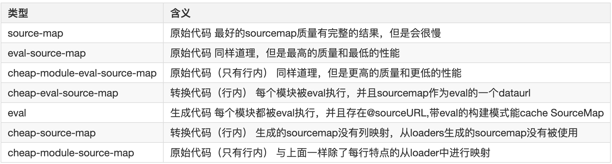
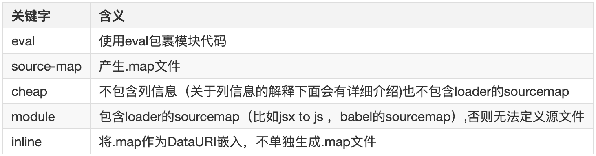
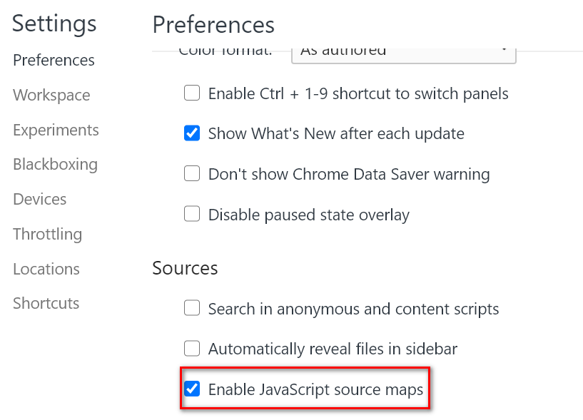
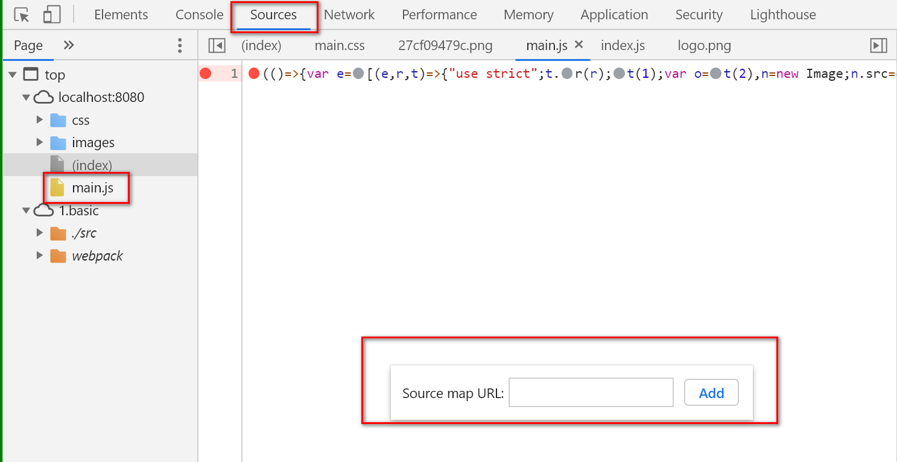

# sourceMap

`sourcemap`是为了解决开发代码与实际运行代码不一致时帮助我们`debug`到原始开发代码的技术，`webpack`通过配置可以自动给我们`source maps`文件，`map`文件是一种对应编译文件和源文件的方法。

在`webpack`编译过程中，会生成一个 `.map` 文件，一般用于代码调试和错误监控。

- 包含了源代码、编译后的代码、以及它们之间的映射关系。

- 编译后的文件通常会在文件末尾添加一个注释，指向 `SourceMap`文件的位置。

```js
// # sourceMappingURL=example.js.map
```

- 当在浏览器开发者工具调试时，浏览器会读取这行注释并加载对应的 `SourceMap` 文件

## 配置项



## 关键字



## 本地调试

> 举个 🌰

```js
const path = require('path')
const webpack = require('webpack')
// 文件管理器插件
const FileManagerPlugin = require('filemanager-webpack-plugin')

module.exports = {
  // 源文件与sourcemap文件不产生关联，更安全
  devtool: 'hidden-source-map',
  plugins: [
    new FileManagerPlugin({
      events: {
        // 事件
        onEnd: {
          // 当整个编译结束时，里面配两个钩子函数
          // 先copy再delete

          // 拷贝
          copy: [
            {
              // 把dist目录下的所有map文件都拷贝到，当前目录下的maps文件夹中
              source: './dist/*.map',
              destination: path.resolve('maps'),
            },
          ],

          // 删除
          delete: ['./dist/*.map'],
        },
      },
    }),
  ],
}
```



- 手动关联本地 sourcemap 文件与打包源代码：


