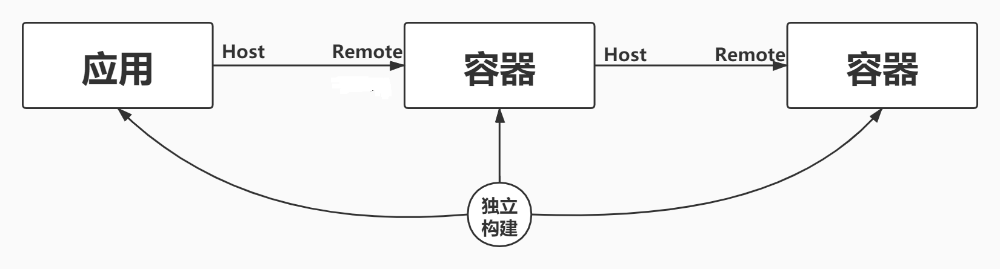
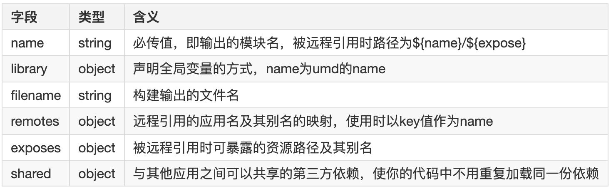
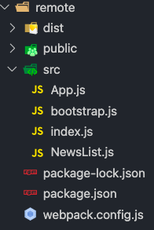
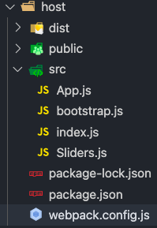
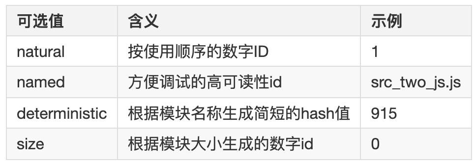

# Webpack 5

> `webpack5` 对于 `webpack4` 升级做了哪些优化

## 持久化缓存

`Webpack 5` 引入了内置的持久化缓存机制，极大地提升了二次构建的速度。在 `Webpack 4` 中，缓存是通过构建插件或者手动配置来实现的，而 `Webpack 5` 默认支持基于文件系统的缓存：

```js
module.exports = {
  cache: {
    type: 'filesystem', // 使用文件系统缓存，'memory'（内存缓存）
  },
}
```

## 资源管理优化

`Asset Modules`简化了处理静态资源的流程，之前需要通过 `file-loader`, `url-loader`, `raw-loader` 等加载器来处理资源文件，现在 `Webpack 5` 提供了统一的资源模块（`Asset Modules`）来替代这些加载器

> 举个 🌰

```js
module.exports = {
  module: {
    rules: [
      {
        test: /\.png$/,
        type: 'asset/resource', //拷贝文件, file-loader
      },
      {
        test: /\.ico$/,
        type: 'asset/inline', //生成一个base64字符串
      },
      {
        test: /\.txt$/,
        type: 'asset/source', //相当于以前raw-loader
      },
      {
        test: /\.jpg$/,
        type: 'asset',
        parser: {
          dataUrlCondition: {
            maxSize: 8 * 1024, // 阈值
          },
        },
      },
    ],
  },
}
```

## 模块联邦

`Webpack 5` 新引入了 模块联邦（`Module Federation`），这使得微前端架构和动态加载远程模块变得更加简单和高效。模块联邦允许应用程序从远程项目中共享和加载模块，而无需重新打包这些模块。

- 使用`Module Federation`时，每个应用块都是一个独立的构建，这些构建都将编译为容器

- 容器可以被其他应用或者其他容器应用

- 一个被引用的容器被称为`remote`，引用者被称为`host`，`remote`暴露模块给`host`, `host`则可以使用这些暴露的模块，这些模块被成为`remote`模块



> 参数配置



> 举个 🌰

### `remote`



> NewsList.js

```js
import React from 'react'
export default () => {
  return <div>列表</div>
}
```

> webpack.config.js

```js
const path = require('path')
const HtmlWebpackPlugin = require('html-webpack-plugin')
const ModuleFederationPlugin = require('webpack/lib/container/ModuleFederationPlugin')
module.exports = {
  mode: 'development',
  // ...
  plugins: [
    new HtmlWebpackPlugin({
      template: './public/index.html',
    }),
    new ModuleFederationPlugin({
      filename: 'remoteEntry.js', //  构建输出的文件名
      name: 'remote', //name   string  必传值，即输出的模块名，被远程引用时路径为${name}/${expose}
      exposes: {
        // 被远程引用时可暴露的资源路径及其别名
        './NewsList': './src/NewsList', // key是引用的名字，value是本地的路径，./ 代表当前容器跟路径下的NewList
      },
      remotes: {
        // 远程引用的应用名及其别名的映射，使用时以key值作为name
        host: 'host@http://localhost:8000/remoteEntry.js',
      },
      shared: {
        react: { singleton: true },
        'react-dom': { singleton: true },
      },
    }),
  ],
}
```

### `host`



> APP.js

```js
// App.js
import React from 'react'
import NewsList from './NewsList'
const RemoteSliders = React.lazy(() => import('host/Sliders'))
const App = () => {
  return (
    <div>
      <h2>本地组件NewsList</h2>
      <NewsList />
      <React.Suspense fallback={<div>加载中......</div>}>
        <RemoteSliders />
      </React.Suspense>
    </div>
  )
}

export default App
```

> webpack.config.js

```js
// webpack.config,js
const path = require('path')
const HtmlWebpackPlugin = require('html-webpack-plugin')
const ModuleFederationPlugin = require('webpack/lib/container/ModuleFederationPlugin')
module.exports = {
  mode: 'development',
  // ...
  plugins: [
    new HtmlWebpackPlugin({
      template: './public/index.html',
    }),
    new ModuleFederationPlugin({
      filename: 'remoteEntry.js', //  构建输出的文件名
      name: 'host', //name string  必传值，即输出的模块名，被远程引用时路径为${name}/${expose}
      remotes: {
        //远程引用的应用名及其别名的映射，使用时以key值作为name
        remote: 'remote@http://localhost:3000/remoteEntry.js',
      },
      exposes: {
        //被远程引用时可暴露的资源路径及其别名
        './Sliders': './src/Sliders',
      },
      shared: {
        react: { singleton: true },
        'react-dom': { singleton: true },
      },
    }),
  ],
}
```

## 长期缓存优化

- 更稳定的 `chunk id` 和 `module id`

`webpack 4` 采用的是，递增数字作为`module id` 和 `chunk id`

::: tip 缺点

- 如果引入顺序发生变化，那么`module id` 也会随之变化，打包后的内容就会大幅变动，缓存失效

- 如果新加入了 `chunk` 或者 `chunk` 的顺序发生变化，所有 `chunk id` 可能会重新分配，导致缓存失效

- 每次构建过程中，如果有新的模块加入，原本的模块顺序可能会发生变化，导致原有`module id` 改变

:::

::: tip webpack 5 的改进

- 默认使用 `deterministic` 模式

`deterministic`： 是一种确定性的生成方式，这种生成方式会根据模块的路径、文件名和内容等因素来确定 `module id`，基于 `chunk` 的内容和名称生成 `id`

- 可选择的配置项



:::

## 移除 `Node.js` 的 `polyfill`

- `webpack4`带了许多`Node`核心模块的`polyfill`，一旦模块中使用了任何核心模块（如`crypto`），这些模块就会被启用。

- `webpack5`不再自动引入这些`polyfill`，为了减小文件体积

> 举个 🌰

```js
module.exports = {
  resolve: {
    /*  fallback:{
        "crypto":false,//如果你确定不需要这个polyfill
        "stream":false,
        "buffer":false
    }, */
    // 需要用到polyfill
    fallback: {
      crypto: require.resolve('crypto-browserify'),
      stream: require.resolve('stream-browserify'),
      buffer: require.resolve('buffer'),
    },
  },
}
```

## `Tree Shaking` 改进

`Webpack 5` 在 `Tree Shaking` 的基础上引入了更精确的模块依赖分析，增强了不必要代码的消除能力。尤其对 `CommonJS` 和 `ESM` 模块的混用做了更好的优化。

### 支持 `CommonJS`

`Tree Shaking` 最初是为 `ECMAScript` 模块（`ESM`）设计的，`ESM` 使用静态导入 (`import` / `export`)，能够在编译时分析依赖关系，因此 `Tree Shaking` 能够有效工作。

`然而，JavaScript` 生态中有大量的项目仍然使用 `CommonJS` 模块格式（`require()`/ `module.exports`）。`Webpack 5` 针对 `Tree Shaking` 的改进之一就是对 `CommonJS` 模块 提供了更好的支持。

### 副作用剖析

Webpack 4 引入了 sideEffects 属性，通过 package.json 中的 sideEffects 字段来标记哪些模块具有副作用，从而帮助 Tree Shaking 更好地识别可移除的部分。

```json
{
  "sideEffects": ["./src/noEffect.js"]
}
```

在 `Webpack 5` 中，`Tree Shaking` 进一步优化了 副作用的剖析，能够更智能地判断哪些模块或导出确实没有副作用，如果你确定整个包都没有副作用，可以直接标记为：

```json
{
  "sideEffects": false
}
```

## 优化默认配置

`Webpack 5` 优化了默认的打包行为，使开发者不需要过多的配置即可得到良好的性能和优化效果。默认情况下启用了 `SplitChunks`、持久化缓存、更加合理的模块处理等。

- 默认开启 `SplitChunks`：`Webpack 5` 默认会对代码进行分块，减少包的体积，提升加载效率。
