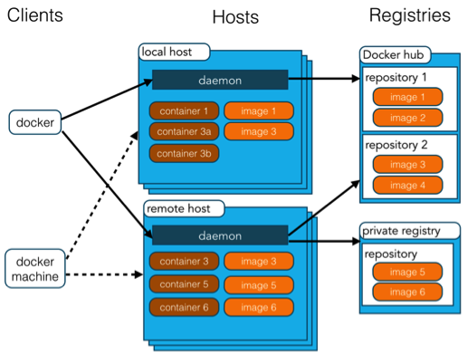

# Docker

`Docker` 是一个开源的应用容器引擎，让开发者打包他们的应用以及依赖包到一个可移植的容器中，然后发布到任何流行的 `Linux` 机器上，也可以实现虚拟化。

`Docker` 容器是完全使用沙箱机制，相互之间不会有任何接口。更重要的是，容器性能开销极低。

## Docker 的应用场景

- `Web` 应用的自动化打包和发布。

- 自动化测试和持续集成、发布。

- 在服务型环境中部署和调整数据库或其他的后台应用。

- 从头编译或者扩展现有的 `OpenShift` 或 `Cloud Foundry` 平台来搭建自己的 `PaaS` 环境。

## Docker 组件

- ` Docker Client：` `Docker ` 客户端，通过命令行或者其他工具使用 `Docker API` 进行操作。
- ` Docker Image：` `Docker ` 镜像，用来打包应用程序及其依赖。
- ` Docker Container：` `Docker ` 容器，是 `Docker` 运行时环境中的一个进程，是应用运行的环境。
- ` Docker Compose：` `Docker ` 编排，用于定义和运行多容器 `Docker` 应用程序。
- ` Docker File：` `Docker` 镜像构建文件，用来定义 `Docker` 镜像的内容。

## 通过 Docker Destop 直观学习 Docker
