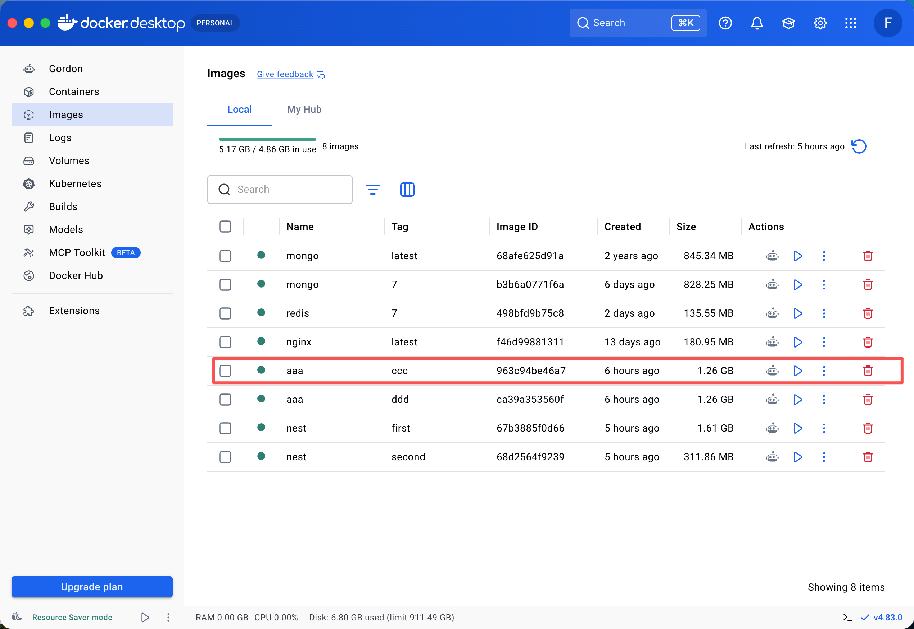
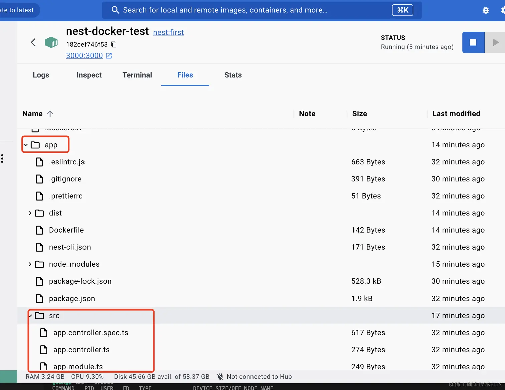
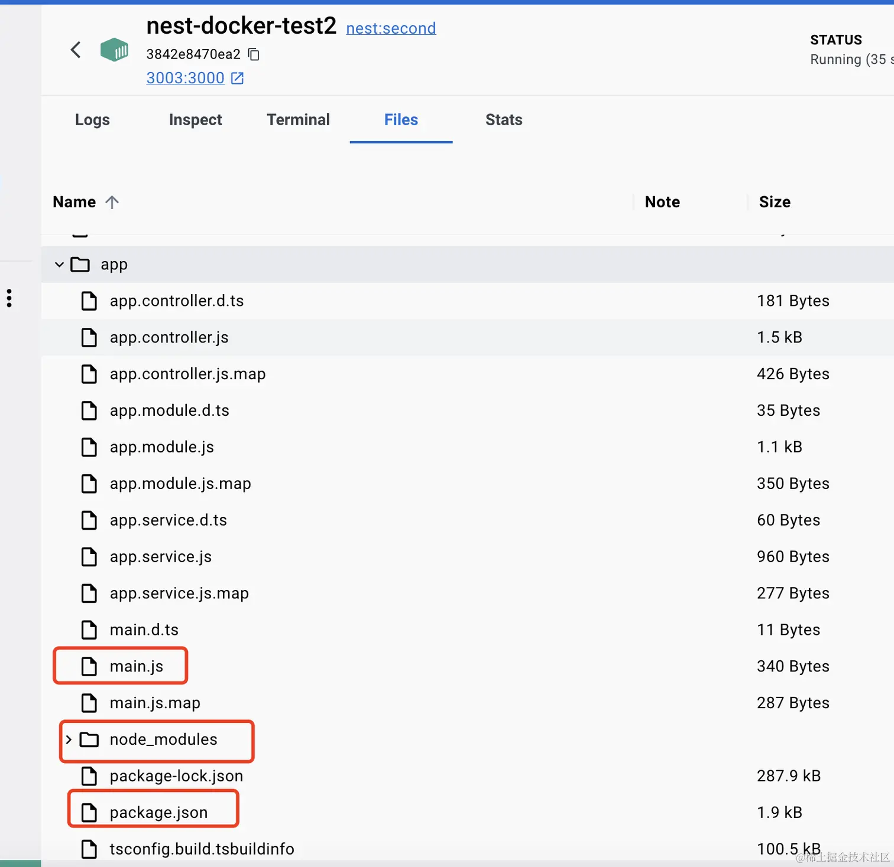
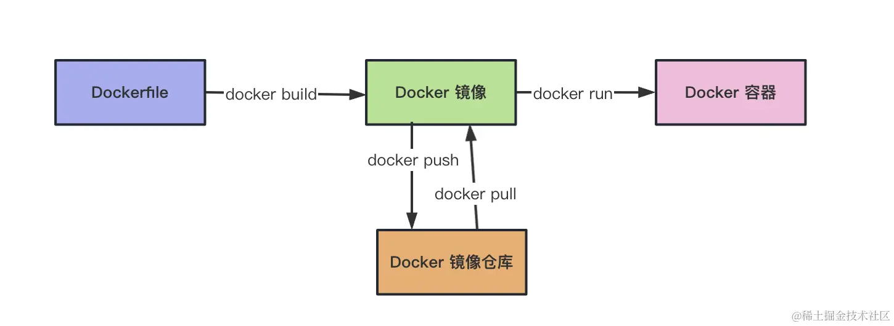
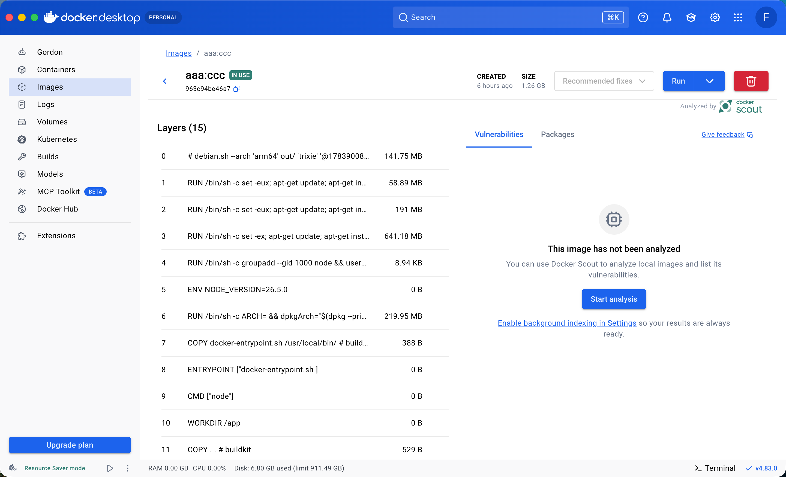

# Dockerfile

## Dockerfile 是什么

如果要自己制作 Docker 镜像，就需要描述镜像的基础环境、文件、依赖和启动命令。`Dockerfile` 就是用来描述这些步骤的配置文件。

执行 `docker build` 时，Docker 会读取 `Dockerfile`，按照其中的指令自动构建镜像。

## 基础 Dockerfile 示例

下面的示例使用 Node.js 镜像，安装 `http-server`，并启动一个静态文件服务：

```dockerfile
FROM node:latest

WORKDIR /app

COPY . .

RUN npm config set registry https://registry.npmmirror.com/
RUN npm install -g http-server

EXPOSE 8080

CMD ["http-server", "-p", "8080"]
```

把上面的内容保存为项目根目录下的 `Dockerfile`，并在同级目录创建 `index.html`。

### 常用指令

| 指令      | 作用                               |
| --------- | ---------------------------------- |
| `FROM`    | 指定基础镜像，例如 `node:latest`。 |
| `WORKDIR` | 设置后续指令执行时的工作目录。     |
| `COPY`    | 将构建上下文中的文件复制到镜像内。 |
| `RUN`     | 在构建镜像时执行命令。             |
| `EXPOSE`  | 声明容器中的服务端口。             |
| `CMD`     | 指定容器启动时执行的默认命令。     |

### Dockerfile 执行过程

1. `FROM` 继承 Node.js 基础镜像，其中已经包含 `node` 和 `npm`。
2. `WORKDIR` 将工作目录设置为 `/app`。
3. `COPY . .` 把构建上下文中的文件复制到容器的 `/app` 目录。
4. `RUN` 在构建阶段安装 `http-server`。
5. `EXPOSE` 声明服务使用容器的 `8080` 端口。
6. `CMD` 指定容器启动后运行 `http-server`。

## 构建镜像

在 `Dockerfile` 所在目录执行：

```bash
docker build -t aaa:ccc .
```

- `-t aaa:ccc`：将镜像命名为 `aaa`，标签为 `ccc`。
- `.`：指定当前目录作为构建上下文。



构建完成后，可以使用下面的命令启动容器：

```bash
docker run --name http-server -p 8080:8080 -d aaa:ccc
```

之后访问 `http://localhost:8080` 即可查看 `index.html`。

## `.dockerignore`

Docker 构建时会把构建上下文发送给 Docker daemon。镜像不需要的文件可以写入 `.dockerignore`，减少发送内容和构建时间，也可以避免镜像体积变大。

```dockerignore
*.md
!README.md
node_modules/
[a-c].txt
.git/
.DS_Store
.vscode/
.dockerignore
.eslintignore
.eslintrc
.prettierrc
.prettierignore
```

规则说明：

- `*.md`：忽略所有 Markdown 文件。
- `!README.md`：取消忽略 `README.md`。
- `node_modules/`：忽略 `node_modules` 目录及其内容。
- `[a-c].txt`：忽略 `a.txt`、`b.txt` 和 `c.txt`。
- `.git/`、`.DS_Store`：忽略 Git 数据和 macOS 系统文件。
- ESLint、Prettier 配置：如果构建过程中不需要，可以忽略。

`.dockerignore` 的作用类似于 Git 的 `.gitignore`：只把构建需要的文件发送给 Docker。

## Dockerfile 注释

使用 `#` 编写注释：

```dockerfile
# 使用 Node.js 作为基础镜像
FROM node:latest
```

## 多阶段构建

### 为什么需要多阶段构建

在项目中，构建阶段通常需要源码、开发依赖和构建工具，但生产环境只需要构建后的 `dist` 文件和生产依赖。

如果把所有文件都放进最终镜像，镜像体积会变大，也会增加部署和传输成本。多阶段构建可以使用一个 `Dockerfile` 完成“构建”和“运行”两个阶段，并只把构建产物复制到最终镜像。



### 多阶段构建示例

```dockerfile
# 构建阶段：安装完整依赖并生成 dist
FROM node:18 AS build-stage

WORKDIR /app

COPY package*.json ./

RUN npm config set registry https://registry.npmmirror.com/
RUN npm install

COPY . .
RUN npm run build

# 生产阶段：只保留运行所需文件
FROM node:18 AS production-stage

WORKDIR /app

COPY --from=build-stage /app/dist ./dist
COPY --from=build-stage /app/package*.json ./

RUN npm config set registry https://registry.npmmirror.com/
RUN npm install --omit=dev

EXPOSE 3000

CMD ["node", "/app/dist/main.js"]
```

### 多阶段构建过程

1. `build-stage` 安装完整依赖，并执行 `npm run build` 生成 `dist`。
2. `production-stage` 重新使用干净的 Node.js 镜像。
3. `COPY --from=build-stage` 只复制构建产物和依赖配置文件。
4. `npm install --omit=dev` 只安装生产依赖。
5. 最终容器只运行 `/app/dist/main.js`。

> `COPY --from=build-stage` 中的 `build-stage` 是前一个 `FROM` 阶段的名称，不是镜像名称。



## Dockerfile 与 CI/CD

实际项目中通常会维护一个 `Dockerfile`，然后经过以下流程发布应用：

```text
提交代码
  ↓
CI：拉取代码并执行 docker build
  ↓
为镜像添加版本 tag
  ↓
推送到镜像仓库
  ↓
CD：拉取指定版本镜像
  ↓
docker run 启动容器
```

CI 阶段负责构建并推送镜像，CD 阶段负责拉取指定版本并部署容器。使用镜像作为交付物，可以让测试环境和生产环境使用相同的运行内容。



## Docker 分层机制

每个容器都是独立的文件系统，相互独立，而这些文件系统之间可能很大部分都是一样的，同样的内容占据了很大的磁盘空间，会导致浪费。

所以 Docker 设计了一种分层机制：每一层都是不可修改的，也叫做镜像。

我们写的这个 Dockerfile，每一行指令都会生成一层镜像：

```dockerfile
FROM node:latest

WORKDIR /app

COPY . .

RUN npm config set registry https://registry.npmmirror.com/
RUN npm install -g http-server

EXPOSE 8080

CMD ["http-server", "-p", "8080"]
```

点开 docker 镜像的详情可以看到：就上面这个 dockerfile，它对应的镜像就有 15 层。当然，很多都是一层层通过 FROM 继承下来的。



Docker 通过这种分层的镜像存储，极大的减少了文件系统的磁盘占用。
