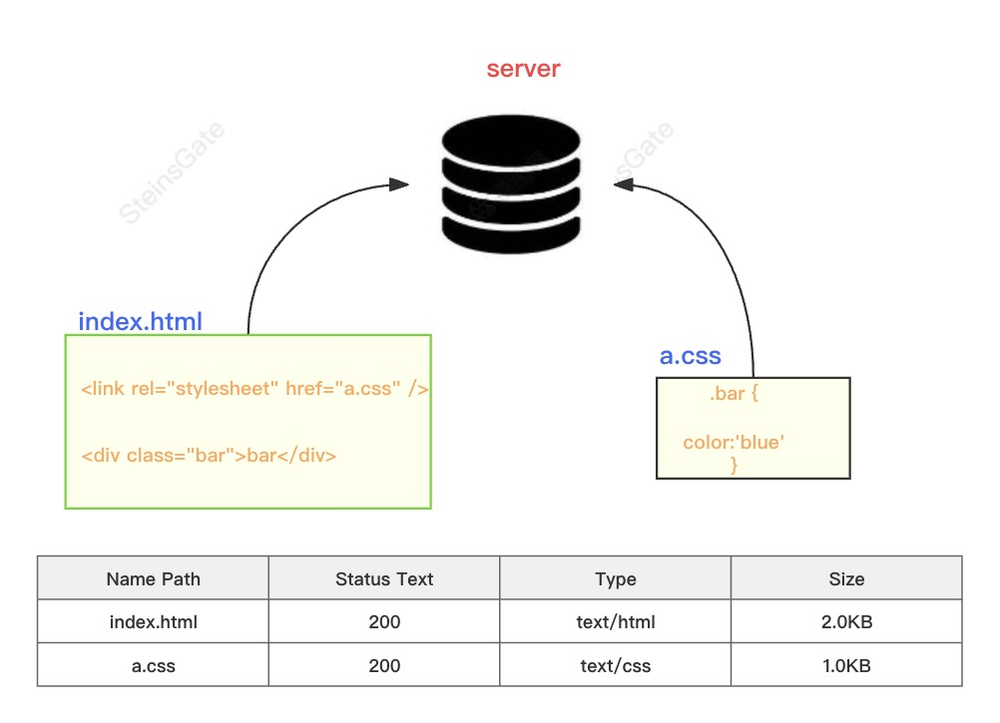
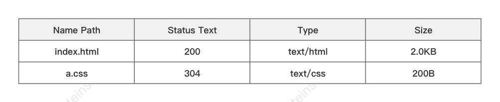
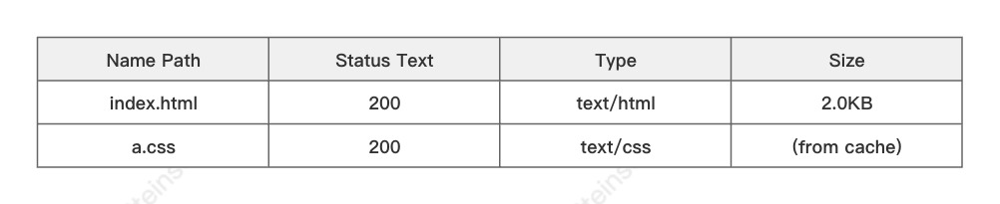
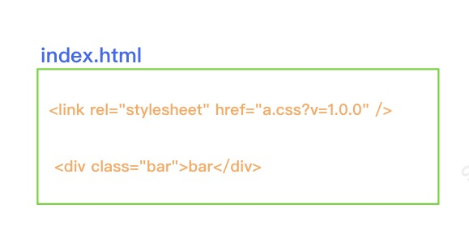
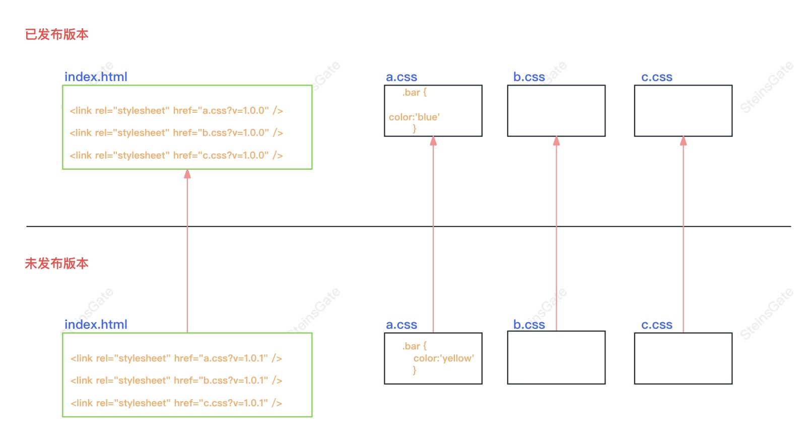

# 前端发布策略

前端发布的本质，其实是静态资源的发布，一般是 `js`、`css`,而不包括动态渲染出来的`html`模版。

## 野生状态下的前端资源

- 有一个`HTML`
- `HTML`中引入一个`CSS`
- `CSS`和`HTML`模版都有服务器反向代理

这时候他们的网络时序图会如下图所示，`html` 和 `css` 会依此加载：

用 HTTP 的缓存提高资源的加载速度

## 协商缓存

使用协商缓存的话，浏览器去请求资源，服务器会告诉浏览器这个资源已经多久没有改变过了，浏览器发现这个时间内自己请求过这个资源，于是就把缓存的资源拿出来直接使用。

这种方式省去了重新下载整个资源的时间，但是仍然需要一次协商缓存的过程。

## 本地缓存

另一种是本地缓存，在这种方式下，浏览器在发起请求之前，会对比请求的`url`，如果发现和之前一致的话，就从硬盘或是内存中，找到对应的缓存，直接使用。

显然本地缓存对加载速度更好，但是本地缓存带来了新的问题，如果资源更新了怎么办？用户一直使用老的缓存，即使发布了新的版本，用户不是也用不上吗？

既然本地缓存更请求的`url`有关，那么我们在请求资源的后面多加个版本的参数不就好了么，每次更新资源的时候也同步的更新参数。

比如说：所有的资源都加上一个`v.x.x.x`的版本号，在下次更新的时候修改版本号，让用户的缓存失效。

但是在实际情况中，我们还发现了新的问题，对于一个大型网站来说，静态资源可能非常非常多，每天都会有新的前端代码被修改，如果其中每一个资源被修改了，我们就全量修改所有的版本号的话。那缓存的意义也就不大了。

针对这个问题，我们可以用 hash 来解决。

hash 是一串字符串，它像是文件的一种特质，只和文件的内容有关，如果一个文件的内容变了，那么它的 hash 值也会变化。

利用 hash 的特性，我们可以把上一步的版本号改为 hash 值，这样的话只有被我们改动过的静态资源的缓存才会失效。
