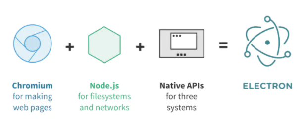
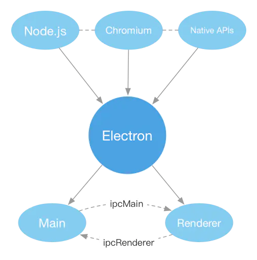

# Electron

## 介绍

Electron 是一个框架，可以让您使用 JavaScript, HTML 和 CSS 创建桌面应用程序。 然后这些应用程序可以打包在 macOS、Windows 和 Linux 上直接运行。

## Electron 为什么能跨平台

Electron 由 chromium、nodejs、native api 构成。其中，nodejs 是一个基于 Chrome V8 引擎的 JavaScript 运行时，提供了不同系统平台的支持，chromium 是谷歌公司开源的浏览器引擎，同样的也提供了不同系统平台的支持。

Electron 开发团队通过继承不同系统的 chromium 和 nodejs，提供一些桌面应用依赖的系统级别 api，实现了 Electron 的跨平台。

