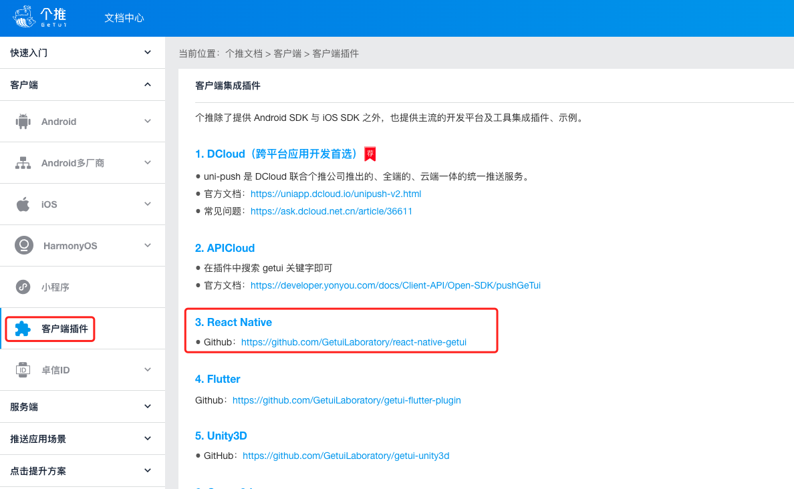

# React Native 集成个推消息推送

:::tip
[个推官网](https://www.getui.com/)

多通道一键下发：全面覆盖华为、小米、OPPO vivo、魅族、个推 UPS（坚果 索尼、海信等）系统级下发通道，合力提升多通道消息到达率

推送方式丰富：支持通知消息、透传消息，展示样式支持文本、大图、自定义等富媒体，推送样式丰富多样，满足开发者多种需求，提升消息点击率
:::

## 创建

1. 登录个推开发者中心，点击首页的”立即开通“。


2. 上传应用图片，填写应用名称、应用类型、`android` 包名、`ios bundleID` 等信息，点击【下一步】按钮


3. 集成使用

查看应用信息，记录 `appId`、`appKey`、`appSecret`、`masterSecret` 等信息，根据【集成指南】的步骤，集成 `SDK`。


## 集成

[react-native-getui 个推客户端插件](https://github.com/GetuiLaboratory/react-native-getui)



安装插件

```shell
npm install react-native-getui -save
```

```shell
cd ios && pod install
```

### 安卓配置

1. 配置 `build.gradle` 文件

```js
buildscript{
  ...
}

allprojects {
  repositories {
      mavenCentral()
      google()
      maven {
          url "https://mvn.getui.com/nexus/content/repositories/releases/"
      }
  }~
}
```

2. 配置 `app/build.gradle` 文件

```js
android {
  ...
  defaultConfig {
    ...
    manifestPlaceholders = [
      GETUI_APP_ID : "",
      GETUI_APP_KEY : "",
      GETUI_APP_SECRET : "",
      // 华为 相关应用参数
      HUAWEI_APP_ID  : "",

      // 小米相关应用参数
      XIAOMI_APP_ID  : "",
      XIAOMI_APP_KEY : "",

      // OPPO 相关应用参数
      OPPO_APP_KEY   : "",
      OPPO_APP_SECRET: "",

      // VIVO 相关应用参数
      VIVO_APP_ID    : "",
      VIVO_APP_KEY   : "",

      // 魅族相关应用参数
      MEIZU_APP_ID   : "",
      MEIZU_APP_KEY  : "",

      // 荣耀相关应用参数
      HONOR_APP_ID   : "",
    ]
  }
  ...
}

dependencies {
    implementation("com.facebook.react:react-android")
    + implementation project(':react-native-getui')
    ...
}
```

3. 配置 `MainApplication.kt` 文件`(app/src/main/java/com/youAppName/MainApplication.kt)`

```java
...
import android.os.Bundle
import com.getui.reactnativegetui.GetuiModule;
import com.getui.reactnativegetui.GetuiPackage;


class MainApplication : Application(), ReactApplication {

  override val reactNativeHost: ReactNativeHost =
      object : DefaultReactNativeHost(this) {
        override fun getPackages(): List<ReactPackage> =
          PackageList(this).packages.apply {
              add(GetuiPackage());
            }
      ...
      }
  ...

  override fun onCreate() {
    super.onCreate()
    SoLoader.init(this, false)
    GetuiModule.initPush(this)
    ...
  }
}
```

4. 配置 `AndroidManifest.xml` 文件`(app/src/main/AndroidManifest.xml)`

```xml
<manifest xmlns:android="http://schemas.android.com/apk/res/android" xmlns:tools="http://schemas.android.com/tools">

  <application>
    <meta-data android:name="GETUI_APPID" android:value="" tools:replace="android:value"/>

    <meta-data android:name="MEIZUPUSH_APPID" android:value="" tools:replace="android:value"/>
    <meta-data android:name="MEIZUPUSH_APPKEY" android:value="" tools:replace="android:value"/>

    <meta-data android:name="MIPUSH_APPID" android:value="" tools:replace="android:value"/>
    <meta-data android:name="MIPUSH_APPKEY" android:value="" tools:replace="android:value"/>

    <meta-data android:name="OPPOPUSH_APPKEY" android:value="" tools:replace="android:value"/>
    <meta-data android:name="OPPOPUSH_APPSECRET" android:value="" tools:replace="android:value"/>

    <meta-data android:name="com.vivo.push.app_id" android:value="" tools:replace="android:value"/>
    <meta-data android:name="com.vivo.push.api_key" android:value="" tools:replace="android:value"/>

    <meta-data android:name="com.huawei.hms.client.appid" android:value="" tools:replace="android:value"/>

    <receiver
        android:name="com.huawei.hms.support.api.push.PushMsgReceiver"
        android:exported="true">
    </receiver>

    <receiver
        android:name="com.huawei.hms.support.api.push.PushReceiver"
        android:exported="true">
    </receiver>
  </application>
</manifest>

```

5. 使用

```jsx
import Getui from 'react-native-getui'

const Home = () => {
  useEffect(() => {
    Getui.turnOnPush()
    Getui.clientId((param: string) => {
      getStorageUser().then((res: any) => {
        Getui.bindAlias(res.id, param)
      })
    })
  }, [])

  return <div>Home</div>
}
```
