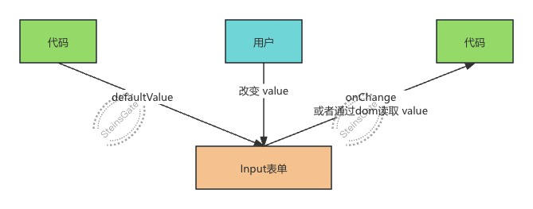

# 受控与非受控模式

:::tip
什么是受控，什么是非受控？

`value` 由用户控制就是非受控模式，由代码控制就是受控模式。

非受控模式就是完全用户自己修改 `value`，我们只是设置个 `defaultValue`，可以通过 `onChange` 或者 `ref` 拿到表单值。

受控模式是代码来控制 `value`，用户输入之后通过 `onChange` 拿到值然后 `setValue`，触发重新渲染。
:::

## 非受控模式

代码设置表单的初始 `value`，但是能改变 `value` 的只有用户，代码通过监听 `onChange` 来拿到最新的值，或者通过 `ref` 拿到 `dom` 之后读取 `value`。



## 受控模式

代码可以改变表单的 value，用户输入之后在 onChange 事件里拿到输入，然后通过代码去设置 value，这就是受控模式。


当然需要对输入的值做处理之后设置到表单的时候，或者是想实时同步状态值到父组件时，受控模式就比较有用了。

**<font color="FF9D00">注意： 受控模式下，每次的 setState 都会导致组件重新渲染。</font>**

```jsx
import { useState } from 'react'

function App() {
  const [value, setValue] = useState('')

  console.log('Rendering App')

  return <input value={value} onChange={(e) => setValue(e.target.value)} />
}

export default App
```


而非受控模式下只会渲染一次：

```jsx
function App() {
  console.log('Rendering App')

  return <input defaultValue="hi" />
}

export default App
```


:::tip
哪什么时候使用受控模式呢？

**当你需要对输入的值做处理之后设置到表单的时候，或者是想实时同步状态值到父组件。**

那么基础组件是怎么同时实现受控和非受控模式的呢？

[arco design 的 useMergeValue](https://github.com/arco-design/arco-design/blob/1e677c3c5bba72728668c40d78faea6536c480a8/components/_util/hooks/useMergeValue.ts)
:::

```tsx
import { useEffect, useRef, useState } from 'react'

interface ChildProps {
  value?: string
  defaultValue?: string
  onChange?: (data: string) => void
}

function Child(props: ChildProps) {
  // 参数同时支持 value 和 defaultValue
  const { value: propsValue, defaultValue, onChange } = props

  // 通过判断 propsValue 是不是 undefined 来区分受控模式和非受控模式
  const [value, setValue] = useState(() => {
    if (propsValue !== undefined) {
      // 如果是受控模式，useState 的初始值设置 props.value，然后渲染用 props.value
      return propsValue
    } else {
      // 如果是非受控模式，那渲染用内部 state 的 value，然后 changeValue 里 setValue
      return defaultValue
    }
  })

  const isFirstRender = useRef(true)

  useEffect(() => {
    // 第一次渲染时候，props.value 已经在useState里赋值给stateValue了，不需要再次赋值。
    // 当不是首次渲染，但 value 变为 undefined 的情况，也就是从受控模式切换到了非受控模式，要同步设置 state 为 propsValue
    if (propsValue === undefined && !isFirstRender.current) {
      setValue(propsValue)
    }
    isFirstRender.current = false
  }, [propsValue])

  const mergedValue = propsValue === undefined ? value : propsValue

  function changeValue(data: string) {
    if (propsValue === undefined) {
      setValue(data)
    }
    onChange?.(data)
  }

  return (
    <div>
      {mergedValue}
      <div
        onClick={() => {
          changeValue('11')
        }}
      >
        1
      </div>
      <div
        onClick={() => {
          changeValue('22')
        }}
      >
        2
      </div>
      <div
        onClick={() => {
          changeValue('33')
        }}
      >
        3
      </div>
    </div>
  )
}

function Father() {
  return (
    <Child
      defaultValue={'1'}
      onChange={(value) => {
        console.log(value)
      }}
    />
  )
}

export default Father
```
