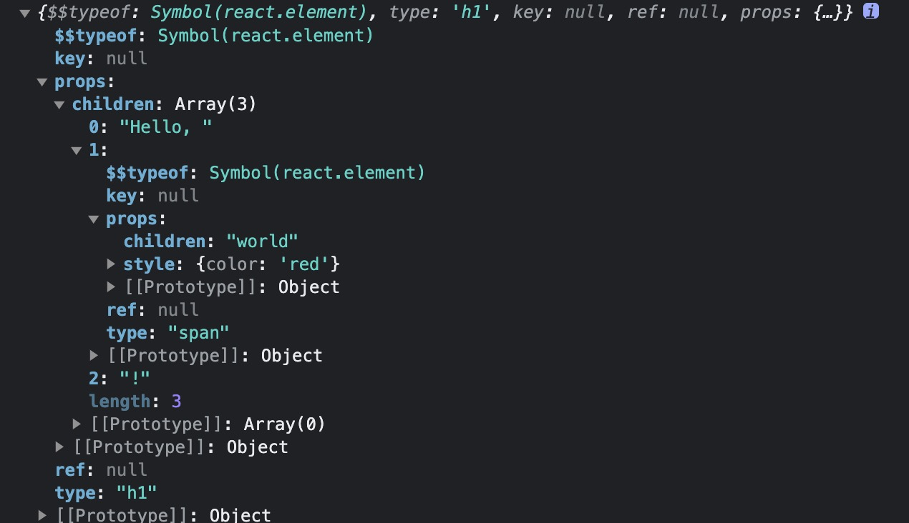

# 虚拟 DOM

## `虚拟 DOM` 是什么

1. `React.createElement` 函数所返回的就是一个`虚拟 DOM`
2. `虚拟 DOM` 就是一个描述真实 `DOM` 的纯 `JS` 对象

```js
let element = (
  <h1>
    Hello, <span style={{ color: 'red' }}>world</span>!
  </h1>
)

console.log(element)
```


