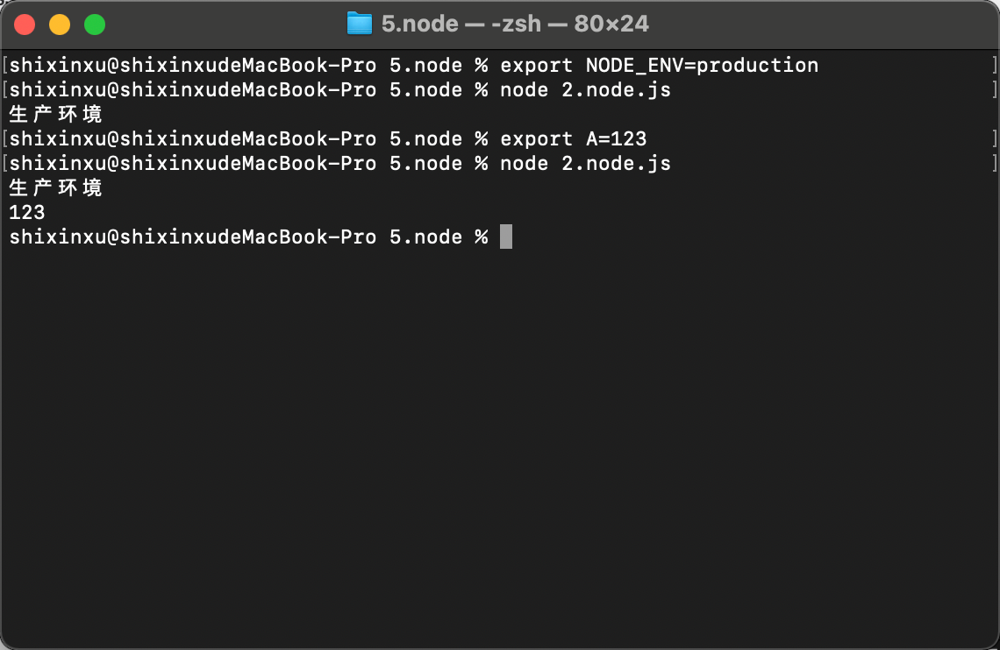
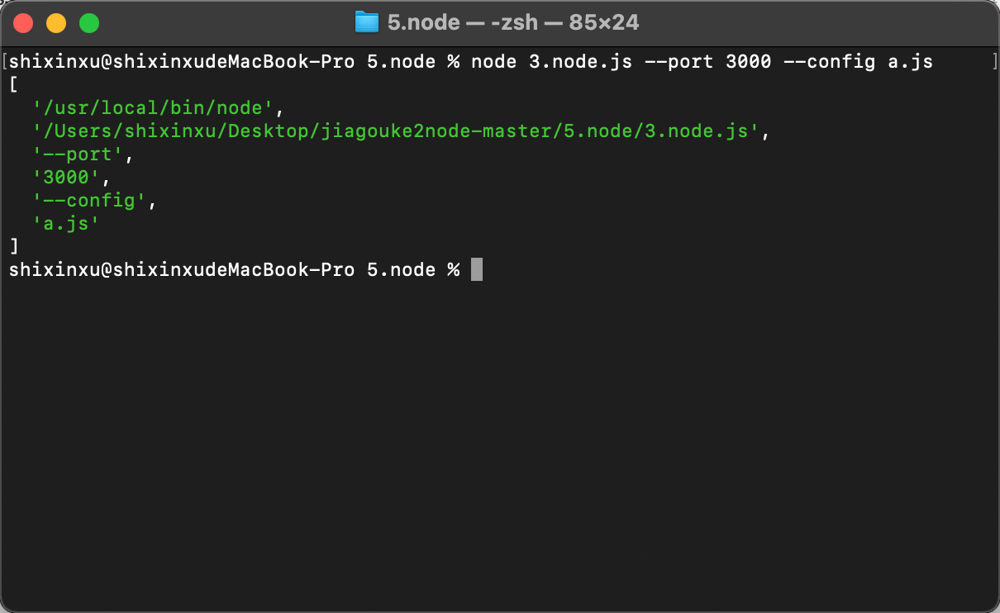
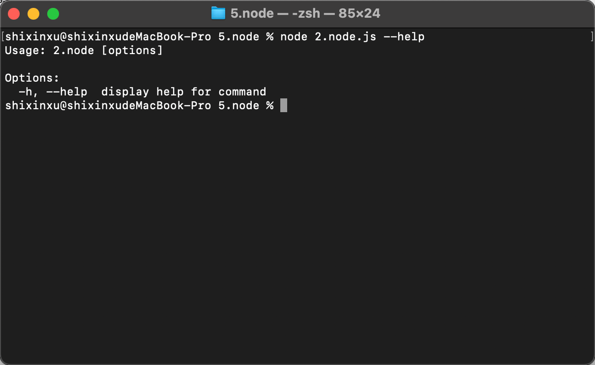
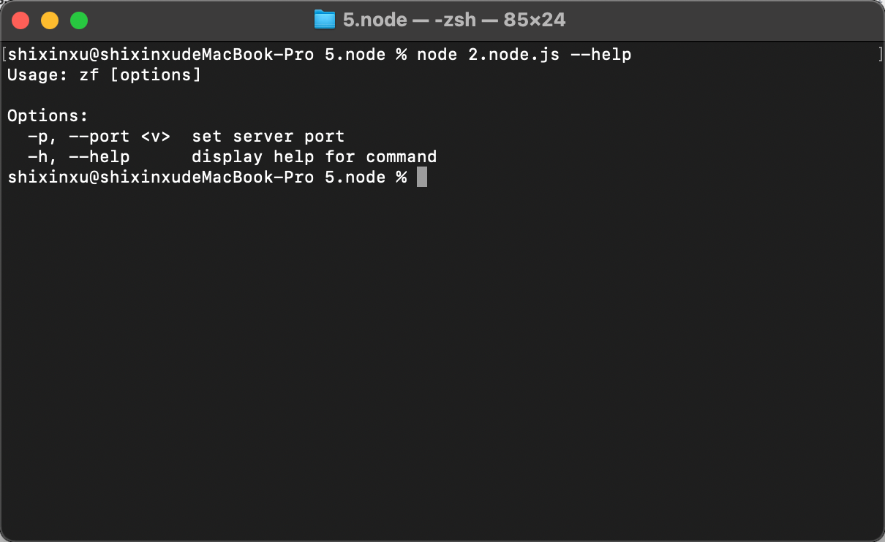
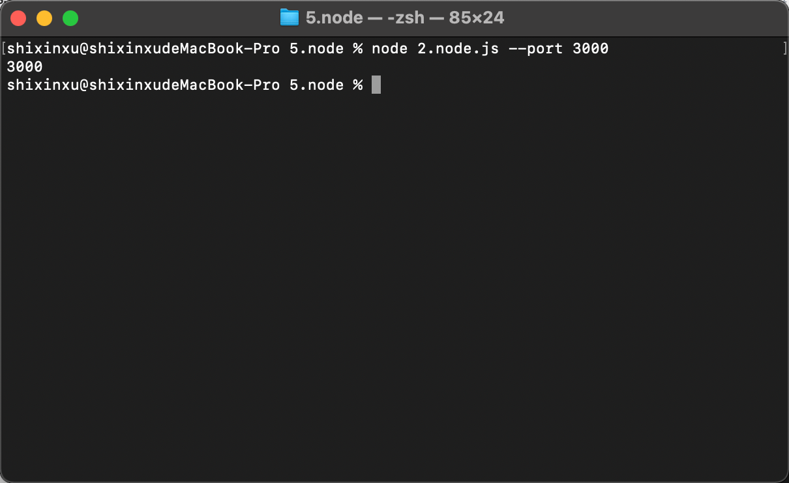
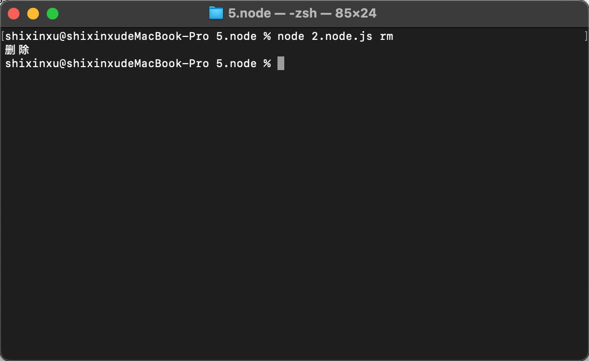

# Node 的一些 API

## Global

1. node 中的全局变量是 global。
2. 浏览器中的 this 是指代的是 window（浏览器中是没有 global 的可以理解为 window 代理了 global），服务端中的 this 指代的都是 global。
3. 当我们在文件中访问 this 时，内部被更改了，所以返回的不是 global，而是 module.exports。
4. setInterval、clearInterval、setTimeout、clearTimeout、setImmediate、clearImmediate、queueMicrotask、process、buffer 这些是全局变量（就是直接在文件中不需要声明就能直接访问的），他们都是挂在 global 上的，global.xxx。
5. reqiure、module、exports、\_\_dirname、\_\_filename 也叫全局变量，但实际上不是他们只存在于模块的作用域中，他们不在 global 上。

```js
console.log(this) // {} 所以返回的是空对象
```

```js
function a() {
    console.log(this) // this指向调用a函数的
}
a()
Object [global] {
    global: [Circular *1],
    clearInterval: [Function: clearInterval],
    clearTimeout: [Function: clearTimeout],
    setInterval: [Function: setInterval],
    setTimeout: [Function: setTimeout] {
      [Symbol(nodejs.util.promisify.custom)]: [Function (anonymous)]
    },
    queueMicrotask: [Function: queueMicrotask],
    clearImmediate: [Function: clearImmediate],
    setImmediate: [Function: setImmediate] {
      [Symbol(nodejs.util.promisify.custom)]: [Function (anonymous)]
    }
}
```

## process 进程对象

1. process 中常用的变量有：platform、cwd、env、argv、nextTick。
2. process.platform 用途：根据不同平台操作系统文件的。

```lua
console.log(process.platform)
win32  windows系统
drawin linux系统
```

3. process.cwd()用途：可以获取当前执行 node 命令的目录，可以找到当前目录下的某个文件。
   process.cwd()获取的路径是可以改变的，\_\_dirname 是不变的。

```lua
console.log(process.cwd())
/Users/xinxu/Desktop/node-master
```

4. process.env 用途：根据不同的环境变量做配置（webpack 环境配置）
   cross-env 这是一个第三方模块，用于区分环境。
   如果 windows 系统可以用 set xxx=xxx，mac 用 export xxx=xxx

```js
if (process.env.NODE_ENV === 'production') {
  console.log('生产环境')
} else {
  console.log('开发环境')
}
console.log(process.env.A) // 123 // 当前系统环境变量
```



5. process.argv 用途：运行代码时传入参数，可以获取到当前用户传的所有参数 --port(简写：-p)，--config

```js
console.log(process.argv)
// 第一个指代的是node的执行文件，node.exe
// 第二个指代的是当前执行文件
```



```js
// 那如何取出用户传入的参数呢
process.argv.slice(2).reduce((memo, current, index, arr) => {
  //[--port, 3000, --config, a.js] 对数组进行收敛
  if (current.startWith('--')) {
    memo[current.slice(2)] = arr[index + 1]
  }
  return memo
}, {})
// => {port:3000,config:a.js}
```

[commnder](https://www.npmjs.com/package/commander)这个 npm 包可以解决，解析用户传参，就不需要手写数组收敛。

```js
const program = require('commander')
program.parse(process.argv)
```



```js
const program = require('commander') // 解析用户传递的参数
program.name('zf')
program.usage('[options]')
program.option('-p, --port <v>', 'set server port') // <v>表示-p --port 后面有参数
program.parse(process.argv)
```



```js
const program = require('commander')
program.name('zf')
program.usage('[options]')
program.option('-p, --port <v>', 'set server port') // <v>表示-p --port 后面有参数
program.parse(process.argv)
console.log(program.port) // 3000
```



### commander 识别一些命令

```js
const program = reuqire('commander')
program.name('zf')
program.usage('[options]')
program.command('rm').action(() => {
  console.log('删除')
})
program.prase(process.argv)
```


