# AOP

## `AOP` 是什么

`AOP`（Aspect Oriented Programming）是面向切面编程，是一种程序设计思想，是软件设计领域中的一个重要概念。`AOP` 允许用户把公用的代码抽取出来，便于重复使用。

## `AOP` 的好处

`AOP` 的好处是可以把一些通用逻辑分离到切面中，保持业务逻辑的纯粹性，这样切面逻辑可以复用，还可以动态的增删。

举个例子 🌰：

一个请求过来，可能会经过 `Controller`（控制器）、`Service`（服务）、`Repository`（数据库访问） 的逻辑，如果想在这个调用链路里加入一些通用逻辑该怎么加呢？比如日志记录、异常处理等，通过 `AOP` 透明的给业务逻辑加上通用逻辑。

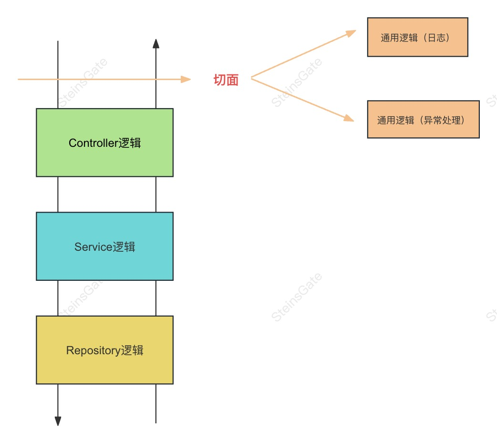

## `Nest`实现`AOP`的方式

### `Middleware` 中间件

中间件是在路由处理程序 之前 调用的函数。 中间件函数可以访问请求和响应对象，以及应用程序请求响应周期中的 `next()` 中间件函数。 `next()` 中间件函数通常由名为 `next` 的变量表示。


中间件函数可以执行以下任务:

- 执行任何代码。
- 对请求和响应对象进行更改。
- 结束请求-响应周期。
- 调用堆栈中的下一个中间件函数。
- 如果当前的中间件函数没有结束请求-响应周期, 它必须调用 `next()` 将控制传递给下一个中间件函数。否则, 请求将被挂起。

**<font color="FF9D00">全局中间件</font>**

在 `main.ts` 里通过 `app.use` 使用：

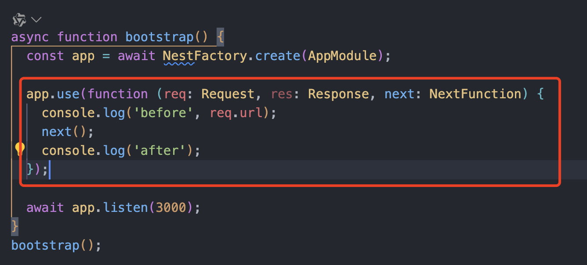

```ts
app.use(function (req: Request, res: Response, next: NextFunction) {
  console.log('before', req.url)
  next()
  console.log('after')
})
```

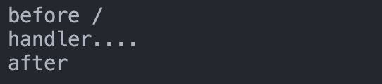

**<font color="FF9D00">路由中间件</font>**

```shell
nest g middleware log --no-spec --flat
```

`--no-spec` 是不生成测试文件，`--flat` 是平铺，不生成目录。

生成`log.middleware.ts` 代码

```ts
import { Injectable, NestMiddleware } from '@nestjs/common'
import { Request, Response } from 'express'

@Injectable()
export class LogMiddleware implements NestMiddleware {
  use(req: Request, res: Response, next: () => void) {
    console.log('before2', req.url)

    next()

    console.log('after2')
  }
}
```

然后在 `AppModule` 里启用：

在 `configure` 方法里配置 `LogMiddleware` 在哪些路由生效。

```ts
import { MiddlewareConsumer, Module, NestModule } from '@nestjs/common'
import { AppController } from './app.controller'
import { AppService } from './app.service'
import { LogMiddleware } from './log.middleware'

@Module({
  imports: [],
  controllers: [AppController],
  providers: [AppService],
})
export class AppModule implements NestModule {
  configure(consumer: MiddlewareConsumer) {
    consumer.apply(LogMiddleware).forRoutes('aaa*')
  }
}
```

```ts
// app.controller.ts
@Controller()
export class AppController {
  constructor(private readonly appService: AppService) {}

  @Get()
  getHello(): string {
    console.log('handler....')
    return this.appService.getHello()
  }

  @Get('/aaa')
  aaa(): string {
    console.log('aaa...')
    return 'aaa'
  }
}
```

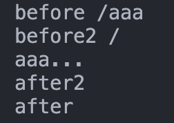

### `Guard` 路由守卫

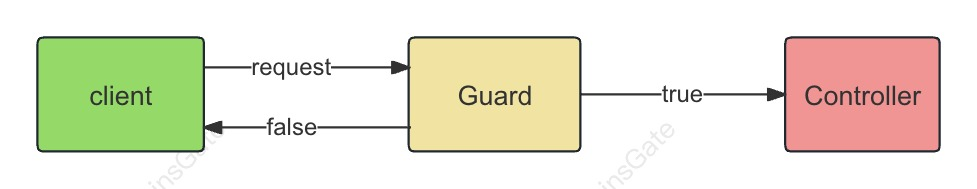

`Guard` 是路由守卫的意思，可以用于在调用某个 `Controller` 之前判断权限，返回 `true` 或者 `false` 来决定是否放行，它们根据运行时出现的某些条件（例如权限，角色，访问控制列表等）来确定给定的请求是否由路由处理程序处理。这通常称为授权。

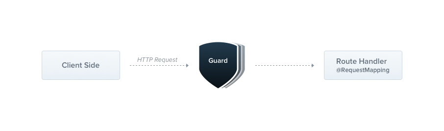

创建 `guard`

```shell
nest g guard login --no-spec --flat
```

生成代码：

```ts
import { CanActivate, ExecutionContext, Injectable } from '@nestjs/common'
import { Observable } from 'rxjs'

@Injectable()
export class LoginGuard implements CanActivate {
  canActivate(context: ExecutionContext): boolean | Promise<boolean> | Observable<boolean> {
    // console信息
    console.log('guard...')

    return true
  }
}
```

守卫是一个使用 `@Injectable()` 装饰器的类。 守卫要实现 `CanActivate` 接口，实现 `canActivate` 方法，可以从 `context` 拿到请求的信息，然后做一些权限验证等处理之后返回 `true` 或者 `false`。

```ts
// app.controller.ts
import {UseGuards} from '@nestjs/common';

  @Get('/aaa')
  @UseGuards(LoginGuard)
  aaa(): string {
    console.log('aaa...');
    return 'aaa';
  }
```

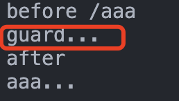

`Controller` 本身不需要做啥修改，却透明的加上了权限判断的逻辑，这就是 `AOP` 架构的好处。

**<font color="FF9D00">全局路由守卫</font>**

- 方式一：`main.ts` 里`app.useGlobalGuards`

```ts
import { NestFactory } from '@nestjs/core'
import { AppModule } from './app.module'
import { LoginGuard } from './login.guard'

async function bootstrap() {
  const app = await NestFactory.create(AppModule)

  app.useGlobalGuards(new LoginGuard())

  await app.listen(3000)
}
bootstrap()
```

这种方式是手动 `new` 的 `Guard` 实例，不在 `IoC` 容器里。

- 方式二：用 `provider` 的方式声明的 `Guard` 是在 `IoC` 容器里的，可以注入别的 `provider`

```ts
// app.module.ts
import { MiddlewareConsumer, Module } from '@nestjs/common';
import { AppController } from './app.controller';
import { AppService } from './app.service';
import { LoginGuard } from './login.guard';

@Module({
  imports: [],
  controllers: [AppController],
  providers: [
    AppService,
    {
      provide: 'APP_GUARD',
      useClass: LoginGuard,
    },
  ],
})
```

当需要注入别的 `provider` 的时候，就要用第二种全局 `Guard` 的声明方式。

### `Interceptor` 拦截器

`Interceptor` 拦截器，可以在目标 Controller 方法前后加入一些逻辑。

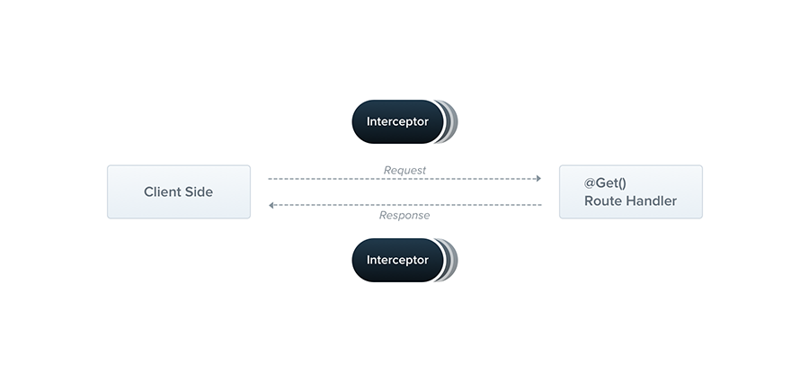

拦截器具有一系列有用的功能，它们可以：

- 在函数执行之前/之后绑定额外的逻辑
- 转换从函数返回的结果
- 转换从函数抛出的异常
- 扩展基本函数行为
- 根据所选条件完全重写函数 (例如, 缓存目的)

**拦截器是使用 `@Injectable()` 装饰器注解的类。拦截器应该实现 `NestInterceptor` 接口。**

创建个 `Interceptor`

```shell
nest g interceptor data --no-spec --flat
```

生成代码：

```ts
import { CallHandler, ExecutionContext, Injectable, NestInterceptor } from '@nestjs/common'
import { Observable } from 'rxjs'

@Injectable()
export class DataInterceptor implements NestInterceptor {
  intercept(context: ExecutionContext, next: CallHandler): Observable<any> {
    return next.handle()
  }
}
```

`Interceptor` 要实现 `NestInterceptor` 接口，实现 `intercept` 方法，调用 `next.handle()` 就会调用目标 `Controller`，可以在之前和之后加入一些处理逻辑。

`Controller` 之前之后的处理逻辑可能是异步的。`Nest` 里通过 `rxjs` 来组织它们，所以可以使用 `rxjs` 的各种 `operator`。

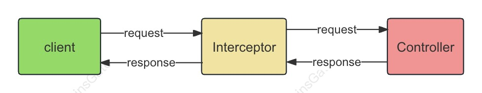

添加代码：

```ts
// date.interceptor
import { CallHandler, ExecutionContext, Injectable, NestInterceptor } from '@nestjs/common'
import { Observable, tap } from 'rxjs'

@Injectable()
export class DataInterceptor implements NestInterceptor {
  intercept(context: ExecutionContext, next: CallHandler): Observable<any> {
    return next.handle().pipe(
      tap(() => {
        console.log('time: ', Date.now())
      }),
    )
  }
}

// Interceptor 支持每个路由单独启用，只作用于某个 handler：
// app.controller.ts
  @Get('/bbb')
  @UseInterceptors(DataInterceptor)
  bbb(): string {
    console.log('bbb...');
    return 'bbb';
  }

// 也同样支持全局启用，作用于全部 controller：
@Controller()
@UseInterceptors(DataInterceptor)
export class AppController {}
```

也同样支持全局启用，作用于全部 controller：

```ts
// main.ts
async function bootstrap() {
  const app = await NestFactory.create(AppModule)

  app.useGlobalInterceptors(new DataInterceptor())

  await app.listen(3000)
}
bootstrap()

// app.module.ts
@Module({
  imports: [],
  controllers: [AppController],
  providers: [
    AppService,
    {
      provide: 'APP_INTERCEPTOR',
      useClass: DataInterceptor,
    },
  ],
})
```

:::tip

`interceptor` 与 `middleware` 其实是有区别的，主要在于参数的不同。

`interceptor` 可以从`(context: ExecutionContext)`拿到调用的 `controller` 和 `handler`。

:::

### `Pipe` 管道

`Pipe` 是管道的意思，用来对参数做一些检验和转换。

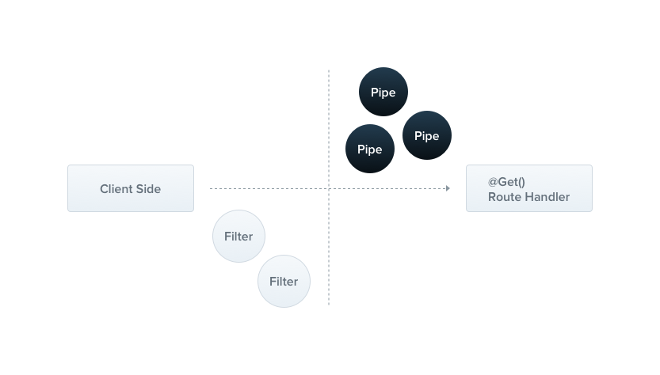

管道有两个典型的应用场景:

- 转换：管道将输入数据转换为所需的数据输出(例如，将字符串转换为整数)。
- 验证：对输入数据进行验证，如果验证成功继续传递; 验证失败则抛出异常。

`Nest` 自带九个开箱即用的管道，即：

- `ValidationPipe`
- `ParseIntPipe`
- `ParseFloatPipe`
- `ParseBoolPipe`
- `ParseArrayPipe`
- `ParseUUIDPipe`
- `ParseEnumPipe`
- `DefaultValuePipe`
- `ParseFilePipe`
  他们从 `@nestjs/common` 包中导出。

`nest cli` 创建个 `pipe`

```shell
nest g pipe validate --no-spec --flat
```

生成代码：

```ts
import { ArgumentMetadata, Injectable, PipeTransform } from '@nestjs/common'

@Injectable()
export class ValidatePipe implements PipeTransform {
  transform(value: any, metadata: ArgumentMetadata) {
    return value
  }
}
```

`Pipe` 要实现 `PipeTransform` 接口，实现 `transform` 方法，里面可以对传入的参数值 `value` 做参数验证，比如格式、类型是否正确，不正确就抛出异常。也可以做转换，返回转换后的值。

实现一下：

```ts
// validate.pipe.ts
import {
  ArgumentMetadata,
  BadRequestException,
  Injectable,
  PipeTransform,
} from '@nestjs/common';

@Injectable()
export class ValidatePipe implements PipeTransform {
  transform(value: any, metadata: ArgumentMetadata) {
    if (Number.isNaN(parseInt(value))) {
      throw new BadRequestException(`参数${metadata.data}错误`)
    }

    return typeof value === 'number' ? value * 10 : parseInt(value) * 10
  }
}

// app.controller.ts
import { ValidatePipe } from './validate.pipe';

@Get('/ccc')
  @UseFilters(TestFilter)
  ccc(@Query('num', ValidatePipe) num: number): number {
    return num + 1;
  }
```

同样，`Pipe` 可以只对某个参数生效，或者整个 `Controller` 都生效,或者全局生效。

### ExceptionFilter 异常过滤器

`ExceptionFilter` 可以对抛出的异常做处理，返回对应的响应。

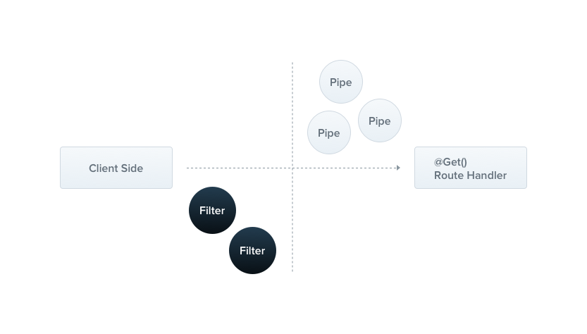

创建一个 filter

```shell
nest g filter test --no-spec --flat
```

生成代码：

```ts
import { ArgumentsHost, BadRequestException, Catch, ExceptionFilter } from '@nestjs/common'
import { Response } from 'express'

@Catch()
export class TestFilter<T> implements ExceptionFilter {
  catch(exception: BadRequestException, host: ArgumentsHost) {}
}
```

实现 `ExceptionFilter` 接口，实现 `catch` 方法，就可以拦截异常了。

拦截什么异常用 `@Catch` 装饰器来声明，然后在 `catch` 方法返回对应的响应，给用户更友好的提示。

```ts
// test.filter.ts
import { ArgumentsHost, BadRequestException, Catch, ExceptionFilter } from '@nestjs/common'
import { Response } from 'express'

@Catch(BadRequestException)
export class TestFilter implements ExceptionFilter {
  catch(exception: BadRequestException, host: ArgumentsHost) {
    const response: Response = host.switchToHttp().getResponse()

    response.status(400).json({
      statusCode: 400,
      message: 'test: ' + exception.message,
    })
  }
}

// app.controller.ts
import { TestFilter } from './test.filter';

@Get('/ccc')
  @UseFilters(TestFilter)
  ccc(@Query('num', ValidatePipe) num: number): number {
    return num + 1;
  }
```

`Nest` 通过这样的方式实现了异常到响应的对应关系，代码里只要抛出不同的异常，就会返回对应的响应，很方便。

## 总结

`Middleware`、`Guard`、`Pipe`、`Interceptor`、`ExceptionFilter` 都可以透明的添加某种处理逻辑到某个路由或者全部路由，AOP 是把通用逻辑抽离出来，通过切面的方式添加到某个地方，可以复用和动态增删切面逻辑，这就是 `AOP` 的好处。

但是它们之间的顺序关系是什么呢？

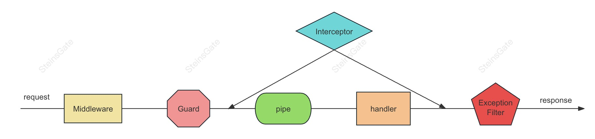

`Middleware` 是 `Express` 的概念，在最外层，到了某个路由之后，会先调用 `Guard`，`Guard `用于判断路由有没有权限访问，然后会调用 `Interceptor`，对 `Contoller` 前后扩展一些逻辑，在到达目标 `Controller` 之前，还会调用 `Pipe` 来对参数做检验和转换。所有的 `HttpException` 的异常都会被 `ExceptionFilter` 处理，返回不同的响应。
