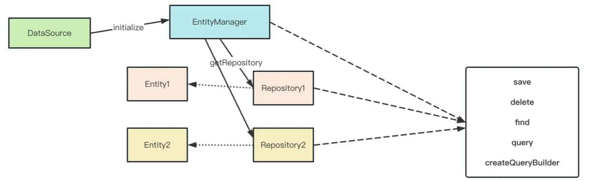
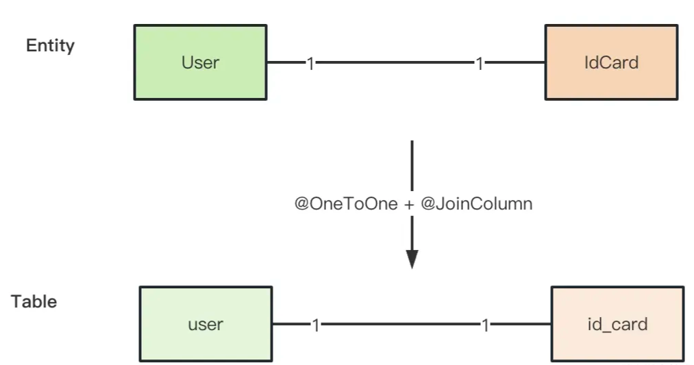
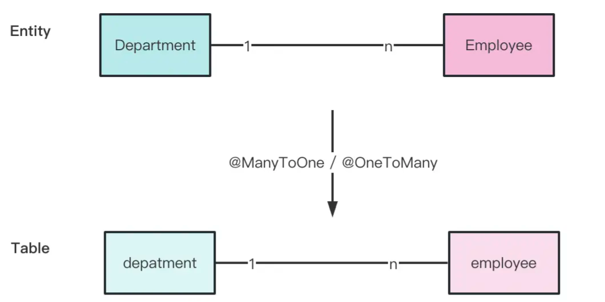
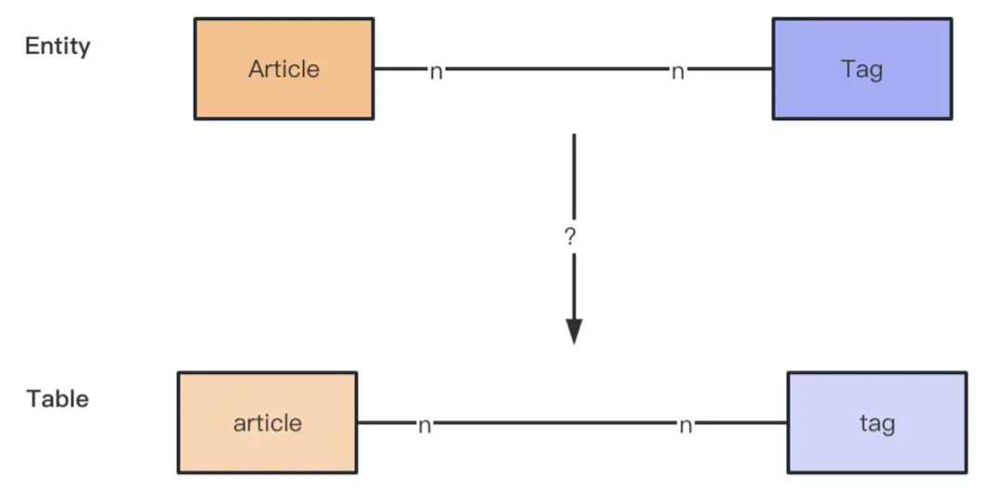
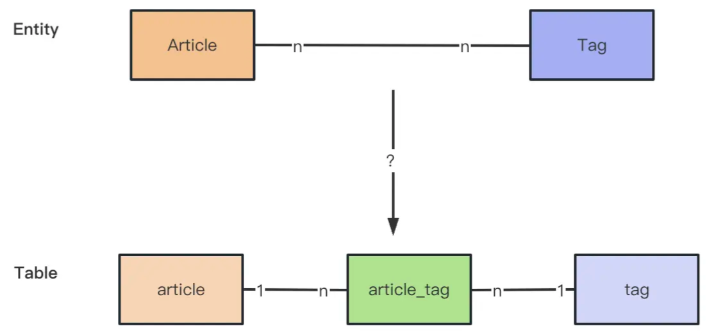
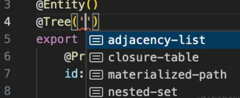
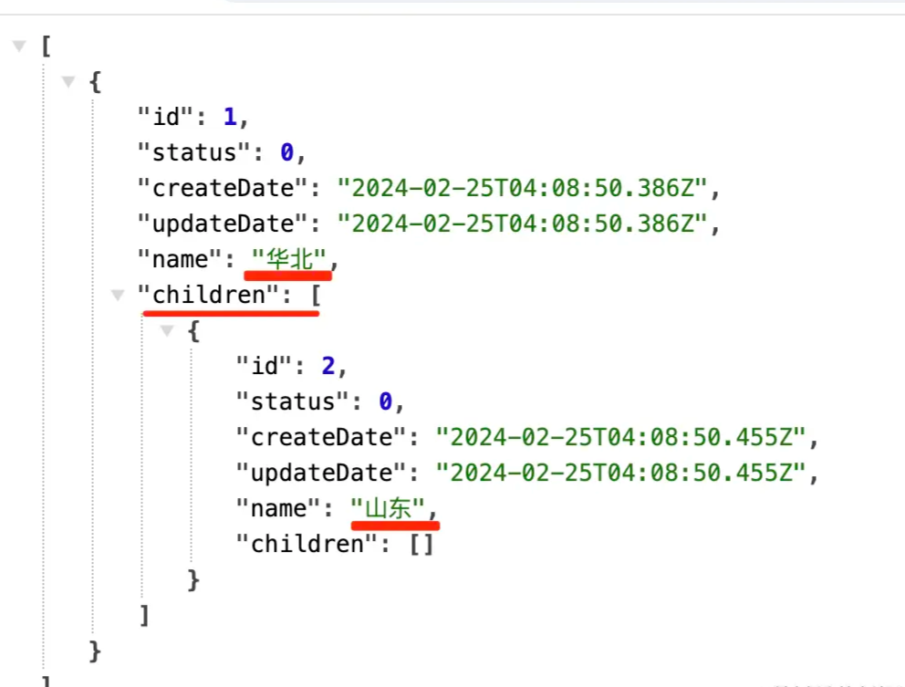
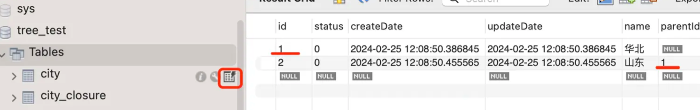
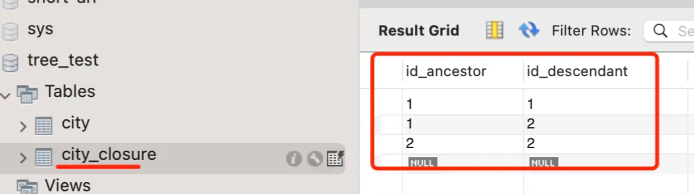

# NestJS 使用 TypeORM

## ORM 是什么

ORM（Object Relational Mapping，对象关系映射）负责在面向对象代码和关系型数据库之间转换数据：

- 数据库表映射为 TypeScript 的 `class`，称为 Entity。
- 表字段映射为 Entity 的属性。
- 表之间的外键关系映射为 Entity 之间的关联属性。

TypeORM 是一个支持 MySQL、PostgreSQL、SQLite 等数据库的 ORM。NestJS 通过 `@nestjs/typeorm` 提供模块注册和依赖注入能力。

```bash
pnpm add @nestjs/typeorm typeorm mysql2
```

## 核心对象

| 对象            | 职责                                                      |
| --------------- | --------------------------------------------------------- |
| `DataSource`    | 管理数据库连接、驱动和事务入口。                          |
| `EntityManager` | 面向全局的 Entity 增删改查工具。每次调用需要传入 Entity。 |
| `Repository<T>` | 面向单个 Entity 的数据访问工具，适合注入到 Service。      |
| `QueryBuilder`  | 构造复杂查询、连接查询、聚合和锁定查询。                  |

实际的 Nest 应用通常采用 `Module -> Service -> Repository` 的调用链：Controller 处理请求，Service 编排业务，Repository 访问数据库。

## 配置数据库连接

### 独立的 `DataSource`

不使用 Nest 时，可以直接创建 `DataSource`：

```ts
import 'reflect-metadata'
import { DataSource } from 'typeorm'
import { User } from './entity/user.entity'

export const AppDataSource = new DataSource({
  type: 'mysql',
  host: 'localhost',
  port: 3306,
  username: 'root',
  password: process.env.DB_PASSWORD,
  database: 'practice',
  entities: [User],
  migrations: ['dist/migrations/*.js'],
  synchronize: false,
  logging: false,
})
```

常用配置：

- `type`：数据库类型，例如 `mysql`、`postgres`。
- `host`、`port`：数据库服务地址和端口。
- `username`、`password`、`database`：连接凭据和数据库名。
- `entities`：需要映射的 Entity，可以传 class 或文件匹配路径。
- `migrations`：数据库结构迁移文件。
- `synchronize`：根据 Entity 自动修改表结构。
- `logging`：是否输出 TypeORM 生成的 SQL。

`synchronize` 适合本地实验，不建议在生产环境开启。生产环境应使用 migration 管理表结构，避免 Entity 变化导致数据丢失。

### 在 Nest 中使用 `forRoot`

`TypeOrmModule.forRoot` 负责创建并注册全局数据库连接：

```ts
import { Module } from '@nestjs/common'
import { TypeOrmModule } from '@nestjs/typeorm'
import { User } from './user/entities/user.entity'
import { UserModule } from './user/user.module'

@Module({
  imports: [
    TypeOrmModule.forRoot({
      type: 'mysql',
      host: process.env.DB_HOST ?? 'localhost',
      port: Number(process.env.DB_PORT ?? 3306),
      username: process.env.DB_USER,
      password: process.env.DB_PASSWORD,
      database: process.env.DB_NAME,
      entities: [User],
      synchronize: false,
    }),
    UserModule,
  ],
})
export class AppModule {}
```

大型项目可以使用 `forRootAsync` 从 `ConfigService` 读取环境变量，避免把密码写在代码里。

## Entity 与字段映射

Entity 是数据库表的模型定义：

```ts
import { Column, CreateDateColumn, Entity, PrimaryGeneratedColumn, UpdateDateColumn } from 'typeorm'

@Entity({ name: 'users' })
export class User {
  @PrimaryGeneratedColumn()
  id: number

  @Column({ name: 'display_name', length: 50 })
  name: string

  @Column({ unique: true, length: 100 })
  email: string

  @Column({ type: 'int', default: 0 })
  age: number

  @CreateDateColumn({ name: 'created_at' })
  createdAt: Date

  @UpdateDateColumn({ name: 'updated_at' })
  updatedAt: Date
}
```

常用装饰器：

- `@Entity`：声明 Entity，并可指定表名。
- `@PrimaryGeneratedColumn`：声明自增主键。
- `@Column`：声明普通字段，可配置数据库类型、长度、默认值、唯一约束和可空性。
- `@CreateDateColumn`、`@UpdateDateColumn`：自动维护创建时间和更新时间。

`name` 是数据库字段名，TypeScript 属性名可以保持驼峰形式。`nullable: false` 是默认行为；只有明确允许为空时才配置 `nullable: true`。

## Repository 的 CRUD



`DataSource` 管理连接，`EntityManager` 可以操作所有 Entity，而 `Repository` 是针对某个 Entity 的专用数据访问对象。

### 注册和注入 Repository

`forFeature` 为当前模块注册指定 Entity 的 Repository：

```ts
import { Module } from '@nestjs/common'
import { TypeOrmModule } from '@nestjs/typeorm'
import { User } from './entities/user.entity'
import { UserService } from './user.service'

@Module({
  imports: [TypeOrmModule.forFeature([User])],
  providers: [UserService],
  exports: [UserService],
})
export class UserModule {}
```

在 Service 中注入：

```ts
import { Injectable, NotFoundException } from '@nestjs/common'
import { InjectRepository } from '@nestjs/typeorm'
import { Repository } from 'typeorm'
import { User } from './entities/user.entity'

@Injectable()
export class UserService {
  constructor(
    @InjectRepository(User)
    private readonly userRepository: Repository<User>,
  ) {}

  async create(name: string, email: string) {
    const user = this.userRepository.create({ name, email })
    return this.userRepository.save(user)
  }

  findAll() {
    return this.userRepository.find({
      order: { createdAt: 'DESC' },
    })
  }

  async findOne(id: number) {
    const user = await this.userRepository.findOneBy({ id })
    if (!user) throw new NotFoundException('用户不存在')
    return user
  }

  async updateName(id: number, name: string) {
    const result = await this.userRepository.update({ id }, { name })
    if (!result.affected) throw new NotFoundException('用户不存在')
    return this.findOne(id)
  }

  remove(id: number) {
    return this.userRepository.delete(id)
  }
}
```

### 常用方法

| 方法                   | 说明                                                    |
| ---------------------- | ------------------------------------------------------- |
| `create`               | 创建 Entity 对象，不会立即写入数据库。                  |
| `save`                 | 有主键时通常更新，没有主键时插入；适合保存完整 Entity。 |
| `insert`               | 直接插入，不先查询 Entity。                             |
| `update`               | 按条件直接更新，不先查询完整 Entity。                   |
| `delete`               | 按主键或条件删除，不需要先加载 Entity。                 |
| `remove`               | 删除已经加载的 Entity，可能触发生命周期钩子。           |
| `find`、`findBy`       | 查询多条记录。                                          |
| `findOne`、`findOneBy` | 查询一条记录。                                          |
| `findAndCount`         | 分页时同时返回记录和总数。                              |
| `findOneOrFail`        | 查询不到时抛出 `EntityNotFoundError`。                  |

`save` 更方便，但可能需要判断 Entity 是新增还是修改；只想执行一次直接更新时，使用 `update` 更明确。`update` 不会自动返回更新后的完整对象，必要时要再次查询。

### 查询条件与分页

```ts
const [users, total] = await this.userRepository.findAndCount({
  select: {
    id: true,
    name: true,
    email: true,
  },
  where: { age: 18 },
  order: { id: 'DESC' },
  skip: 0,
  take: 20,
})
```

`skip` 表示跳过的记录数，`take` 表示最多返回的记录数。分页接口通常同时返回 `users` 和 `total`，让前端计算总页数。

## EntityManager 与 QueryBuilder

### 使用 `EntityManager`

当一个 Service 需要操作多个 Entity，或者需要显式控制事务时，可以注入 `EntityManager`：

```ts
import { InjectEntityManager } from '@nestjs/typeorm'
import { EntityManager } from 'typeorm'

constructor(
  @InjectEntityManager()
  private readonly manager: EntityManager,
) {}

const users = await this.manager.find(User, {
  where: { age: 18 },
})
```

它的缺点是每次调用都要传入 Entity。只操作一个 Entity 时，直接注入 `Repository` 更清晰。

### 使用原生 SQL

简单且已经验证过的 SQL 可以通过 `query` 执行，参数必须使用占位符，避免 SQL 注入：

```ts
const users = await this.manager.query('SELECT * FROM users WHERE age >= ? AND name LIKE ?', [
  18,
  '张%',
])
```

### 使用 QueryBuilder

需要连接多张表、动态拼接条件、聚合或加锁时，可以使用 QueryBuilder：

```ts
const users = await this.userRepository
  .createQueryBuilder('user')
  .where('user.age >= :age', { age: 18 })
  .andWhere('user.email IS NOT NULL')
  .orderBy('user.created_at', 'DESC')
  .take(20)
  .getMany()
```

参数使用 `:name` 占位，不要通过字符串拼接用户输入。

## 事务

事务应该覆盖一个完整的业务动作，例如创建订单时同时写入订单和订单明细：

```ts
import { DataSource } from 'typeorm'

constructor(private readonly dataSource: DataSource) {}

async createOrder(userId: number, amount: number) {
  return this.dataSource.transaction(async (manager) => {
    const order = await manager.save(Order, {
      userId,
      totalAmount: amount,
      status: 'pending',
    })

    await manager.save(OrderItem, {
      orderId: order.id,
      quantity: 1,
      price: amount,
    })

    return order
  })
}
```

事务回调中必须使用传入的 `manager`，不要混用事务外的 Repository，否则部分 SQL 可能不在同一个事务里。

## 关系映射

### 一对一

只有维护外键的一方添加 `@JoinColumn`。下面表示身份证表通过 `user_id` 关联用户：



```ts
@Entity('id_cards')
export class IdCard {
  @PrimaryGeneratedColumn()
  id: number

  @Column({ length: 50 })
  cardNumber: string

  @OneToOne(() => User, (user) => user.idCard, {
    onDelete: 'CASCADE',
  })
  @JoinColumn({ name: 'user_id' })
  user: User
}

@Entity('users')
export class User {
  @PrimaryGeneratedColumn()
  id: number

  @OneToOne(() => IdCard, (idCard) => idCard.user)
  idCard: IdCard
}
```

`cascade: true` 是 TypeORM 的保存级联，表示保存一个 Entity 时自动保存关联 Entity；`onDelete: 'CASCADE'` 是数据库外键级联删除，两者作用不同，不要混淆。

查询关联数据时需要显式指定：

```ts
const cards = await idCardRepository.find({
  relations: { user: true },
})
```

### 一对多

外键一定在“多”的一方，因此 `@ManyToOne` 是关系的拥有方：



```ts
@Entity('departments')
export class Department {
  @PrimaryGeneratedColumn()
  id: number

  @Column({ length: 50 })
  name: string

  @OneToMany(() => Employee, (employee) => employee.department)
  employees: Employee[]
}

@Entity('employees')
export class Employee {
  @PrimaryGeneratedColumn()
  id: number

  @Column({ length: 50 })
  name: string

  @ManyToOne(() => Department, (department) => department.employees, {
    onDelete: 'CASCADE',
  })
  department: Department
}
```

注意：`@OneToMany` 只是反向引用，不会创建外键；真正保存 `department_id` 的是 `@ManyToOne`。

```ts
const departments = await departmentRepository.find({
  relations: { employees: true },
})
```

### 多对多

多对多关系通过中间表保存两边的外键。只需要在一方使用 `@JoinTable`：



数据库层面，多对多关系可以拆分为两个一对多关系：



```ts
@Entity('articles')
export class Article {
  @PrimaryGeneratedColumn()
  id: number

  @Column({ length: 100 })
  title: string

  @ManyToMany(() => Tag, (tag) => tag.articles)
  @JoinTable({ name: 'article_tags' })
  tags: Tag[]
}

@Entity('tags')
export class Tag {
  @PrimaryGeneratedColumn()
  id: number

  @Column({ unique: true, length: 50 })
  name: string

  @ManyToMany(() => Article, (article) => article.tags)
  articles: Article[]
}
```

保存关联关系：

```ts
const article = await articleRepository.findOneOrFail({
  where: { id: 1 },
  relations: { tags: true },
})
const tag = await tagRepository.findOneByOrFail({ id: 2 })

article.tags.push(tag)
await articleRepository.save(article)
```

如果中间表还需要保存创建人、排序或关联时间，不建议使用隐式 `@ManyToMany`，而应把中间表建模成单独的 Entity。

## 树形结构

商品分类、地区、组织架构都属于树形数据。TypeORM 可以通过 `@Tree`、`@TreeParent` 和 `@TreeChildren` 映射父子关系：



```ts
@Entity('categories')
@Tree('closure-table')
export class Category {
  @PrimaryGeneratedColumn()
  id: number

  @Column({ length: 100 })
  name: string

  @TreeChildren()
  children: Category[]

  @TreeParent()
  parent: Category
}
```

写入并查询树：

```ts
const root = await categoryRepository.save({ name: '电子产品' })
await categoryRepository.save({ name: '手机', parent: root })

const treeRepository = dataSource.getTreeRepository(Category)
const categories = await treeRepository.findTrees()
```

查询到的分类树结果示例：



使用 `closure-table` 时，实体表会保存分类自身的数据以及直接父节点关系：



TypeORM 还会维护一张闭包表，用于保存节点之间的祖先和后代关系：



`closure-table` 会额外维护关系表，查询任意层级的祖先和后代比较方便。分类层级简单、只需要查询直接父子关系时，也可以考虑普通的 `parent_id` 自关联表。

## NestJS 中的依赖注入关系

Nest 集成 TypeORM 后，常见关系如下：

1. `TypeOrmModule.forRoot` 创建并注册 `DataSource`。
2. `TypeOrmModule.forFeature([User])` 为当前模块导出 `User` 对应的 Repository。
3. `@InjectRepository(User)` 将 Repository 注入 Service。
4. Service 使用 Repository、EntityManager 或 DataSource 执行业务操作。

```ts
@Module({
  imports: [TypeOrmModule.forFeature([User])],
  providers: [UserService],
})
export class UserModule {}
```

## 生产环境注意事项

- 不要在生产环境开启 `synchronize`，使用 migration 管理结构变更。
- 不要把数据库密码硬编码在 Entity、配置文件或提交记录中。
- 不要直接把 Entity 当作接口响应，避免返回密码、内部字段或过多关联数据。
- 对分页、排序、搜索条件使用白名单，避免把用户输入直接拼入 SQL。
- 事务中使用事务回调提供的 `manager`，保证所有操作使用同一个连接。
- 关联查询要控制 `relations` 和返回字段，避免 N+1 查询和返回过大的数据。
- `cascade` 会放大保存和删除操作，只有确定业务边界时才开启。
- 数据库连接池大小应结合并发量、数据库最大连接数和实例数量配置。

## 回忆辅助

### 核心心智模型

```text
Entity        -> 描述数据库表结构
DataSource    -> 管理数据库连接
Repository    -> 操作单个 Entity
EntityManager -> 操作多个 Entity
QueryBuilder  -> 构造复杂 SQL
Transaction   -> 保证一组操作的原子性
```

在 NestJS 中，一次典型请求通常经过下面的调用链：

```text
Controller
  -> Service
  -> Repository
  -> EntityManager / DataSource
  -> MySQL
```

- `Controller`：接收参数、调用 Service、返回结果。
- `Service`：编排业务规则和事务边界。
- `Repository`：执行某个 Entity 的查询和持久化操作。
- `EntityManager`：在跨 Entity 或事务场景中统一管理数据库操作。
- `DataSource`：提供连接、事务和底层数据库能力。

### API 选择表

| 业务场景              | 推荐 API                |
| --------------------- | ----------------------- |
| 新增或保存完整 Entity | `save`                  |
| 直接更新指定字段      | `update`                |
| 直接插入数据          | `insert`                |
| 按 id 删除记录        | `delete`                |
| 删除已经加载的 Entity | `remove`                |
| 查询多条记录          | `find` / `findBy`       |
| 查询列表并获取总数    | `findAndCount`          |
| 查询单条记录          | `findOne` / `findOneBy` |
| 查询不到时抛异常      | `findOneOrFail`         |
| 简单关联查询          | `relations`             |
| 动态条件或多表查询    | `QueryBuilder`          |
| 执行已验证的原生 SQL  | `query`                 |
| 多表一致性操作        | `transaction`           |
| 操作单个 Entity       | `Repository`            |
| 操作多个 Entity       | `EntityManager`         |

记忆重点：`save` 更方便但可能先查询；`update` 更直接但不会返回更新后的完整 Entity；`relations` 适合简单查询，复杂查询使用 `QueryBuilder`。

### 关系映射口诀

```text
一对一：谁保存外键，谁加 @JoinColumn
一对多：多的一方加 @ManyToOne
多对多：一方加 @JoinTable
反向查询：第二个参数指向对方的关系属性
```

判断关系映射时，先问自己一个问题：

> 数据库中的外键实际保存在哪张表？

保存外键的一方是关系拥有方。只有拥有方负责写入外键，另一方通常通过第二个参数建立反向引用。

### 常见问题排查

#### 查不到关联数据

```text
1. 是否在 find 中声明 relations？
2. relations 中的属性名是否和 Entity 一致？
3. 是否正确配置 @JoinColumn 或 @ManyToOne？
4. 数据库中是否确实存在外键和关联数据？
5. 查询是否需要改用 leftJoinAndSelect？
```

#### 事务没有回滚

```text
1. 是否通过 dataSource.transaction 开启事务？
2. 是否使用事务回调传入的 manager？
3. 是否在异常发生前执行了 commit？
4. 是否把事务外的 repository 混进了事务逻辑？
5. 数据库表是否使用支持事务的 InnoDB 引擎？
```

#### 更新后拿不到最新数据

`update` 只执行更新操作，不会返回完整 Entity。需要更新后继续使用数据时，应再次查询：

```ts
const result = await userRepository.update({ id }, { name })

if (!result.affected) {
  throw new NotFoundException('用户不存在')
}

return userRepository.findOneByOrFail({ id })
```

#### 出现重复查询或性能变慢

```text
1. 是否在循环中逐条查询关联数据？
2. 是否产生了 N+1 查询？
3. 是否只返回真正需要的字段？
4. 查询条件和排序字段是否有索引？
5. 是否应该使用一次 QueryBuilder 完成关联查询？
```

### 面试速答

**`Repository` 和 `EntityManager` 有什么区别？**

`Repository` 是针对单个 Entity 的数据访问对象，`EntityManager` 可以操作多个 Entity。普通 CRUD 更适合使用 Repository，跨表操作和事务更常使用 EntityManager。

**`save` 和 `update` 有什么区别？**

`save` 根据 Entity 是否有主键判断新增或更新，使用方便但可能先查询；`update` 按条件直接执行更新，不会加载完整 Entity，性能和意图更明确，但不会返回更新后的对象。

**`@OneToMany` 为什么不能单独保存外键？**

因为外键保存在多的一方。`@OneToMany` 只是反向引用，真正维护外键的是多的一方的 `@ManyToOne`。

**`cascade` 和 `onDelete: 'CASCADE'` 有什么区别？**

`cascade` 是 TypeORM 的操作级联，影响保存或删除 Entity 时是否自动处理关联对象；`onDelete: 'CASCADE'` 是数据库外键约束，影响主表记录删除后数据库如何处理从表记录。

**事务中为什么必须使用回调里的 `manager`？**

事务绑定在特定数据库连接上。回调里的 `manager` 使用的就是这条事务连接；如果改用事务外的 Repository，操作可能在另一条连接上执行，无法保证一起提交或回滚。

例如复习事务时，先尝试回答：

- 为什么创建订单和扣减库存必须放在同一个事务？
- 事务中为什么不能混用外部 Repository？
- `save`、`update` 和 `insert` 分别适合什么场景？
- 如果关联数据查不到，应该按照什么顺序排查？
- TypeORM 的事务能不能回滚已经发出的 HTTP 请求？

## 小结

- Entity 描述表结构，Repository 负责单个 Entity 的 CRUD。
- `EntityManager` 适合跨 Entity 操作，`DataSource` 常用于事务入口。
- `QueryBuilder` 适合复杂查询，但参数必须使用占位符。
- 一对一的外键方使用 `@JoinColumn`；一对多的外键在 `@ManyToOne` 一方；多对多使用 `@JoinTable`。
- `cascade` 是 TypeORM 的操作级联，`onDelete` 是数据库外键级联。
- Nest 中通过 `forRoot` 注册连接，通过 `forFeature` 注册 Repository。
