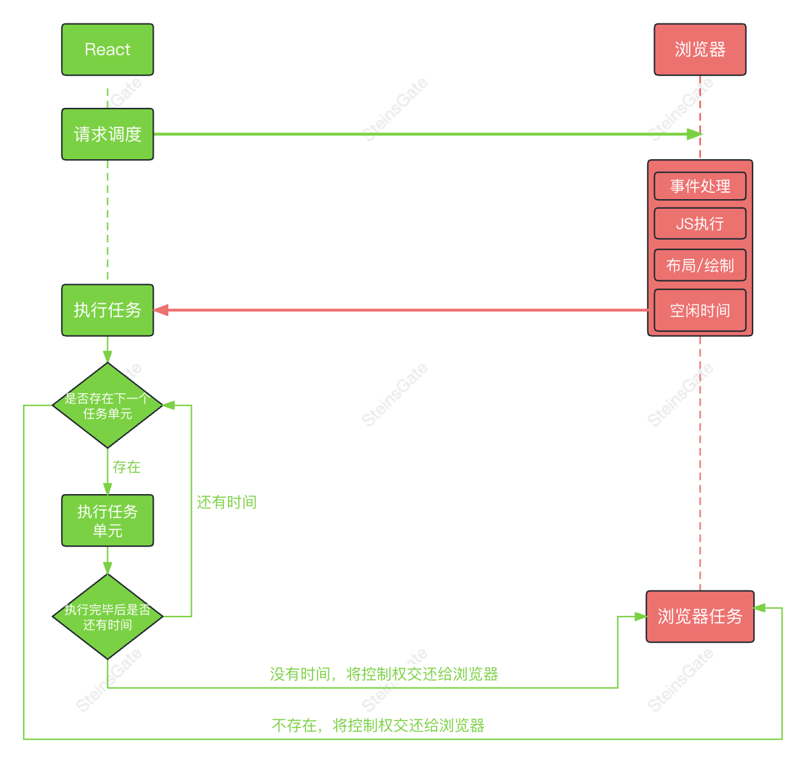
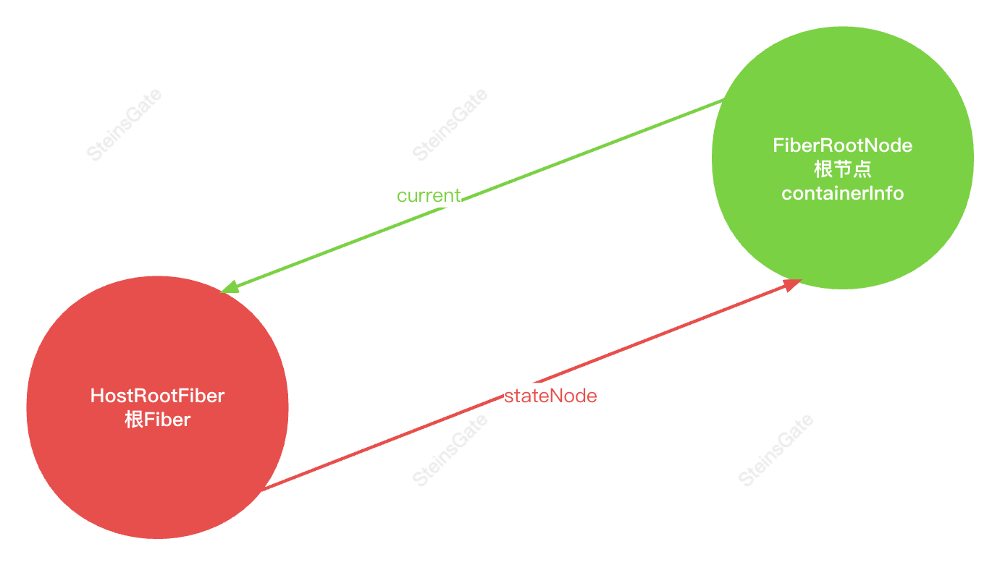
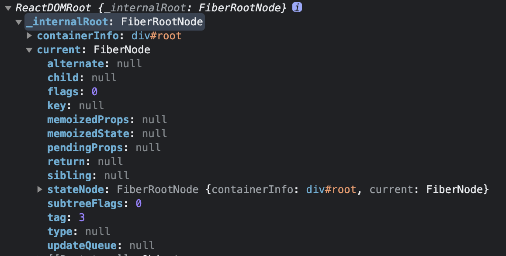
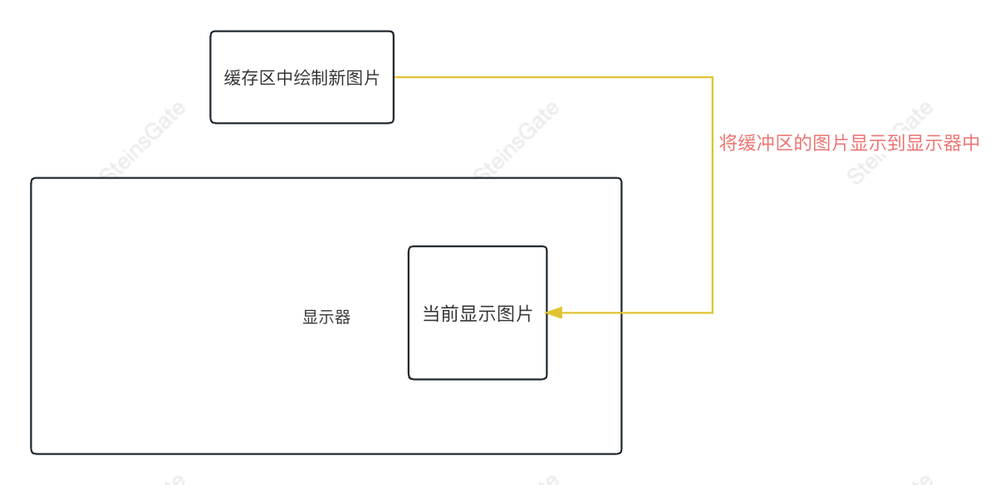

# Fiber

## 介绍

- 我们可以通过某些调度策略合理分配 CPU 资源，从而提高用户的响应速度。
- 通过 Fiber 架构，让渲染过程变成可被中断、暂停、恢复的过程。 适时地让出 CPU 执行权，除了可以让浏览器及时地响应用户的交互。

## Fiber 是一个执行单元

Fiber 是一个执行单元,每次执行完一个执行单元, React 就会检查现在还剩多少时间，如果没有时间就将控制权让出去。



## Fiber 是一个数据结构

- React 目前的做法是使用链表, 每个虚拟节点内部表示为一个 Fiber
- 从顶点开始遍历
- 如果有第一个儿子，先遍历第一个儿子
- 如果没有第一个儿子，标志着此节点遍历完成
- 如果有弟弟遍历弟弟
- 如果有没有下一个弟弟，返回父节点标识完成父节点遍历，如果有叔叔遍历叔叔
- 没有父节点遍历结束

### 创建根 Fiber



```js
// main.jsx
import { createRoot } from 'react-dom/src/client/ReactDOMRoot'

let element = (
  <h1>
    Hello, <span style={{ color: 'red' }}>world</span>
  </h1>
)

const root = createRoot(document.getElementById('root'))
console.log(root)
```



```js
// ReactDOMRoot
import { createContainer } from 'react-reconciler/src/ReactFiberReconciler'

function ReactDOMRoot(internalRoot) {
  this._internalRoot = internalRoot
}

export function createRoot(container) {
  // container ---> div #root
  const root = createContainer(container) // ---> 创建FiberRootNode

  return new ReactDOMRoot(root)
}
```

```js
// ReactFiberReconciler
import { createFiberRoot } from './ReactFiberRoot'

export function createContainer(containerInfo) {
  return createFiberRoot(containerInfo)
}
```

```js
// ReactFiberRoot
import { createHostRootFiber } from './ReactFiber'
import { initializeUpdateQueue } from './ReactFiberClassUpdateQueue'

function FiberRootNode(containerInfo) {
  this.containerInfo = containerInfo // div #root
}

export function createFiberRoot(containerInfo) {
  const root = new FiberRootNode(containerInfo)
  // HostRoot指的是根节点div #root
  const uninitializedFiber = createHostRootFiber()
  // 根容器的current指向渲染好的根Fiber
  root.current = uninitializedFiber
  // 根节点的Fiber的stateNode（真实DOM）指向根节点FiberRootNode
  uninitializedFiber.stateNode = root
  // 初始化更新队列
  initializeUpdateQueue(uninitializedFiber)
  return root
}
```

```js
// ReactFiber
import { HostRoot } from './ReactWorkTags'
import { NoFlags } from './ReactFiberFlags'

/**
 *
 * @param {*} tag  fiber 类型：函数组件（0）、类组件（1）、原生标签（5）
 * @param {*} pendingProps 新属性，等待处理或生效的属性
 * @param {*} key 唯一标识
 */
export function FiberNode(tag, pendingProps, key) {
  this.tag = tag
  this.key = key
  this.type = null // fiber类型，来自于虚拟DOM节点的type：div、span、p
  // 每个虚拟DOM --> fiber节点 --> 真实DOM
  this.stateNode = null // 此fiber对应的真实DOM节点

  this.return = null // 指向父节点
  this.child = null // 指向第一个子节点
  this.sibling = null // 指向弟弟节点

  // 虚拟DOM会提供pendingProps，用来创建fiber节点的属性
  this.pendingProps = pendingProps // 等待生效的属性
  this.memoizedProps = null // 已经生效的属性

  // 每个fiber都有自己的状态，每种fiber状态存的类型是不一样的，HostRoot存的是要渲染的元素
  this.memoizedState = null // fiber状态

  // 每个fiber身上可能还有更新队列
  this.updateQueue = null // 更新的队列

  // 副作用的标识，标识针对此fiber节点进行何种操作（二进制增删改操作）
  this.flags = NoFlags
  // 子节点对应的副作用标识
  this.subtreeFlags = NoFlags
  // 替身、轮替
  //我们使用双缓冲池技术，因为我们知道我们最多只需要树的两个版本。
  //我们将可以自由重用的“其他”未使用节点集合在一起。
  this.alternate = null
}

export function createFiber(tag, pendingProps, key) {
  return new FiberNode(tag, pendingProps, key)
}

export function createHostRootFiber() {
  return createFiber(HostRoot, null, null)
}
```

```js
// ReactWorkTags

// 每种虚拟DOM都会对应自己的fiber tag类型

// 根fiber的tag类型
export const HostRoot = 3
```

```js
// ReactFiberFlags
export const NoFlags = 0b0000000000000000000000000000
export const Placement = 0b0000000000000000000000000010
export const Update = 0b0000000000000000000000000100
```

```js
// ReactFiberClassUpdateQueue
export function initializeUpdateQueue(fiber) {
  // 创建一个新的更新队列
  const queue = {
    shared: {
      pending: null, // 是循环链表
    },
  }
  fiber.updateQueue = queue
}
```

#### 双缓冲

双缓冲技术是在内存或显存中开辟一块与屏幕一样大小的储存空间，作为缓冲屏幕。将下一帧要显示的图像绘制到这个缓冲屏幕上，在显示的时候将虚拟屏幕中的数据复制到可见区域里去。


