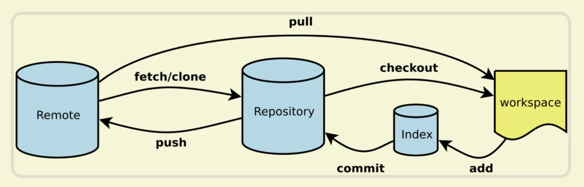

# Git 常用命令

`git`的一些基础知识解释：

- 工作区`（Workspace）`：本地编辑器里的代码，基本上我们开发操作的就是工作区。
- 暂存区`（Index / Stage）`：暂时存储文件的地方，`git add` 操作之后的文件就是存在这里。
- 本地仓库`（Repository）`：`git commit` 操作之后就是将暂存区的代码存放到本地仓库。
- 远程仓库`（Remote）`：远程存储文件的地方。
  它们之间的关系如下图所示：



## `git add`

把要提交的文件的信息添加到暂存区中。当使用 `git commit` 时，将依据暂存区中的内容来进行文件的提交。

它通常将现有路径的当前内容作为一个整体添加，但是通过一些选项，它也可以用于添加内容，只对所应用的工作树文件进行一些更改，或删除工作树中不存在的路径了。

“索引”保存工作树内容的快照，并且将该快照作为下一个提交的内容。 因此，在对工作树进行任何更改之后，并且在运行 `git commit` 命令之前，必须使用 `git add` 命令将任何新的或修改的文件添加到索引。

该命令可以在提交之前多次执行。它只在运行 `git add` 命令时添加指定文件的内容; 如果希望随后的更改包含在下一个提交中，那么必须再次运行 `git add` 将新的内容添加到索引。

```sh
# 将当前目录下所有修改过的文件添加到暂存区的命令
git add .

# 把指定的文件添加到暂存区中
git add <文件路径>
```

## `git commit`

将索引的当前内容与描述更改的用户和日志消息一起存储在新的提交中。

```sh
# 把暂存区中的文件提交到本地仓库，调用文本编辑器输入该次提交的描述信息
git commit

# 把暂存区中的文件提交到本地仓库中并添加描述信息
git commit -m "<提交的描述信息>"

# 把所有修改、已删除的文件提交到本地仓库中
# 不包括未被版本库跟踪的文件，等同于先调用了 "git add -u"
git commit -a -m "<提交的描述信息>"

# 修改上次提交的描述信息
git commit --amend

# 提交时包含指定文件，并添加提交信息
git commit <file1> <file2> ... -m "Your commit message here"

# 将暂存区的更改拆分成多个提交，交互式地选择要提交的文件
git commit --interactive

# 提交时允许修改之前的提交信息
git commit --reuse-message=HEAD

# 提交时不生成新的提交对象，只更新上一次提交的时间戳和提交信息
git commit --only --amend
```

## `git branch`

操作 `Git` 的分支命令。

```sh
# 列出本地的所有分支，当前所在分支以 "*" 标出
git branch

# 列出本地的所有分支并显示最后一次提交，当前所在分支以 "*" 标出
git branch -v

# 创建新分支，新的分支基于上一次提交建立
git branch <分支名>

# 修改分支名称
# 如果不指定原分支名称则为当前所在分支
git branch -m [<原分支名称>] <新的分支名称>
# 强制修改分支名称
git branch -M [<原分支名称>] <新的分支名称>

# 删除指定的本地分支
git branch -d <分支名称>

# 强制删除指定的本地分支
git branch -D <分支名称>

# 列出远程仓库的所有分支
git branch -r

# 列出所有本地和远程仓库的分支
git branch -a

# 查看每个分支的最后一次提交
git branch -v

# 查看每个分支的最后一次提交和提交信息
git branch -vv

# 合并指定分支到当前分支
git merge <branch_name>

# 使用 rebase 将当前分支的提交移动到指定分支的最后
git rebase <branch_name>

# 查看分支合并图
git log --graph --oneline --all

# 设置当前分支的追踪分支
git branch --set-upstream-to=<remote>/<branch>  # 或 git branch -u <remote>/<branch>

# 查看所有已合并到当前分支的分支
git branch --merged

# 查看所有未合并到当前分支的分支
git branch --no-merged
```

## `git checkout`

更新工作树中的文件以匹配索引或指定树中的版本。如果没有给出路径 `- git checkout` 还会更新 `HEAD `，将指定的分支设置为当前分支。

```sh
# 切换到已存在的指定分支
git checkout <分支名称>

# 创建并切换到指定的分支，保留所有的提交记录
# 等同于 "git branch" 和 "git checkout" 两个命令合并
git checkout -b <分支名称>

# 创建并切换到指定的分支，删除所有的提交记录
git checkout --orphan <分支名称>

# 替换掉本地的改动，新增的文件和已经添加到暂存区的内容不受影响
git checkout <文件路径>
```

## `git clone`

将存储库克隆到新创建的目录中，为克隆的存储库中的每个分支创建远程跟踪分支(使用 `git branch -r` 可见)，并从克隆检出的存储库作为当前活动分支的初始分支。

```sh
# 默认在当前目录下创建和版本库名相同的文件夹并下载版本到该文件夹下
git clone <远程仓库的网址>

# 指定本地仓库的目录
git clone <远程仓库的网址> <本地目录>

# -b 指定要克隆的分支，默认是master分支
git clone <远程仓库的网址> -b <分支名称> <本地目录>
```

## `git config`

主要是用来配置 `Git` 的相关参数

```sh
# 查看配置信息
# --local：仓库级，--global：全局级，--system：系统级
git config <--local | --global | --system> -l

# 查看当前生效的配置信息
git config -l

# 编辑配置文件
# --local：仓库级，--global：全局级，--system：系统级
git config <--local | --global | --system> -e

# 添加配置项
# --local：仓库级，--global：全局级，--system：系统级
git config <--local | --global | --system> --add <name> <value>

# 获取配置项
git config <--local | --global | --system> --get <name>

# 删除配置项
git config <--local | --global | --system> --unset <name>

# 配置提交记录中的用户信息
git config --global user.name <用户名>
git config --global user.email <邮箱地址>

# 更改Git缓存区的大小
# 如果提交的内容较大，默认缓存较小，提交会失败
# 缓存大小单位：B，例如：524288000（500MB）
git config --global http.postBuffer <缓存大小>

# 调用 git status/git diff 命令时以高亮或彩色方式显示改动状态
git config --global color.ui true

# 配置可以缓存密码，默认缓存时间15分钟
git config --global credential.helper cache

# 配置密码的缓存时间
# 缓存时间单位：秒
git config --global credential.helper 'cache --timeout=<缓存时间>'

# 配置长期存储密码
git config --global credential.helper store
```

## `git diff`

用于显示提交和工作树等之间的更改。

此命令比较的是工作目录中当前文件和暂存区域快照之间的差异,也就是修改之后还没有暂存起来的变化内容。

```sh
# 比较当前文件和暂存区中文件的差异，显示没有暂存起来的更改
git diff

# 比较暂存区中的文件和上次提交时的差异
git diff --cached
git diff --staged

# 比较当前文件和上次提交时的差异
git diff HEAD

# 查看从指定的版本之后改动的内容
git diff <commit ID>

# 比较两个分支之间的差异
git diff <分支名称> <分支名称>

# 查看两个分支分开后各自的改动内容
git diff <分支名称>...<分支名称>
```

## `git init`

初始化项目所在目录，初始化后会在当前目录下出现一个名为 `.git` 的目录。

```sh
# 初始化本地仓库，在当前目录下生成 .git 文件夹
git init
```

## `git log`

显示提交的记录。

```sh
# 打印所有的提交记录
git log

# 打印从第一次提交到指定的提交的记录
git log <commit ID>

# 打印指定数量的最新提交的记录
git log -<指定的数量>
```

## `git merge`

用于将两个或两个以上的开发历史加入(合并)一起。

```sh
# 把指定的分支合并到当前所在的分支下，并自动进行新的提交
git merge <分支名称>

# 把指定的分支合并到当前所在的分支下，不进行新的提交
git merge --no-commit <分支名称>
```

## `git pull`

从远程仓库获取最新版本并合并到本地。 首先会执行 `git fetch`，然后执行 `git merge`，把获取的分支的 `HEAD` 合并到当前分支。

```sh
# 从远程仓库拉取并合并最新的更改到当前分支
git pull

# 从远程仓库拉取并重新播放（rebase）本地未推送的更改
git pull --rebase

# 从指定的远程仓库拉取并合并更改
git pull <remote> <branch>

# 从远程仓库拉取指定分支的更改，并合并到当前分支
git pull origin <branch>

# 从远程仓库拉取指定分支的更改，并重新播放（rebase）到当前分支
git pull --rebase origin <branch>
```

## `git push`

- 推送本地更改到远程仓库。
- 这个命令将本地的提交推送到远程仓库，使得远程仓库中也有了最新的更改。

```sh
# 推送本地分支的更改到远程仓库
git push

# 推送本地分支的更改到指定远程仓库
git push <remote> <branch>

# 推送本地分支的更改到远程仓库，并将分支关联到远程分支
git push -u <remote> <branch>

# 强制推送本地分支的更改到远程仓库（谨慎使用）
git push -f  # 或 git push --force

# 推送本地分支的更改到远程仓库，并删除远程分支的相应分支
git push <remote> --delete <branch>  # 或 git push <remote> :<branch>

# 推送所有本地分支的更改到远程仓库
git push --all

# 推送所有本地分支的更改到远程仓库，并删除远程仓库中不存在的本地分支
git push --all --prune

# 推送所有标签到远程仓库
git push --tags

# 推送指定标签到远程仓库
git push <remote> <tag>
```

## `git reset`

还原提交记录。

```sh
# 重置暂存区，但文件不受影响
# 相当于将用 "git add" 命令更新到暂存区的内容撤出暂存区，可以指定文件
# 没有指定 commit ID 则默认为当前 HEAD
git reset [<文件路径>]
git reset --mixed [<文件路径>]

# 将 HEAD 的指向改变，撤销到指定的提交记录，文件未修改
git reset <commit ID>
git reset --mixed <commit ID>

# 将 HEAD 的指向改变，撤销到指定的提交记录，文件未修改
# 相当于调用 "git reset --mixed" 命令后又做了一次 "git add"
git reset --soft <commit ID>

# 将 HEAD 的指向改变，撤销到指定的提交记录，文件也修改了
git reset --hard <commit ID>
```

## `git tag`

操作标签的命令

```sh
# 打印所有的标签
git tag

# 添加轻量标签，指向提交对象的引用，可以指定之前的提交记录
git tag <标签名称> [<commit ID>]

# 添加带有描述信息的附注标签，可以指定之前的提交记录
git tag -a <标签名称> -m <标签描述信息> [<commit ID>]

# 切换到指定的标签
git checkout <标签名称>

# 查看标签的信息
git show <标签名称>

# 删除指定的标签
git tag -d <标签名称>

# 将指定的标签提交到远程仓库
git push <远程仓库的别名> <标签名称>

# 将本地所有的标签全部提交到远程仓库
git push <远程仓库的别名> –tags
```

## `git status`

用于显示工作目录和暂存区的状态。使用此命令能看到那些修改被暂存到了, 哪些没有, 哪些文件没有被 `Git tracked` 到。

```sh
# 查看工作区和暂存区的状态
git status

# 查看更详细的状态信息，包括未跟踪的文件
git status -u  # 或 git status --untracked-files

# 以简洁的格式显示状态，可用于脚本或其他自动化工作
git status --porcelain

# 查看已暂存的变更
git status --cached  # 或 git status --staged

# 在列出的文件前面显示相对路径
git status --short

# 显示未被忽略的文件
git status --no-ignore

# 显示忽略的文件
git status --ignored

# 以更紧凑的格式显示分支信息
git status -b  # 或 git status --branch

# 显示所有分支的信息，包括远程跟踪分支
git status -vv  # 或 git status --verbose
```

## `git rm`

删除文件或者文件夹。

```sh
# 移除跟踪指定的文件，并从本地仓库的文件夹中删除
git rm <文件路径>

# 移除跟踪指定的文件夹，并从本地仓库的文件夹中删除
git rm -r <文件夹路径>

# 移除跟踪指定的文件，在本地仓库的文件夹中保留该文件
git rm --cached
```

## `git` 大小写敏感

查看 git 的设置

```sh
git config --get core.ignorecase
```

> 发现默认是不区分大小的，因此当你修改了文件名的大小写后，git 并不会认为你有修改哦

更改设置

```sh
git config core.ignorecase false
```
