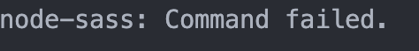

# 问题/解决方式记录

## mac OS M1 跑老项目安装 node-sass 遇到的一系列问题

:::tip


项目初始化 install，会报错，因为本地 node 版本太高了。

```lua
gyp ERR! node -v v16.18.1
```

Mac M1 版本 node 16+版本 编译项目报错 Node Sass 不兼容 arm64 架构

```js
Module build failed: Error: Node Sass does not yet support your current environment: OS X Unsupported architecture (arm64) with Unsupported runtime (93)
For more information on which environments are supported please see:
https://github.com/sass/node-sass/releases/tag/v4.14.1
```

:::

| NodeJS  | Supported node-sass version | Node Module |
| ------- | --------------------------- | ----------- |
| Node 15 | 5.0+                        | 88          |
| Node 14 | 4.14+                       | 83          |
| Node 13 | 4.13+, <5.0                 | 79          |
| Node 12 | 4.12+                       | 72          |
| Node 11 | 4.10+, <5.0                 | 67          |
| Node 10 | 4.9+                        | 64          |
| Node 8  | 4.5.3+, <5.0                | 57          |
| Node <8 | <5.0                        | <57         |

💡 那么我们去降低 node 版本，使用 nvm 工具

在我使用 nvm 安装低版本的 node 时，又报错了 ❗️

原因是： 对于 v15 以下的任何内容，您需要使用 Rosetta 2 安装节点。

在我 nvm use 时又报错，python 版本 3.11 过高

```sh
# 切换版本
brew switch python 3.8
```

之后

```sh
# 重新安装node-sass

​​​​​​​npm install node-sass@4.14.1
```

这时又报 node-sass 不支持当前平台环境 💢

```sh
# 切换 sass

​​​​​​​npm install node-sass@npm:sass
```

成功解决改问题 😄，项目顺利跑了起来。

:::tip
[参考链接-starkoverflow 解决 nvm 安装问题](https://stackoverflow.com/questions/67254339/nvm-install-node-fails-to-install-on-macos-big-sur-m1-chip)

[参考链接-node-sass 平台支持](https://github.com/sass/node-sass/releases/tag/v4.14.1)

[参考链接-切换 sass](https://stackoverflow.com/questions/68095626/node-sass-with-apple-m1-big-sur-and-arm64)
:::
