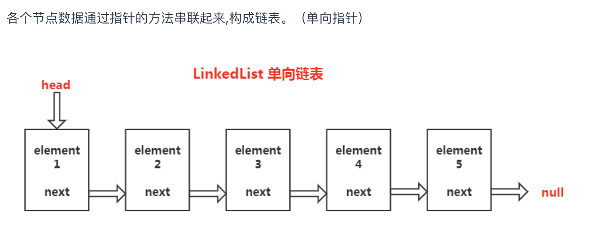
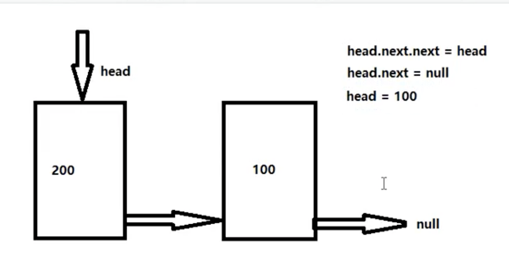
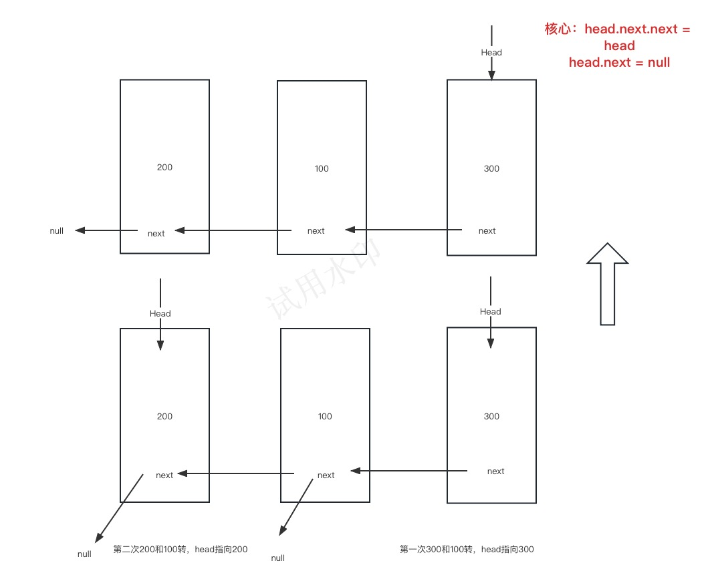
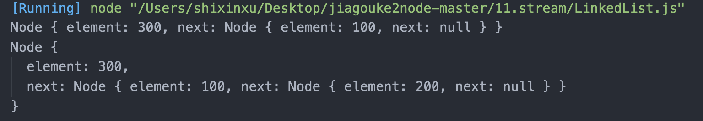
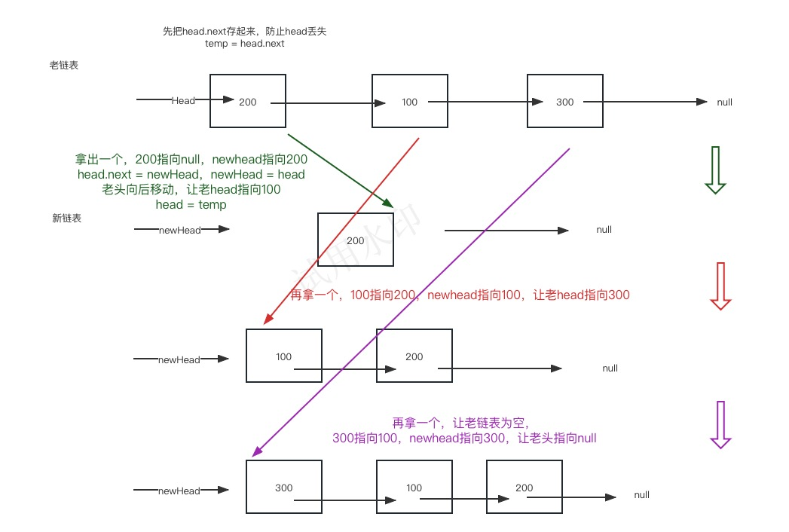

# 链表

链表的删除、查找平均复杂度是 O(n)（就是至少要把链表遍历一遍），所以链表可以优化了头尾操作比较合适。

## 单向链表

每个节点都有 next 属性，指向下一个节点，最后的节点指向 null，当前的指针（head）指向第一个。



#### Demo

```js
// 链表中的节点
class Node {
  constructor(element, next) {
    this.element = element // 元素
    this.next = next // next指针
  }
}

// 链表
class LinkedList {
  constructor() {
    this.head = null // 指针
    this.size = 0 // 链表的个数
  }

  //往链表里加节点
  add(index, element) {
    if (arguments.length === 1) {
      // arguments是add的参数数量
      element = index
      index = this.size
    }
    if (index < 0 || index > this.size) throw new Error('越界')
    if (index == 0) {
      // index是0，作为头指针
      let head = this.head // 老的头指针
      this.head = new Node(element, head)
      // 1、add(0, 100) 2、add(0, 200)
      // 第一次 head --> 100 next --> null
      // 第二次 head --> 200 next --> 100(老的head)
    } else {
      // index不是0，怎么添加？就要找到当前我要添加的前一个是谁
      let prevNode = this.getNode(index - 1) // 获取前一个节点（这里前一个节点可定有，如果没有就走if语句）
      prevNode.next = new Node(element, prevNode.next)
      // 找到前一个节点了，就需要前一个节点的next指向(=)新节点，前一个节点的next的指向就是新节点的next指向
      // 1235-->12345
      // 3的next = 新节点(e,把3的next变成4的next)
      // 以前3的next指向5，现在4的next指向5
    }
    this.size++
  }

  // 删除链表中的节点
  remove(index) {
    // 找到要删除的节点的前一个，要让前一个节点的next指向删除节点的next
    if (this.size === 0) return null
    let oldNode
    if (index === 0) {
      // 删除第一个节点，就相当于把head指针向后移
      oldNode = this.head
      this.head = oldNode && oldNode.next
    } else {
      // 就是让前一个节点的next指向删除节点的next
      let prevNode = this.getNode(index - 1) // 获取当前的前一个节点
      oldNode = prevNode.next // 前一个的下一个就是要删除的
      prevNode.next = oldNode.next // 让前一个下一个 指向 之前的下一个
    }
    this.size--
    return oldNode.element
  }

  // 获取链表中的某个节点
  getNode(index) {
    let current = this.head // 从头找
    for (let i = 0; i < index; i++) {
      // 遍历链表
      current = current.next // i = index - 1时就找到前一个节点了
    }
    return current
  }
  length() {
    // 链表的大小
    return this.size
  }
}
module.exports = LinkedList
```

```js
let ll = new LinkedList()
ll.add(0, 100) // 往索引0处添加
ll.add(0, 200)
ll.add(300) // 末尾添加
// 200 下一个 100 下一个 300
```

## 链表反转

链表反转（先考虑两个怎么反转（不是位置的反转，是指针反过来）），多个的话也是俩俩互转。

### 递归





#### Demo

```js
class Node {
  constructor(element, next) {
    this.element = element
    this.next = next
  }
}
class LinkedList {
  constructor() {
    this.head = null
    this.size = 0
  }
  add() {}
  remove() {}
  getNode() {}
  length() {
    return this.size
  }
  reverseLinedList() {
    function reverse(head) {
      // 先递归最里面的，在出来
      // 如果链表为空 或者没有下一个了 就不用反转了
      if (head == null || head.next == null) return head
      let newHead = reverse(head.next) // 将原来的下一个变成头结点
      head.next.next = head // 让下一个节点的下一个指向原来的头
      head.next = null // 让老头指向null
      return newHead
    }
    this.head = reverse(this.head)
    return this.head
  }
}
```

```js
let ll = new LinkedList()
ll.add(0, 100)
ll.add(0, 200)
ll.add(300)
let reverseList = ll.reverseLinkedList()
console.log(reverseList)
// 想变成 head --> 300 next --> 100 next --> 200
```



### 创建一个新链表



#### Demo

```js
class Node {
  constructor(element, next) {
    this.element = element
    this.next = next
  }
}

class LinkedList {
  constructor() {
    this.head = null
    this.size = 0
  }
  add() {}
  remove() {}
  getNode() {}
  length() {
    return this.size
  }
  reverseLinedList() {
    let head = this.head // 保存老头
    let newHead = null // 新链表默认指向null
    if (head === null || head.next === null) return head
    while (head !== null) {
      // 循环老链表，将内容一次取出
      let temp = head.next //把老head的下一个先存起来(储存的是100)
      head.next = newHead //
      newHead = head // 新的头指向老的头
      head = temp // 老的头向后移
    }
    this.head = newHead
    return this.head
  }
}
```
