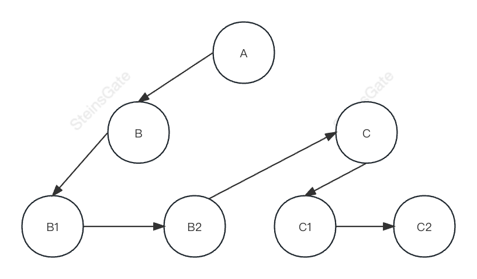
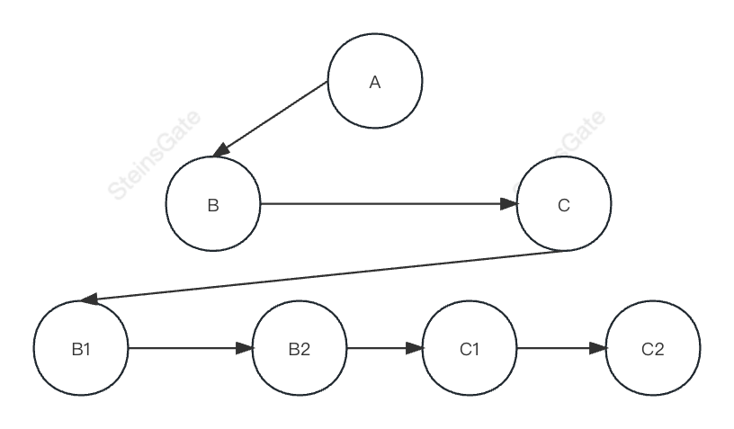

# 树 🌲

## 数的遍历

### 深度优先（DFS）

深度优先搜索英文缩写为 DFS 即 Depth First Search。
其过程简要来说是对每一个可能的分支路径深入到不能再深入为止，而且每个节点只能访问一次。
应用场景：

- React 虚拟 DOM 的构建
- React 的 fiber 树构建

### 广度优先（BFS）

宽度优先搜索算法（又称广度优先搜索），其英文全称是 Breadth First Search。
算法首先搜索距离为 k 的所有顶点，然后再去搜索距离为 k+l 的其他顶点。

