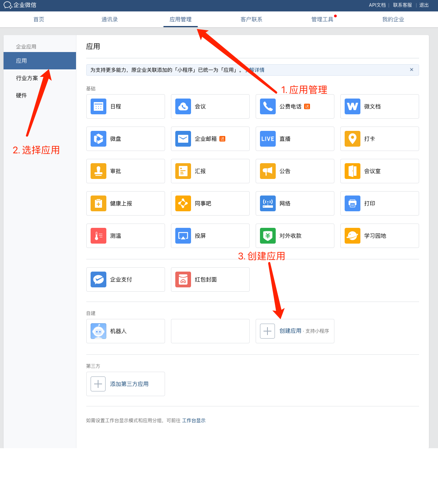
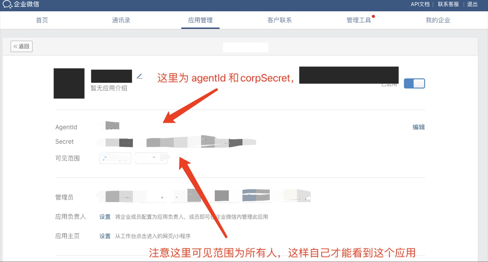
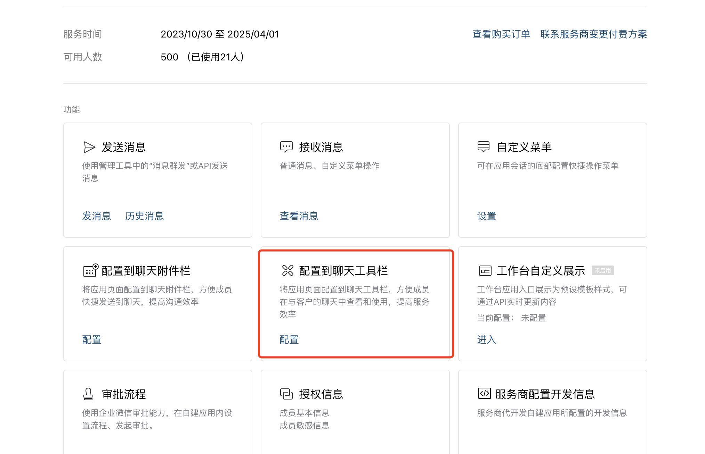
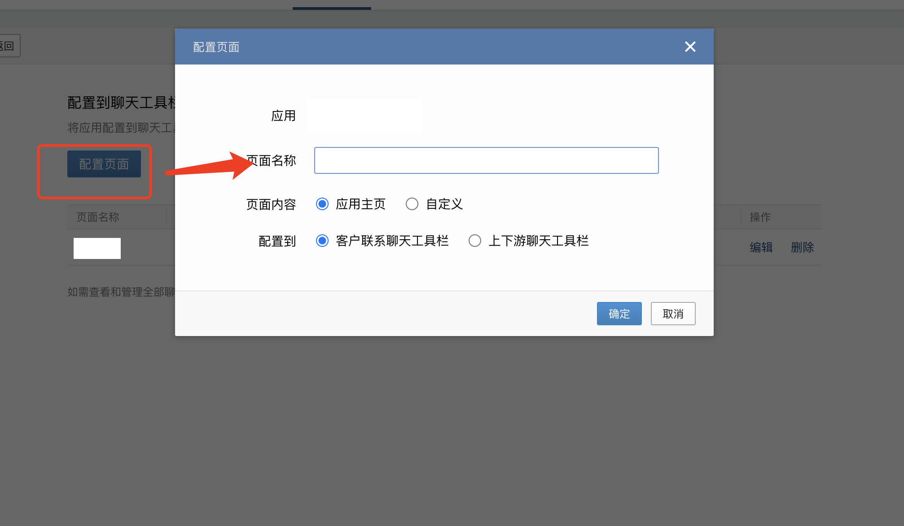

# 企业微信侧边栏开发

## 配置侧边栏

管理后台 - 应用管理 - 应用 - 自建，点击创建自建应用



创建成功后，点进去刚创建的自建应用，选择 配置到聊天工具栏





然后点击 配置页面，配置你的页面链接



这样你就可以在企业微信侧边栏看到配置好的页面了

## 开发

支持两种 SDK

- [<u>`WECOM-JSSDK`</u>](https://developer.work.weixin.qq.com/document/path/98416)

- [<u>`JSSDK`</u>](https://developer.work.weixin.qq.com/document/path/96914)

### `WECOM-JSSDK`

- 安装

```sh
npm install @wecom/jssdk
```

- 引入使用

```js
import * as ww from '@wecom/jssdk'
```

- 企业身份与权限

```js
ww.register({
  corpId: 'ww7ca4776b2a70000', // 必填，当前用户企业所属企业ID
  jsApiList: ['getExternalContact'], // 必填，需要使用的JSAPI列表
  getConfigSignature, // 必填，根据url生成企业签名的回调函数
})

async function getConfigSignature(url) {
  // 根据 url 生成企业签名
  // 生成方法参考 https://developer.work.weixin.qq.com/document/14924
  return { timestamp, nonceStr, signature }
}
```

### `JSSDK`

- 引入`sdk`文件

```html
<script src="//res.wx.qq.com/open/js/jweixin-1.2.0.js"></script>
```

- 通过`config`接口注入权限验证配置

```js
wx.config({
  beta: true, // 必须这么写，否则wx.invoke调用形式的jsapi会有问题
  debug: true, // 开启调试模式,调用的所有api的返回值会在客户端alert出来，若要查看传入的参数，可以在pc端打开，参数信息会通过log打出，仅在pc端时才会打印。
  appId: '', // 必填，企业微信的corpID，必须是本企业的corpID，不允许跨企业使用
  timestamp: '', // 必填，生成签名的时间戳
  nonceStr: '', // 必填，生成签名的随机串
  signature: '', // 必填，签名，见 附录-JS-SDK使用权限签名算法
  jsApiList: [], // 必填，需要使用的JS接口列表，凡是要调用的接口都需要传进来
})
```

- 通过`agentConfig`注入应用的权限

调用 `wx.agentConfig`需要引入 `jwxwork sdk`

```html
<script src="https://open.work.weixin.qq.com/wwopen/js/jwxwork-1.0.0.js"></script>
```

::: tip agentConfig 的作用

`config`注入的是企业的身份与权限，而`agentConfig`注入的是应用的身份与权限。

尤其是当调用者为第三方服务商时，通过`config`无法准确区分出调用者是哪个第三方应用，而在部分场景下，又必须严谨区分出第三方应用的身份，此时即需要通过`agentConfig`来注入应用的身份信息

:::

```js
wx.agentConfig({
  corpid: '', // 必填，企业微信的corpid，必须与当前登录的企业一致
  agentid: '', // 必填，企业微信的应用id
  timestamp: , // 必填，生成签名的时间戳
  nonceStr: '', // 必填，生成签名的随机串
  signature: '',// 必填，签名
  jsApiList: ['sendChatMessage'], //必填，传入需要使用的接口名称
  success: function(res) {
    // 回调
  },
  fail: function(res) {
    if(res.errMsg.indexOf('function not exist') > -1){
      alert('版本过低请升级')
    }
  }
});
```

> 举个 🌰

```ts
qwClass {

  public init() {
    return new Promise<void>((resolve, reject) => {
      // config
      xxx(params).then((res) => {
        const { appId, timestamp, nonceStr, signature } = res;
        window.wx.config({
          beta: true,
          appId,
          timestamp,
          nonceStr,
          signature,
          jsApiList: [],
        });
      });

      // agentConfig
      xxx(params).then((agentRes) => {
        const {
          timestamp: agentTimestamp,
          nonceStr: agentNonceStr,
          signature: agentSignature,
          corpid,
          agentid,
        } = agentRes;
        window.wx.agentConfig({
          corpid,
          agentid,
          timestamp: agentTimestamp,
          nonceStr: agentNonceStr,
          signature: agentSignature,
          jsApiList: ['getCurExternalContact', 'getCurExternalChat', 'sendChatMessage'],
          success: (res: any) => {
            console.log('agentSuccess', res);
            this.handleGetCurData(resolve);
          },
          fail: function (res: any) {
            console.log('agentFail', res);
            if (res.errMsg.indexOf('function not exist') > -1) {
              alert('当前企业微信版本过低请升级');
            }
          },
          complete: function (res: any) {
            console.log('agentComplete', res);
            GlobalLoading.close();
          },
        });
      });
    });
  }

  // 获取客户id/群id
  public async handleGetCurData(resolve: any) {
    const res = await Promise.allSettled([this.handleGetCurrentUser(), this.handleGetChat()]);
    const [userRes, chatRes] = res;
    if (userRes.status === 'fulfilled') {
      resolve({ cpChatId: userRes.value, chatType: 'SINGLE' });
    }
    if (chatRes.status === 'fulfilled') {
      resolve({ cpChatId: chatRes.value, chatType: 'GROUP' });
    }
  }

  private handleGetCurrentUser() {
    return new Promise((resolve, reject) => {
      window.wx.invoke('getCurExternalContact', {}, function (res: any) {
        if (res.err_msg === 'getCurExternalContact:ok') {
          resolve(res.userId);
        } else {
          reject(res);
        }
      });
    });
  }

  private handleGetChat() {
    return new Promise((resolve, reject) => {
      window.wx.invoke('getCurExternalChat', {}, function (res: any) {
        if (res.err_msg === 'getCurExternalChat:ok') {
          resolve(res.chatId);
        } else {
          reject(res);
        }
      });
    });
  }
}
```

::: info 相关资料

- [<u>企业微信 ｜ 开发者中心</u>](https://developer.work.weixin.qq.com/document)

- [<u>企业微信侧边栏开发</u>](https://wecom-sidebar.github.io/wecom-sidebar-docs/)

:::
